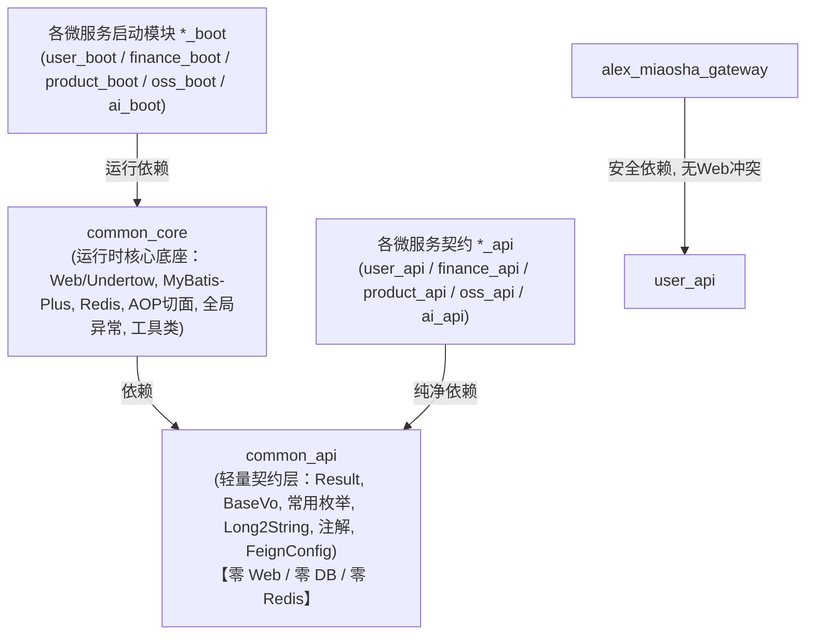
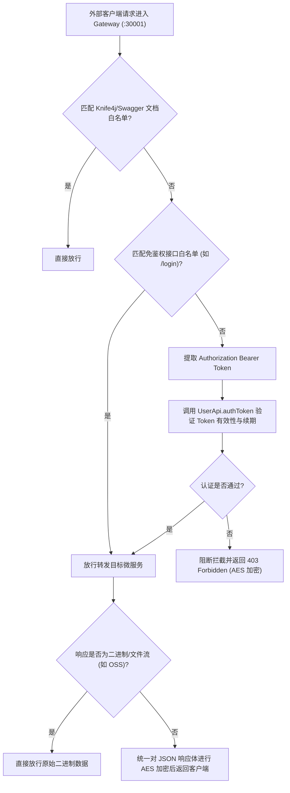

# 🌐 全栈系统架构总览与交互流

返回导航：[[Home]] | [[01-Standards/后端微服务开发规则与运维规约|后端规范]]

---

## 1. 三端全栈系统拓扑图

```mermaid
graph TD
    subgraph Clients["客户端交互层 (Frontend Layer)"]
        PC["PC 运营管理端\nalex_miaosha_front\nPort: 5173 (Dev)"]
        Mobile["移动端 H5 记账\nalex_miaosha_mobile\nPort: 5174 (Dev)"]
    end

    subgraph GatewayLayer["统一网关层 (API Gateway)"]
        GW["Spring Cloud Gateway\nalex_miaosha_gateway\nPort: 30001"]
    end

    subgraph BackendCluster["分布式微服务集群 (Backend Microservices)"]
        UserSvc["用户与RBAC权限中心\nalex_miaosha_user\nPort: 30006"]
        FinanceSvc["财务与礼尚往来服务\nalex_miaosha_finance\nPort: 30008"]
        ProductSvc["商品与类目库存服务\nalex_miaosha_product\nPort: 30007"]
        OssSvc["对象存储服务\nalex_miaosha_oss\nPort: 30009"]
        AiSvc["AI 智能微服务\nalex_miaosha_ai\nPort: 30010"]
    end

    subgraph Middlewares["基础设施与中间件 (Infrastructures)"]
        Nacos["Nacos 注册与配置中心\nPort: 8848"]
        Redis[("Redis 缓存集群\nPort: 6679")]
        MySQL[("MySQL 8.0 关系数据库\nPort: 3306")]
        XXLJob[("宿主机 XXL-Job 调度\nPort: 8088")]
    end

    PC -->|REST API (Long2String) / Bearer Token| GW
    Mobile -->|REST API / 触觉交互| GW

    GW -->|/am-user/** 路由| UserSvc
    GW -->|/am-finance/** 路由| FinanceSvc
    GW -->|/am-product/** 路由| ProductSvc
    GW -->|/am-oss/** 路由| OssSvc
    GW -->|/am-ai/** 路由| AiSvc

    UserSvc -.->|心跳注册 & 配置刷新| Nacos
    FinanceSvc -.->|心跳注册 & 配置刷新| Nacos
    ProductSvc -.->|心跳注册 & 配置刷新| Nacos
    OssSvc -.->|心跳注册 & 配置刷新| Nacos
    AiSvc -.->|心跳注册 & 配置刷新| Nacos

    UserSvc --> Redis
    FinanceSvc --> Redis
    ProductSvc --> Redis

    UserSvc --> MySQL
    FinanceSvc --> MySQL
    ProductSvc --> MySQL
```

---

## 2. 核心端口与数据隔离拓扑

| 服务/组件 | 端口 | 职能定义 | 核心存储与隔离 |
| :--- | :--- | :--- | :--- |
| **`alex_miaosha_gateway`** | `30001` | 全局统一流量入口、Token 验签与限流 | Redis |
| **`alex_miaosha_user`** | `30006` | 用户、单机构唯一归属、多角色聚合、权限树 | MySQL (`alex_user`), Redis |
| **`alex_miaosha_finance`** | `30008` | Gift 礼尚往来人情对账、优惠券、资产记账 | MySQL (`alex_finance`), Redis |
| **`alex_miaosha_product`** | `30007` | SPU/SKU 多规格商品、批次库存 | MySQL (`alex_product`), Redis |
| **`alex_miaosha_oss`** | `30009` | 对象存储抽象、流式分块存取 | MinIO / 阿里云 OSS |
| **`alex_miaosha_ai`** | `30010` | 知识问答与智能助手扩展 | Vector DB / LLM API |

> [!NOTE]
> 架构演进说明：原 `mission`（历史Demo）与 `monitor`（512M Spring Boot Admin）已于 2026-09 彻底下线；原 `alex_miaosha_base` 与 `alex_miaosha_utils` 已彻底收敛重构为标准的 `alex_miaosha_common` 双层架构（`common_api` 与 `common_core`）。

---

## 3. 统一公共底座架构 (`alex_miaosha_common`)

后端系统消除了历史遗留的 `base` 与 `utils` 冗余空壳模块，统一标准化为 **`alex_miaosha_common`** 两层分立底座：



- **`common_api`（轻量契约层）**：仅包含 DTO/VO 传输对象、统一返回结构体 `Result<T>`、基础枚举与序列化器，**绝不引入 Web/Undertow 容器与数据库连接池**，供所有微服务 `*_api` 与网关使用，彻底消除网关 WebFlux 与 Servlet 依赖冲突。
- **`common_core`（运行时底座）**：依赖 `common_api`，聚合 Undertow、MyBatis-Plus、Redis 缓存、AOP 切面（防重复提交、接口限流）、全局异常处理与综合工具类，仅供各微服务 `*_boot` 启动容器依赖。

---

## 4. 统一网关鉴权与安全过滤流 (Gateway Traffic & Security Flow)



