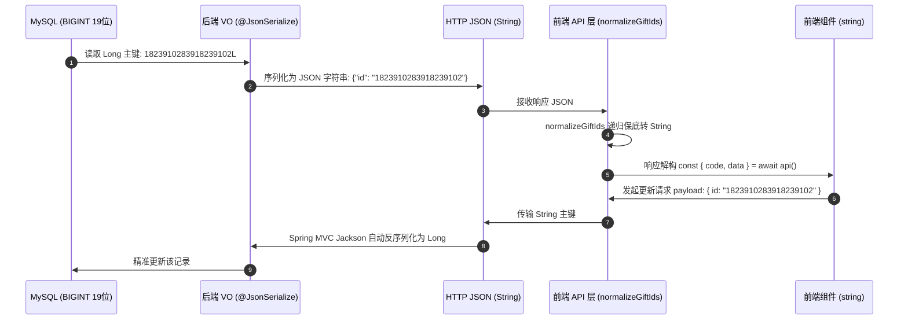

# 🔒 前后端 ID 安全与数据契约护城河

返回导航：[[Home]] | [[01-Standards/PC端开发规则与组件范式|PC端规范]] | [[01-Standards/后端微服务开发规则与运维规约|后端规范]]

---

## 1. 为什么必须建立 ID 安全护城河？

- **根本原因**：JavaScript `Number` 遵循 IEEE 754 双精度浮点标准，安全最大整数 `Number.MAX_SAFE_INTEGER` 为 $2^{53} - 1 = 9007199254740991$（16位）。
- **痛点场景**：后端雪花算法或 MySQL `BIGINT` 产生的 19 位主键（如 `1823910283918239102`）在前端一旦被 JSON.parse 解析为 `number`，低位必然丢失并被四舍五入为 `00`（变异为 `1823910283918239100`），从而导致后续更新/删除等接口报 404 或主键不存在错误。

---

## 2. 前后端全链路闭环防御图



---

## 3. 严格前后端契约规范

### 3.1 后端约束规范
1. 所有对外暴露的 VO 类中，凡是 `Long` 类型的主键、外键字段，**必须显式标注**：
   ```java
   @JsonSerialize(using = Long2StringSerializer.class)
   private Long id;
   ```
2. DTO 入参保持 `Long` 类型，利用 Jackson 默认 String 转 Long 机制。

### 3.2 前端约束规范 (PC 与 移动端通用)
1. **统一解构**：发起请求时必须解构，禁止 `res.code` 链式点读取：
   ```typescript
   const { code, data, message } = await getGiftRecordPageApi(params);
   ```
2. **递归规范化护城河**：在前端封装的 API 模块中（如 `views/finance/gift/api/index.ts`），必须由 `normalizeGiftIds` 递归把所有 `*Id` 属性转为 string。
