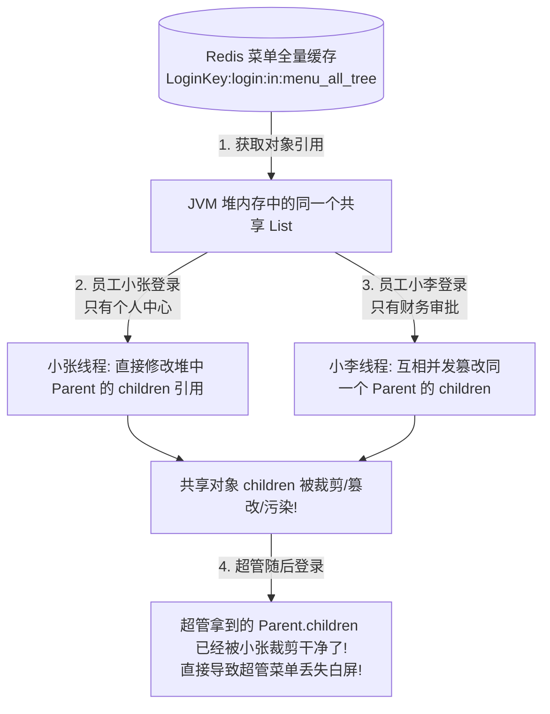

# 💣 Java 引用传递惹的祸：一个偷懒的 tree 拼接，把整个系统的 Redis 菜单缓存污染了！

> **作者**：Alex
> **专栏**：微服务生产排错实战与高并发踩坑集
> **关键词**：Java 引用传递、Redis 缓存污染、树形结构拼装、structuredClone、不可变对象
> **阅读时长**：约 13 分钟

---

@[TOC](目录)

---

## 😱 灵异现场：超管的菜单怎么被“夺舍”了？

这是一个真实发生在生产环境中的“大型灵异事件”：

周一上午，公司总经理兼超级管理员登录后台，突然发现自己左侧的菜单栏全空了：
> **总经理**：“我那么大一个【系统管理】和【权限配置】菜单呢？！怎么只剩一个【个人中心】了？我是不是被降权开除了？！”

技术团队立刻开始查库：
- 数据库里超管角色没有任何改动；
- 超管的菜单关联表数据好端端的都在；
- 奇怪的是：**重启一次用户微服务，超管登录又能看到所有菜单了！**
- 但好景不长，下午两点，超管的菜单**又神奇地消失了！**

团队排查了一下午，甚至怀疑是 Redis 丢键或者网络闪烁。最后，通过堆内存 Dump 和断点单步跟踪，所有人都倒吸了一口凉气 —— **凶手居然是一段人人都在写的树形结构拼装代码！**

---

## 🔍 案情重演：偷懒的“就地组装”

在企业级中后台中，为了提升菜单加载性能，避免每次登录都执行复杂的递归连表查询，系统通常会在 Redis 中缓存一份全量的公共菜单树：

```java
// Redis 缓存键
String CACHE_KEY = "LoginKey:login:in:menu_all_tree";
```

业务逻辑希望实现：
1. 从 Redis 中取出全量菜单节点列表；
2. 根据当前登录用户的角色，过滤出用户有权查看的节点；
3. 将平铺的 List 组装成具有父子层级关系的 Tree（即填充每一个节点的 `children` 属性）。

一位开发小哥写下了这段非常“优雅紧凑”的树拼装代码：

```java
// ❌ 埋下巨大灾难的原始业务代码
public List<MenuVo> getUserMenuTree(Long userId) {
    // 1. 从缓存或本地内存中获取全量菜单列表（注意：拿到的是堆内存中的原始对象引用！）
    List<MenuVo> allMenus = redisUtils.getList(CACHE_KEY, MenuVo.class);

    // 2. 获取当前用户拥有的菜单 ID 集合（比如普通员工小李只有 3 个菜单）
    Set<Long> userMenuIds = getUserGrantedMenuIds(userId);

    // 3. 过滤出属于当前用户的菜单项
    List<MenuVo> userMenus = allMenus.stream()
            .filter(item -> userMenuIds.contains(item.getId()))
            .collect(Collectors.toList());

    // 4. 组装父子树形结构
    Map<Long, MenuVo> menuMap = userMenus.stream()
            .collect(Collectors.toMap(MenuVo::getId, item -> item));

    List<MenuVo> rootTree = new ArrayList<>();
    for (MenuVo menu : userMenus) {
        if (menu.getParentId() == 0L) {
            rootTree.add(menu);
        } else {
            MenuVo parent = menuMap.get(menu.getParentId());
            if (parent != null) {
                // 💥 致命一行：直接向 parent.getChildren() 添加子节点！
                if (parent.getChildren() == null) {
                    parent.setChildren(new ArrayList<>());
                }
                parent.getChildren().add(menu);
            }
        }
    }

    return rootTree;
}
```

---

## 💥 祸根剖析：Java 引用传递的“连环爆雷”

代码看起来毫无毛病，单元测试也能跑通。但放在高并发多用户环境下，灾难爆发了：



### 1. 堆内存对象被就地篡改（In-Place Mutation）
`allMenus` 内部的每一个 `MenuVo` 实体对象，都是在堆内存中长久驻留的。
当普通员工小张登录时，代码拿到了“系统管理”这个父节点，并把小张仅有的 1 个子菜单 `add` 到了 `parent.getChildren()` 中。
**由于 Java 是引用传递，修改 `parent.getChildren()`，实质上是直接修改了堆内存中所有线程共享的那个“系统管理”节点！**

### 2. 共享缓存被交叉污染
- 员工 A 登录，把父节点的子列表改成了 `[A1, A2]`；
- 紧接着员工 B 登录，又把父节点的子列表清空并替换成了 `[B1]`；
- 随后超级管理员登录，从内存里拿出的“系统管理”，其子列表已经被其他普通员工改得面目全非，管理员菜单直接丢失！
- 更要命的是：如果后续有某段代码不小心调用了一次 `redisUtils.set(CACHE_KEY, allMenus)`，**这具被严重污染的残缺菜单尸体，就会被重新写回 Redis 持久化缓存中！从此全系统永久瘫痪，只能重启！**

---

## 🛡️ 治本之策：不可变性与架构治理红线

要彻底终结这一顽疾，必须从**架构规约、不可变集合、深拷贝防御**三个层面同时筑牢防线。

### 1. 架构红线：分清“登录全局缓存”与“接口局部查询”

在我们的架构中，明确定下了一条**铁律军规**（已沉淀至 `AGENTS.md`）：

> 🚨 **全栈工程红线**：
> 1. 管理端动态菜单树接口（`GET/POST /menu-info/tree`）**严禁读写公共全量缓存 `LoginKey:login:in:menu_all_tree`！** 该缓存仅供无状态登录态快速校验；
> 2. 动态菜单树必须走带有 `@DataPermission` 的 Scoped 查询在隔离的局部栈内存中构建，从数据源头实现租户/权限物理隔离！

```java
// ✅ 正确规范：基于当前权限作用域独立构建，绝不污染全局
@Override
public List<MenuVo> getTree(MenuInfoQuery query) {
    // 1. 走带数据权限隔离的查询，每次查询产生全新独立实例
    List<MenuVo> scopedList = menuInfoMapper.selectScopedList(query);
    
    // 2. 在独立的局部上下文中组装树
    return buildTreeSafely(scopedList);
}
```

---

### 2. 防御性拷贝（Defensive Copy）：不可变包装

如果在某些特定场景下，必须从共享缓存中读取数据进行内存过滤，**必须牢记“永远不要相信下游不会篡改数据”！**

#### 做法 A：深拷贝隔离（Deep Copy）
在取出共享缓存对象后，立即通过深拷贝生成一份完全独立的克隆镜像：
```java
List<MenuVo> rawList = redisUtils.getList(CACHE_KEY, MenuVo.class);
// 基于 JSON 或序列化进行物理级深度拷贝，斩断所有堆内存指针引用
List<MenuVo> isolatedList = JSON.parseArray(JSON.toJSONString(rawList), MenuVo.class);
```

#### 做法 B：防御性封装 `Collections.unmodifiableList`
如果一个集合设计为全系统共享只读，在发布它时，应当用只读包装器保护起来：
```java
public List<MenuVo> getChildren() {
    return children == null ? Collections.emptyList() : Collections.unmodifiableList(children);
}
```
任何试图在业务代码里偷懒调用 `getChildren().add(...)` 的操作，都会在第一时间抛出 `UnsupportedOperationException`，把隐患扼杀在编译期和自测期！

---

### 3. 前端防御：Pinia 与 Vue Router 路由过滤的深拷贝规范

后端在防，前端同样不能掉以轻心！
在 Vue 3 前端项目中，Pinia Store 通常保存了登录后返回的菜单树。如果前端在动态注册路由（`router.addRoute`）时，直接用递归函数修改了 `route.children`，同样会导致**切换账号或退出登录时不刷新页面产生的权限残留污染**！

我们规定前端必须采用浏览器原生 **`structuredClone`** 进行防御：

```typescript
// ✅ 前端规约：必须深拷贝切断引用指针
export function generateAsyncRoutes(menus: MenuVo[]) {
    // 现代浏览器原生深度克隆，效率远超 JSON.parse(JSON.stringify)
    const clonedMenus = structuredClone(menus);
    
    return clonedMenus.map(menu => {
        // 在克隆出来的隔离副本上进行路由扁平化或权限裁剪
        return transformMenuToRoute(menu);
    });
}
```

---

## 🎯 总结与启示

这个价值千万的 Bug，再次向我们敲响了现代软件工程的警钟：

1. **警惕“引用共享”**：Java 与 JavaScript 的对象引用是高并发下的隐形杀手。共享变量 + 内存篡改 = 生产海森堡 Bug；
2. **推崇函数式纯函数（Pure Functions）**：处理集合或树形结构转换时，输入参数应当是只读的，输出应当返回全新的不可变对象，绝不在入参上做“就地增删改”；
3. **架构边界高于代码技巧**：通过架构规范将“登录全量缓存”与“用户Scoped业务”彻底物理隔离，才是治本之道。

从此，团队里的每一个新同学入职，第一件事就是牢记这条防线：**“莫伸手，伸手必深拷贝！”**

---

*（本文已同步收录至 Alex 知识库：`02-Features/02-RBAC-用户组织权限/避坑与Bug修复SOP/避坑SOP-Redis共享菜单污染.md`）*
