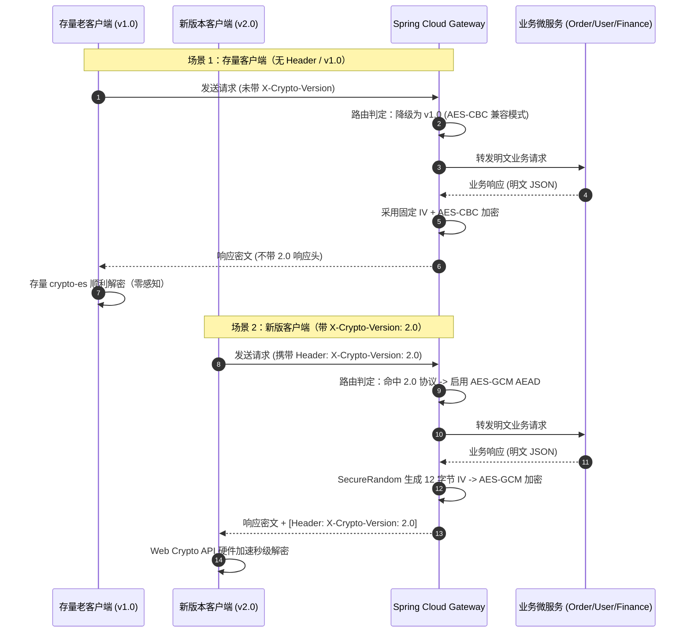
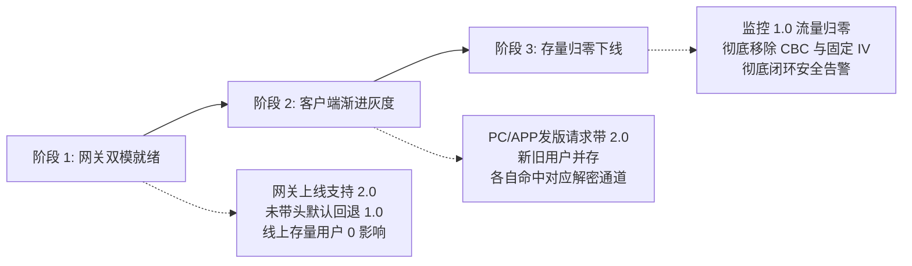

# 🚀 从 Sonar 告警到架构跃迁：全栈报文安全演进与 AES-GCM 动态协议协商实战

> **作者**：Alex
> **专栏**：微服务架构实战与网络安全护城河
> **代码环境**：Spring Cloud Gateway (WebFlux) + Java 21 + Vue 3 / Vite + Web Crypto API
> **阅读时长**：约 15 分钟

---

@[TOC](目录)

---

## 💥 背景：一条刺眼的 Sonar 漏洞告警

在一次日常的 SonarQube 代码质量与静态安全门禁扫描中，系统报出了一个高危漏洞阻断（Blocker）：

> 🚨 **SonarQube Rule java:S3329**
> *"Use dynamically generated initialization vectors (IV) for cipher block chaining (CBC) mode."*
> **（在密码分组链接模式下，严禁使用硬编码或固定的初始化向量 IV！）**

打开被告警的工具类 `AESUtils.java`，映入眼帘的是一段历史遗留代码：

```java
// 历史代码：固定密钥与固定 IV
private static final String DEFAULT_IV = "1234567890123456";

private static Cipher getCipher(String key, String iv, String type, Integer mode) {
    Cipher cipher = Cipher.getInstance("AES/CBC/" + type);
    SecretKeySpec keySpec = new SecretKeySpec(key.getBytes(StandardCharsets.UTF_8), "AES");
    IvParameterSpec ips = new IvParameterSpec(iv.getBytes(StandardCharsets.UTF_8));
    cipher.init(mode, keySpec, ips);
    return cipher;
}
```

不仅是后端网关，打开 PC 前端（`alex_miaosha_front`）和移动端（`alex_miaosha_mobile`）的通信层工具库，赫然写着：

```typescript
// 前端通信层：写死的 IV 偏移量
const iv = Utf8.parse('1234567890123456');
const decrypt = AES.decrypt(src, key, { iv, mode: CBC, padding: Pkcs7 });
```

### 为什么固定 IV 是灾难？
在密码学中，**IV（Initialization Vector）的本质是“引入随机性”**：
1. **字典碰撞与特征泄露**：如果 IV 永远不变，相同的明文在相同密钥下，加密后的第一组密文分组永远相同！攻击者无需破解密钥，通过流量抓包对比即可反推明文特征；
2. **重放攻击（Replay Attack）**：攻击者窃取密文包后，由于缺乏报文时序与随机因子，可反复向服务端重放请求；
3. **Padding Oracle 漏洞**：AES-CBC 配合 PKCS5/PKCS7 填充，如果在解密校验时返回了不同的错误细节，极易遭受填充提示攻击（Padding Oracle Attack），导致密文被逐字节爆破破解。

---

## ⚡ 架构两难：直接改动态 IV？线上立马瘫痪！

开发者的第一反应往往是：“这还不简单？在后端用 `SecureRandom` 动态生成 16 字节 IV 不就完了吗？”

**千万别动！** 如果你直接改了后端：
- 线上运行的数十万存量 **PC 浏览器缓存版本、移动端 App、微信内置 WebView** 依然拿着固定的 `1234567890123456` 去解密；
- 后端一旦发出动态 IV 加密的密文，**所有客户端将在解密时瞬间全线抛错、白屏瘫痪！**

### 传统升级方案的致命硬伤

| 升级方式 | 实现逻辑 | 线上代价 | 架构评分 |
| :--- | :--- | :--- | :--- |
| **暴力升级** | 后端直接改动态 IV，前端发版 | 强退存量用户，老版本 App / 强刷前页面 100% 挂死 | ❌ 灾难（0分） |
| **URL 路由分流** | 新增 `/api/v2/**` 接口路径 | 后端、网关、前端全量业务代码推翻重写，工作量巨大 | ❌ 笨重（40分） |
| **动态协议协商** | **HTTP Header 协商 + AES-GCM (AEAD) 双模路由** | **零停机、双模共存、自适应灰度、无感过渡** | **🏆 卓越（100分）** |

既然要改，就不能仅仅停留在“把 CBC 的固定 IV 改为动态 IV”这种小修小补上。我们决定**一步到位演进至现代密码学推荐标准——AES-GCM (AEAD)**，并通过 **HTTP Header 协议版本协商机制**，实现新老架构的无缝平滑迁移！

---

## 🏗️ 方案蓝图：AEAD 与动态协议协商架构

### 1. 为什么选择 AES-GCM？
**AES-GCM (Galois/Counter Mode)** 属于 **AEAD（Authenticated Encryption with Associated Data，认证加密）** 算法，是 TLS 1.3、QUIC、HTTP/2 底层钦定的加密标准：
- **机密性 + 完整性双重保证**：自带 128 位 **Auth Tag（认证标签）**，报文若被篡改哪怕 1 个比特，解密立即失败并报错，天然杜绝数据篡改与 Padding Oracle；
- **原生硬件加速**：支持现代 CPU 的 AES-NI 指令集并行计算，吞吐量相比串行 CBC 提升数十倍；
- **防重放**：每个报文绑定唯一的 12 字节 Nonce（随机数）。

### 2. 协议协商 Wire Format 规范

我们在传输层定义了一套通用的封包规约：

$$\text{Base64}\Big(\underbrace{\text{[ 12 Bytes 随机 Nonce/IV ]}}_{\text{SecureRandom 动态生成}} + \underbrace{\text{[ Ciphertext 密文主体 ]} + \text{[ 16 Bytes Auth Tag ]}}_{\text{GCM 认证密文}}\Big)$$

- **解析逻辑**：客户端解码 Base64，前 12 字节截取为 IV，后续字节送入 Web Crypto API 硬件解密器，一气呵成。

### 3. 全链路协议协商时序图



---

## 💻 落地实战：全栈代码详解

### Step 1: 后端核心层标准 AES-GCM 实现 (`AESGcmUtils.java`)

在 `common_core` 底座中，我们遵循 NIST SP 800-38D 标准实现工具类，杜绝任何第三方依赖，纯 JDK 原生 API：

```java
package com.alex.common.utils.secret;

import com.alex.common.config.EncryptionProperties;
import org.springframework.beans.factory.annotation.Autowired;
import org.springframework.stereotype.Component;

import javax.crypto.Cipher;
import javax.crypto.SecretKey;
import javax.crypto.spec.GCMParameterSpec;
import javax.crypto.spec.SecretKeySpec;
import java.nio.ByteBuffer;
import java.nio.charset.StandardCharsets;
import java.security.SecureRandom;
import java.util.Base64;

@Component
public class AESGcmUtils {

    private static final String ALGORITHM = "AES/GCM/NoPadding";
    private static final int TAG_LENGTH_BIT = 128; // 16 字节认证标签
    private static final int IV_LENGTH_BYTE = 12;  // NIST 推荐 12 字节 Nonce
    private static final SecureRandom SECURE_RANDOM = new SecureRandom();

    private static EncryptionProperties encryptionProperties;

    AESGcmUtils() {}

    @Autowired
    public void setEncryptionProperties(EncryptionProperties properties) {
        AESGcmUtils.encryptionProperties = properties;
    }

    public static void setStaticProperties(EncryptionProperties properties) {
        AESGcmUtils.encryptionProperties = properties;
    }

    /**
     * AES-GCM 加密：生成动态 IV 并拼接密文
     */
    public static String encrypt(String text, String key) throws Exception {
        if (text == null) return null;

        byte[] iv = new byte[IV_LENGTH_BYTE];
        SECURE_RANDOM.nextBytes(iv); // 每次全新随机数

        SecretKey secretKey = new SecretKeySpec(key.getBytes(StandardCharsets.UTF_8), "AES");
        Cipher cipher = Cipher.getInstance(ALGORITHM);
        cipher.init(Cipher.ENCRYPT_MODE, secretKey, new GCMParameterSpec(TAG_LENGTH_BIT, iv));

        byte[] cipherTextWithTag = cipher.doFinal(text.getBytes(StandardCharsets.UTF_8));

        // 封包：12B IV + CipherTextWithTag
        ByteBuffer buffer = ByteBuffer.allocate(iv.length + cipherTextWithTag.length);
        buffer.put(iv);
        buffer.put(cipherTextWithTag);

        return Base64.getEncoder().encodeToString(buffer.array());
    }

    /**
     * AES-GCM 解密：剥离 IV 并由底层自动校验 Tag
     */
    public static String decrypt(String base64Encrypted, String key) throws Exception {
        if (base64Encrypted == null) return null;

        byte[] decoded = Base64.getDecoder().decode(base64Encrypted);
        if (decoded.length < IV_LENGTH_BYTE + 16) {
            throw new IllegalArgumentException("GCM 密文长度非法");
        }

        // 提取前 12 字节 IV
        byte[] iv = new byte[IV_LENGTH_BYTE];
        System.arraycopy(decoded, 0, iv, 0, IV_LENGTH_BYTE);

        // 提取密文主体与 Tag
        int cipherLength = decoded.length - IV_LENGTH_BYTE;
        byte[] cipherTextWithTag = new byte[cipherLength];
        System.arraycopy(decoded, IV_LENGTH_BYTE, cipherTextWithTag, 0, cipherLength);

        SecretKey secretKey = new SecretKeySpec(key.getBytes(StandardCharsets.UTF_8), "AES");
        Cipher cipher = Cipher.getInstance(ALGORITHM);
        cipher.init(Cipher.DECRYPT_MODE, secretKey, new GCMParameterSpec(TAG_LENGTH_BIT, iv));

        // 密文被篡改时，此处将直接抛出 AEADBadTagException
        byte[] decrypted = cipher.doFinal(cipherTextWithTag);
        return new String(decrypted, StandardCharsets.UTF_8);
    }
}
```

---

### Step 2: Spring Cloud Gateway 网关双模动态路由

在网关全局过滤器 `GatewayFilter.java` 中，我们根据客户端请求头实现**按需路由分发**：

```java
public class EncryptionUtils {
    public static final String HEADER_CRYPTO_VERSION = "X-Crypto-Version";
    public static final String VERSION_1_0 = "1.0";
    public static final String VERSION_2_0 = "2.0";

    /**
     * 版本协商加密
     */
    public byte[] encryptByVersion(String content, String version) {
        if (!encryptionProperties.isEnabled()) {
            return content.getBytes(StandardCharsets.UTF_8);
        }
        // 客户端支持 2.0 走 AES-GCM；否则保底回退 1.0 (AES-CBC)
        if (VERSION_2_0.equalsIgnoreCase(version)) {
            String encrypted = AESGcmUtils.encrypt(content, encryptionProperties.getKey());
            return encrypted.getBytes(StandardCharsets.UTF_8);
        }
        String encrypted = AESUtils.encryptWithConfig(content);
        return encrypted.getBytes(StandardCharsets.UTF_8);
    }
}
```

在网关响应拦截器装饰器中：

```java
// 提取客户端请求头中的版本协商标识
String clientVersion = exchange.getRequest().getHeaders().getFirst(EncryptionUtils.HEADER_CRYPTO_VERSION);
boolean isV2 = EncryptionUtils.VERSION_2_0.equalsIgnoreCase(clientVersion);

// 若协商为 2.0，响应头同步打标告知客户端
if (isV2) {
    originalResponse.getHeaders().set(EncryptionUtils.HEADER_CRYPTO_VERSION, EncryptionUtils.VERSION_2_0);
}

// 动态选择加密器版本
uppedContent = encryptionUtils.encryptByVersion(
    JSONObject.toJSONString(s),
    isV2 ? EncryptionUtils.VERSION_2_0 : EncryptionUtils.VERSION_1_0
);
```

> 💡 **避坑要点**：文件下载响应（Excel、PDF、图片）以及 AI 智能问答的 SSE 流式响应（`text/event-stream`）必须由网关白名单提前旁路，严禁进入加密缓冲区，以防流中断或内存溢出。

---

### Step 3: 前端（PC & Mobile）Web Crypto API 硬件加速

很多团队不敢升级 GCM 是因为前端 JavaScript 软解密大报文太慢卡死 UI。
实际上，现代浏览器和移动端 WebView 早已原生标配了 **Web Crypto API (`window.crypto.subtle`)**！它直接调用操作系统底层与 CPU 的 AES-NI 指令集，速度比纯 JS 库快 20~50 倍！

#### 1. 前端通用加解密实现 (`src/utils/crypto/index.ts`)

```typescript
const IV_LENGTH = 12;
const DEFAULT_KEY = '20230610HelloDog';
const keyCache = new Map<string, Promise<CryptoKey>>();

function getCryptoKey(rawKey: string): Promise<CryptoKey> {
  let promise = keyCache.get(rawKey);
  if (!promise) {
    const subtle = window.crypto.subtle;
    const enc = new TextEncoder();
    promise = subtle.importKey(
      'raw',
      enc.encode(rawKey),
      { name: 'AES-GCM' },
      false,
      ['decrypt', 'encrypt']
    );
    keyCache.set(rawKey, promise);
  }
  return promise;
}

/**
 * AES-GCM (v2.0) 硬件解密
 */
export async function decryptGcm(base64Payload: string, rawKey = DEFAULT_KEY): Promise<any> {
  if (!base64Payload) return null;

  // Base64 解码转 Uint8Array
  const binary = atob(base64Payload);
  const data = new Uint8Array(binary.length);
  for (let i = 0; i < binary.length; i++) data[i] = binary.charCodeAt(i);

  // 截取前 12 字节 Nonce/IV
  const gcmIv = data.slice(0, IV_LENGTH);
  const ciphertextWithTag = data.slice(IV_LENGTH);

  const cryptoKey = await getCryptoKey(rawKey);
  const decryptedBuffer = await window.crypto.subtle.decrypt(
    { name: 'AES-GCM', iv: gcmIv, tagLength: 128 },
    cryptoKey,
    ciphertextWithTag
  );

  const decodedStr = new TextDecoder('utf-8').decode(decryptedBuffer);
  const parsed = JSON.parse(decodedStr);
  return typeof parsed === 'string' ? JSON.parse(parsed) : parsed;
}
```

#### 2. Axios 请求与响应拦截器自适应绑定 (`request.ts`)

```typescript
// 1. 请求拦截：主动协商升级至 2.0
instance.interceptors.request.use((config) => {
  if (config.headers) {
    config.headers['X-Crypto-Version'] = '2.0';
  }
  return config;
});

// 2. 响应拦截：根据网关实际回传的 Header 自动选择解密器
instance.interceptors.response.use(async (response) => {
  const { data, headers } = response;
  const version = headers ? headers['x-crypto-version'] : null;

  let resData;
  if (version === '2.0' && typeof data === 'string') {
    // 命中 v2.0 协议：走 Web Crypto 硬件加速解密
    resData = await decryptGcm(data);
  } else {
    // 降级命中 v1.0 协议：走旧版 crypto-es AES-CBC
    resData = decryptLegacyCbc(data);
  }

  return resData;
});
```

---

## 🧪 严密质检：全栈测试金字塔与防篡改断言

架构落地必须有扎实的自动化测试兜底。我们按照测试金字塔构建了严密的自动化断言矩阵：

```powershell
# 1. 后端单元测试：验证防重放与篡改拦截
mvn test -Dtest=AESGcmUtilsTest -pl alex_miaosha_common/common_core
# [INFO] Tests run: 6, Failures: 0, Errors: 0, Skipped: 0 -> BUILD SUCCESS

# 2. 网关测试：验证双模版本协商与降级
mvn test -Dtest=EncryptionUtilsVersionTest -pl alex_miaosha_gateway
# [INFO] Tests run: 3, Failures: 0, Errors: 0, Skipped: 0 -> BUILD SUCCESS

# 3. PC 前端：Node 原生断言契约锁
node --test tests/unit/*.test.mts
# [INFO] Tests run: 16, Pass: 16, Fail: 0 -> 100% Passed

# 4. 移动前端：Vitest 移动端适配测试
npx vitest run tests/unit/cryptoGcm.test.ts
# [INFO] Tests run: 5, Pass: 5, Fail: 0 -> 100% Passed
```

在测试用例中，我们设计了**专门的恶意报文篡改测试**：
```typescript
it('密文被恶意篡改时解密失败', async () => {
    const payload = { amount: 888 };
    const encrypted = await encryptGcm(payload, TEST_KEY);

    const buffer = Buffer.from(encrypted, 'base64');
    // 恶意修改密文中的一个比特位
    buffer[buffer.length - 5] ^= 0x55;
    const tampered = buffer.toString('base64');

    // 断言：底层 AEAD Tag 校验失败，绝不返回脏数据
    await expect(decryptGcm(tampered, TEST_KEY)).rejects.toThrow();
});
```

---

## 📈 平滑演进三阶段 SOP：零停机发布指引

该方案最美妙的地方在于**发布节奏的主动权完全掌握在工程团队手中**：



1. **Phase 1（网关双模发布）**：网关率先发布上线。此时前端未发版，所有请求未携带 `X-Crypto-Version: 2.0`，网关自动 100% 走 v1.0 (AES-CBC) 兼容逻辑，**线上生产 0 风险、0 感知**；
2. **Phase 2（客户端渐进灰度）**：PC 端更新发布，移动端 App / 小程序逐步提审灰度放量。更新后的客户端请求自动携带 `2.0` 头，网关针对性以 AES-GCM 响应；未更新的老版本 App 继续走 CBC。**新老版本并存，互不打扰**；
3. **Phase 3（彻底清理下线）**：网关监控统计 `X-Crypto-Version` 为空或 `1.0` 的请求量，待老版本存量自然沉淀归零后，直接在网关关闭 CBC 降级通道，彻底删除 `AESUtils` 中的压制注解 `@SuppressWarnings("java:S3329")`，安全漏洞治理圆满闭环！

---

## 🎯 总结与架构思考

回顾这次技术重构，从一条 SonarQube 的警告代码，到一套优雅跨端协议协商机制的诞生，我们收获的不仅是绿色的代码质量检查报告，更是对生产级架构治理的深刻认知：

1. **架构设计永远要为线上稳定性负责**：密码学改动切忌“后端一拍脑袋硬改”，永远优先考虑存量系统与协议兼容性；
2. **协议协商是跨端版本升级的最佳实践**：类似 HTTP/1.1 到 HTTP/2 的 ALPN 协商，利用 HTTP Header 传递通信元数据，能以极小的侵入性换取极大的解耦灵活性；
3. **拥抱现代平台底座能力**：前端加解密不再是性能瓶颈，充分利用 Web Crypto API 硬件加速，能为全报文加密提供工业级的性能保障。

---

*（本文已同步收录于 Alex 全栈工程知识库：`00-System/网关路由与统一鉴权设计.md`）*
