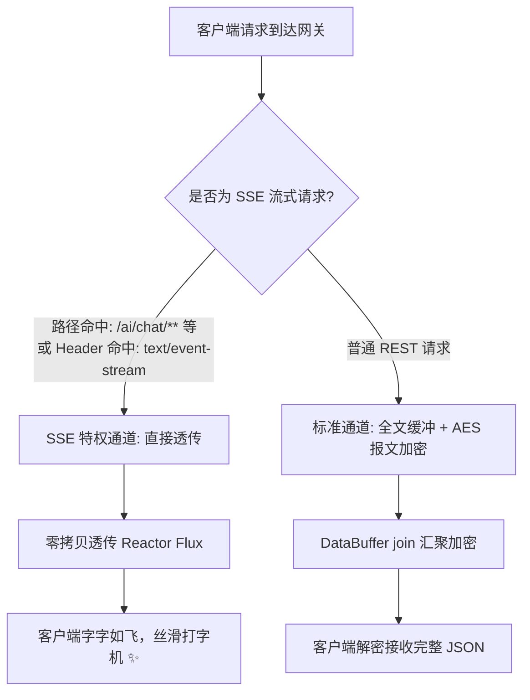

# 🤖 当 DeepSeek 遇到 Spring Cloud Gateway：为什么你的 SSE 流式打字机变成了“憋大招一次性吐出”？

> **作者**：Alex
> **专栏**：微服务架构实战与 AIGC 智能落地
> **关键词**：Server-Sent Events (SSE)、DeepSeek、Spring Cloud Gateway、WebFlux、DataBuffer 缓冲陷阱
> **阅读时长**：约 15 分钟

---

@[TOC](目录)

---

## 😱 现场惨案：本地好好的打字机，上了网关卡成 PPT

在当下大模型（LLM）风起云涌的时代，无论是对接 **DeepSeek-R1 / V3** 还是 OpenAI，**流式输出（Streaming Output，通常基于 SSE 协议）** 都是标配体验：字字如行云流水，推理思考过程即时可见。

然而，几乎所有在微服务体系（Spring Cloud）中接入大模型的团队，都会遭遇一个百思不得其解的诡异现象：

1. **直接调用下游 AI 微服务**（端口 `30010`）：
   浏览器里的 Markdown 渲染器像丝滑打字机一样，以每秒几十个字符的速度优雅输出；
2. **挂载 Spring Cloud Gateway 统一网关后**（端口 `30001`）：
   前端控制台挂起转圈，**整整卡住 10~15 秒毫无动静**！直到 DeepSeek 把整整两千字的大长篇彻底写完了，**前端“轰”的一声一次性把整段内容全砸在屏幕上！** 更离谱的是，中间还偶发夹杂着 `` 这类乱码字符！

从极致流畅的“流式体验”，退化成了极度难受的“憋大招体验”，用户甚至以为网站卡死了。

网关里到底发生了什么“黑魔法”？

---

## 🔬 抽丝剥茧：揪出网关里的“吞流巨兽”

### 1. 传统响应 vs SSE 流式响应的本质区别
- **传统 RESTful 响应**：请求一次，计算完毕，返回一个完整的 JSON 报文包（带明确的 `Content-Length`）；
- **SSE 流式响应 (`text/event-stream`)**：基于长连接，服务端以 `data: {...}\n\n` 为分块（Chunk），持续不断向客户端推送数据切片，**永远没有固定长度，直到服务端主动发出 `[DONE]` 结束帧**。

### 2. 网关的“原罪”：`DataBufferUtils.join()` 与报文加密
在现代微服务网关中，通常会挂载全局拦截器（Global Filter），负责做三件事：
1. **全局响应统一加密**（如我们前面提到的全报文 AES 加密）；
2. **全局统一日志打印**（记录下游响应的完整 Body）；
3. **全局脱敏或签名防篡改**。

打开许多团队的 `GatewayFilter`，往往能看到类似这样的代码（看看你的项目有没有中招）：

```java
// ❌ 破坏 SSE 流式传输的网关拦截器典型代码
ServerHttpResponseDecorator decoratedResponse = new ServerHttpResponseDecorator(originalResponse) {
    @Override
    public Mono<Void> writeWith(Publisher<? extends DataBuffer> body) {
        if (body instanceof Flux<? extends DataBuffer> fluxBody) {
            // 💥 致命代码：buffer() + join()
            return super.writeWith(fluxBody.buffer().handle((dataBuffers, sink) -> {
                // 将下游发过来的所有 DataBuffer 切片强行汇聚合并成一个大 Buffer
                DataBuffer joinedBuffer = DefaultDataBufferFactory.sharedInstance.join(dataBuffers);
                
                byte[] content = new byte[joinedBuffer.readableByteCount()];
                joinedBuffer.read(content);
                DataBufferUtils.release(joinedBuffer);

                // 执行统一加密或日志打印
                byte[] encrypted = encryptService.encrypt(content);
                sink.next(bufferFactory.wrap(encrypted));
            }));
        }
        return super.writeWith(body);
    }
};
```

### 3. 为什么会“憋大招”？
请看 `fluxBody.buffer()` 和 `join()` 的行为：
- Reactor 响应式框架在遇到 `buffer()` 时，其语义是：**“我要把上游发射的所有事件攒在内存池里，直到上游发出 `onComplete()` 信号，我才一次性打成 List 往下游派发”**！
- 面对 DeepSeek 的流式输出，`onComplete()` 只有在最后一行输出完才会触发。
- 结果就是：**网关硬生生把一个长达 15 秒的流式事件，在内存中强行截流缓冲了 15 秒，彻底剥夺了数据块的实时下发能力！**

### 4. 为什么还会偶发乱码（``）？
在 UTF-8 编码中，英文字符占 1 个字节，而**一个常用中文字符占 3 个字节**。
大模型流式推理切词时，是按照 Token 拆分的。如果网关在底层网络包分片时，不小心把一个中文字符的 3 个字节**前 2 个字节切在包 A，后 1 个字节切在包 B**，且网关试图把包 A 转为 `new String(bytes, UTF_8)`，解码器就会立刻判定字节序列残缺，报错并打出一个替换符 ``！

---

## 🛠️ 破局之道：构建网关 SSE 动态旁路拦截器

解决问题的核心原则：**“让上帝的归上帝，让凯撒的归凯撒”**。
网关的加密、压缩、日志缓冲逻辑只针对传统的单次 HTTP 响应；对于 SSE 长流，**必须建立特权快速通道，直接透传（Zero-Copy Bypass），严禁进入任何缓冲池！**



### 1. 构建智能匹配器 (`GatewaySsePathMatcher.java`)

```java
package com.alex.gateway.filter;

import org.springframework.util.AntPathMatcher;
import org.springframework.util.PathMatcher;
import java.util.Set;

public class GatewaySsePathMatcher {

    private static final PathMatcher PATH_MATCHER = new AntPathMatcher();

    // 显式声明的 AI 流式接口路由集合
    private static final Set<String> SSE_PATTERNS = Set.of(
            "**/ai/chat/stream",
            "**/ai/analysis/stream",
            "**/v1/chat/completions",
            "**/sse/**"
    );

    public boolean matches(String path) {
        if (path == null || path.isEmpty()) {
            return false;
        }
        for (String pattern : SSE_PATTERNS) {
            if (PATH_MATCHER.match(pattern, path)) {
                return true;
            }
        }
        return false;
    }
}
```

---

### 2. 网关过滤器改造：双重判定安全旁路 (`GatewayFilter.java`)

在全局拦截器中，通过**路径模式 + Content-Type 响应头**双重保险识别 SSE：

```java
@Component
@Slf4j
public class GatewayFilter implements GlobalFilter, Ordered {

    private final GatewaySsePathMatcher ssePathMatcher = new GatewaySsePathMatcher();

    private boolean shouldSkipResponseEncryption(ServerHttpResponse response, String path) {
        // 1. 优先根据 URL 路径规则预判
        if (ssePathMatcher.matches(path)) {
            log.debug("命中 SSE 流式路由白名单，绕过网关缓冲与加密: {}", path);
            return true;
        }

        // 2. 根据下游实际返回的 Content-Type 动态兜底判断
        String contentType = response.getHeaders().getContentType() != null
                ? response.getHeaders().getContentType().toString().toLowerCase()
                : "";

        if (contentType.contains("text/event-stream")) {
            log.info("检测到下游返回 text/event-stream 媒体流，透明直通: {}", contentType);
            return true;
        }

        return false;
    }

    private Mono<Void> secretOut(ServerWebExchange exchange, GatewayFilterChain chain) {
        ServerHttpResponse originalResponse = exchange.getResponse();
        String path = exchange.getRequest().getPath().toString();

        ServerHttpResponseDecorator decoratedResponse = new ServerHttpResponseDecorator(originalResponse) {
            @Override
            public Mono<Void> writeWith(Publisher<? extends DataBuffer> body) {
                // ✅ 核心护城河：命中 SSE 直接调用 super.writeWith(body) 原生透传！
                if (shouldSkipResponseEncryption(getDelegate(), path)) {
                    // 确保关键防缓冲头传递给前端与 Nginx
                    getDelegate().getHeaders().set("X-Accel-Buffering", "no");
                    getDelegate().getHeaders().set("Cache-Control", "no-cache");
                    return super.writeWith(body);
                }

                // 非流式普通请求，维持原有的安全缓冲与报文加密
                if (body instanceof Flux<? extends DataBuffer> fluxBody) {
                    return super.writeWith(fluxBody.buffer().handle((dataBuffer, sink) -> {
                        // 正常的聚合加密逻辑...
                    }));
                }
                return super.writeWith(body);
            }
        };

        return chain.filter(exchange.mutate().response(decoratedResponse).build());
    }
}
```

---

## 🌐 运维与前端避坑：别忘了 Nginx 这一关！

很多团队把网关改好了，却发现线上依然卡顿，原因是**在最外层的 Nginx 反向代理层再次中招了！**

### 1. Nginx 必须关闭 Proxy Buffering
Nginx 默认会对下游响应开启 `proxy_buffering on;`，它同样会在内存中凑满 `4k` 或 `8k` 才会向浏览器发一个 TCP 包！
**解决方案（两选一）**：
- **方案 A（推荐）**：如我们在上面网关代码中所写，网关主动给响应头打上 `X-Accel-Buffering: no`，Nginx 识别到此头会自动对该请求关闭缓冲；
- **方案 B**：在 Nginx 对应微服务的 location 下显式配置：
  ```nginx
  location /api/ {
      proxy_pass http://gateway_cluster;
      proxy_set_header Connection '';
      proxy_http_version 1.1;
      chunked_transfer_encoding on;
      proxy_buffering off; # 关闭反向代理缓冲
      proxy_cache off;     # 关闭缓存
  }
  ```

---

### 2. 前端原生消费：利用 `TextDecoder` 流式管道解码

前端不再需要安装厚重的第三方库，直接基于现代浏览器原生的 `fetch` + `ReadableStream` 即可实现稳健的流式接收：

```typescript
async function streamChatWithDeepSeek(prompt: string, onMessage: (chunk: string) => void) {
    const response = await fetch('/api/ai/chat/stream', {
        method: 'POST',
        headers: { 'Content-Type': 'application/json' },
        body: JSON.stringify({ prompt }),
    });

    if (!response.body) throw new Error('ReadableStream not supported');

    // TextDecoder 流式解码器，自动跨分片拼接多字节 UTF-8，彻底杜绝中文乱码！
    const reader = response.body.getReader();
    const decoder = new TextDecoder('utf-8');
    let buffer = '';

    while (true) {
        const { value, done } = await reader.read();
        if (done) break;

        // stream: true 是杜绝中文截断乱码的关键参数！
        buffer += decoder.decode(value, { stream: true });
        
        // 按行解析 SSE data: 协议
        const lines = buffer.split('\n');
        buffer = lines.pop() || ''; // 保存尚未结束的半行

        for (const line of lines) {
            const trimmed = line.trim();
            if (trimmed.startsWith('data:')) {
                const data = trimmed.replace(/^data:\s*/, '');
                if (data === '[DONE]') return;
                onMessage(data);
            }
        }
    }
}
```

---

## 🎯 总结

在大模型应用遍地开花的今天，传统的 RPC/REST 架构正在向**持续长响应流（Streaming Architectures）**剧烈演进：

1. **响应式编程是一把尺**：在 Spring WebFlux 和 Gateway 中操作 `Flux` 时，切忌盲目使用 `buffer()`、`join()`、`block()`，每一处全量缓冲都是对响应流的降维打击；
2. **多层全链路审查**：从 AI 后端微服务 $\to$ Spring Cloud Gateway $\to$ Nginx $\to$ 浏览器 Fetch，全链路只要有一环开了 Buffer，流式打字机就会瞬间沦为“憋大招”；
3. **保持通信透明**：善用 `X-Accel-Buffering: no` 与专属 PathMatcher 白名单，是保障前沿 AI 体验与企业级安全合规共存的最佳实践。

从此，让你的 DeepSeek 真正字字如飞，体验拉满！

---

*（本文已同步收录至 Alex 知识库：`00-System/网关路由与统一鉴权设计.md`）*
