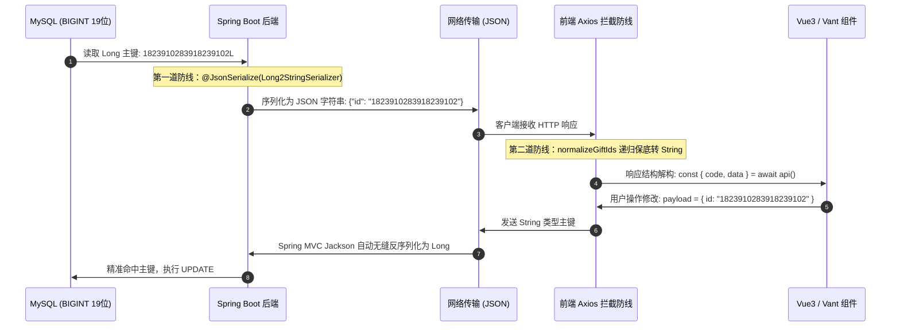

# 🤦‍♂️ 被前端追着打后，我终于搞懂了雪花 ID 在 JS 中的“精度黑洞”与前后端护城河设计

> **作者**：Alex
> **专栏**：全栈避坑实战与微服务契约护城河
> **关键词**：Snowflake ID、IEEE 754、Number.MAX_SAFE_INTEGER、Long2StringSerializer、数据契约
> **阅读时长**：约 12 分钟

---

@[TOC](目录)

---

## 💥 案发经过：一个原本完美的单表增删改查

周五下午 5 点，后端小哥刚把新功能的接口部署到测试环境，正准备收拾背包去喝奶茶，前端同事气势汹汹地冲了过来：

> **前端**：“老哥，你这更新接口怎么回事？我传的 ID 明明是刚刚查出来的，后端死活报 `404 记录不存在`，是不是你 SQL 没提交？！”
> **后端**：“不可能！我本地 Swagger 和 Postman 测得顺顺当当，你看数据库里明明有这条记录：`id = 1823910283918239102`！”

两人凑到前端电脑前一打开 F12 抓包，顿时傻眼了：
- **GET 列表返回的数据**：`"id": 1823910283918239100` （最后两位赫然变成了 `00`！）
- **POST 更新提交的数据**：`{"id": 1823910283918239100, ...}`
- **数据库真实的数据**：`1823910283918239102`

后端看着前端，前端看着后端。原本清清楚楚的 `02`，怎么到了浏览器里就凭空蒸发变成了 `00`？

---

## 🔬 抽丝剥茧：探秘 JavaScript 的“精度黑洞”

### 1. 罪魁祸首：IEEE 754 双精度浮点数
在 Java、Go 或 C++ 中，整型是有明确长度区分的（如 `short` 16位, `int` 32位, `long` 64位）。但在传统的 JavaScript 语言中，**所有的数字（Number 类型）在底层都是 64 位双精度浮点数（IEEE 754 标准）**！

一个 64 位浮点数的二进制结构如下：
- **1 位符号位 (Sign)**
- **11 位指数位 (Exponent)**
- **52 位尾数位/有效数字 (Fraction / Mantissa)**

由于尾数位只有 52 位，加上规格化隐藏的第 1 位（始终为 1），JavaScript 能够**精确无歧义表示的连续整数范围**是：
$$- (2^{53} - 1) \sim (2^{53} - 1)$$

在浏览器的控制台输入 `Number.MAX_SAFE_INTEGER`，你会得到：
```javascript
> Number.MAX_SAFE_INTEGER
9007199254740991 // 只有 16 位！
```

### 2. 当 19 位雪花 ID 闯入 JavaScript
后端通常采用分布式雪花算法（Snowflake）生成 64 位的唯一主键，存入 MySQL 的 `BIGINT(20)`。
雪花 ID 的典型长度通常是 **19 位十进制数**（例如：`1823910283918239102`）。

对比一下：
$$\begin{aligned}
\text{JS 最大安全整数} &= \mathbf{9007199254740991} \quad (16 \text{ 位}) \\
\text{后端雪花主键 ID} &= \mathbf{1823910283918239102} \quad (19 \text{ 位})
\end{aligned}$$

当后端的 JSON 响应未经任何处理直接输出原生数字：
```json
{ "id": 1823910283918239102 }
```
浏览器的 `JSON.parse()` 底层在解析到数字类型时，由于超出了 53 位精度限制，尾部的有效位会被强制舍入（Truncate/Round），低位直接坍缩归零，变成了 `1823910283918239100`！

---

## 🛡️ 防御战术：从“单点防御”到“全栈护城河”

解决这个问题的根本原则极其简单：**在 JSON 网络传输层，严禁使用 Number 承载超过 16 位的长整型，必须转为 String 字符串！**

但在大型团队中，往往存在两个极端：
- **极端 1（推给后端）**：“后端你为什么不每个接口都转成 String？”—— 后端新人一不小心漏加注解，立马爆雷；
- **极端 2（推给前端）**：“前端你们自己 JSON.parse 时用 BigInt 处理啊！”—— 第三方库和脚手架侵入性过高，随时面临生态库不兼容风险。

在我们的企业级项目中，我们推行了一套**前后端协同防御的“ID 安全双保险契约”**。



---

## 💻 落地实践：双重护城河代码实现

### 第一道防线：后端 VO 序列化规范

后端实体类统一保持 `Long` 类型，不破坏 Java 强类型体系；在所有对外暴露的 VO（View Object）层，对 `Long` 字段强制标注 `@JsonSerialize`：

#### 1. 序列化器实现 (`Long2StringSerializer.java`)
```java
package com.alex.common.utils.json;

import com.fasterxml.jackson.core.JsonGenerator;
import com.fasterxml.jackson.databind.JsonSerializer;
import com.fasterxml.jackson.databind.SerializerProvider;

import java.io.IOException;

public class Long2StringSerializer extends JsonSerializer<Long> {
    @Override
    public void serialize(Long value, JsonGenerator gen, SerializerProvider serializers) 
            throws IOException {
        if (value != null) {
            gen.writeString(value.toString());
        } else {
            gen.writeNull();
        }
    }
}
```

#### 2. VO 字段显式标注
```java
@Data
public class GiftRecordVo {
    @JsonSerialize(using = Long2StringSerializer.class)
    private Long id;

    @JsonSerialize(using = Long2StringSerializer.class)
    private Long eventId;

    @JsonSerialize(using = Long2StringSerializer.class)
    private Long personId;

    private String remark;
}
```

---

### 第二道防线：前端响应拦截器递归兜底 (`normalize.ts`)

即便后端规范再严格，也难免有遗漏未标注注解的遗留接口。因此，前端在 API 响应拦截层建立了一道“智能递归兜底护城河”：

```typescript
/**
 * 递归扫描响应对象，将所有 *Id 及核心主键字段无条件规范化为 String
 */
const ID_FIELD_REGEX = /(^id$|Id$|_id$|creator|updater)/;

export function shouldNormalizeGiftId(key: string): boolean {
    return ID_FIELD_REGEX.test(key);
}

export function normalizeGiftIds<T>(data: T): T {
    if (data === null || data === undefined) {
        return data;
    }

    if (typeof data === 'number' || typeof data === 'bigint') {
        return String(data) as unknown as T;
    }

    if (Array.isArray(data)) {
        return data.map((item) => normalizeGiftIds(item)) as unknown as T;
    }

    if (typeof data === 'object') {
        const result: Record<string, any> = {};
        for (const [key, value] of Object.entries(data)) {
            if (shouldNormalizeGiftId(key)) {
                if (typeof value === 'number' || typeof value === 'bigint') {
                    result[key] = String(value);
                } else {
                    result[key] = value;
                }
            } else if (typeof value === 'object' && value !== null) {
                result[key] = normalizeGiftIds(value);
            } else {
                result[key] = value;
            }
        }
        return result as T;
    }

    return data;
}
```

在 API 导出的统一拦截方法中注入：
```typescript
export async function getGiftRecordPageApi(params: GiftRecordQuery) {
    const { code, data, message } = await request.post('/api/gift/record/page', params);
    return {
        code,
        message,
        data: normalizeGiftIds(data), // 兜底护城河触发
    };
}
```

---

## 🧪 契约锁：用单元测试锁住规则红线

为了防止后续开发人员“重构代码时不小心把 `normalizeGiftIds` 给删了”，我们在前端专门编写了 Node.js 原生单元测试，作为不可突破的契约锁：

```typescript
// tests/unit/giftNormalize.test.mts
import { describe, it } from 'node:test';
import assert from 'node:assert/strict';
import { normalizeGiftIds, shouldNormalizeGiftId } from '../../src/views/finance/gift/api/normalize.ts';

describe('全栈 ID 安全契约守门测试', () => {
    it('命中审计与 *Id 字段', () => {
        assert.equal(shouldNormalizeGiftId('id'), true);
        assert.equal(shouldNormalizeGiftId('eventId'), true);
        assert.equal(shouldNormalizeGiftId('personId'), true);
        assert.equal(shouldNormalizeGiftId('creator'), true);
        assert.equal(shouldNormalizeGiftId('remark'), false);
    });

    it('超长 Number 必须被强制转为 String 防止精度丢失', () => {
        const raw = {
            id: 1823910283918239102n, // bigint
            eventId: 12345,
            title: '结婚喜宴'
        };
        const normalized = normalizeGiftIds(raw);
        assert.equal(typeof normalized.id, 'string');
        assert.equal(normalized.id, '1823910283918239102');
        assert.equal(typeof normalized.eventId, 'string');
        assert.equal(normalized.title, '结婚喜宴');
    });
});
```

运行 `npm run test:unit`，16 项测试全部通过，契约固若金汤！

---

## 🎯 总结：全栈协作的智慧

雪花 ID 精度丢失看似是一个细枝末节的小问题，但它背后折射出的是**全栈系统的协同规范**：

1. **后端要有敬畏心**：不要把原始数据结构想当然地直接裸抛给前端，VO 永远是业务与通信的隔离层；
2. **前端要有防御性**：即使后端保证了 100%，前端也必须具备容错和兜底意识；
3. **团队要有契约感**：把口头约定变成代码规范（`AGENTS.md`），把代码规范变成 CI 自动化测试（`test:unit`）。

从此，周五下午 5 点，再也没有人冲进办公室追着后端打了。

---

*（本文已同步收录至 Alex 知识库：`00-System/前后端ID安全与数据契约护城河.md`）*
