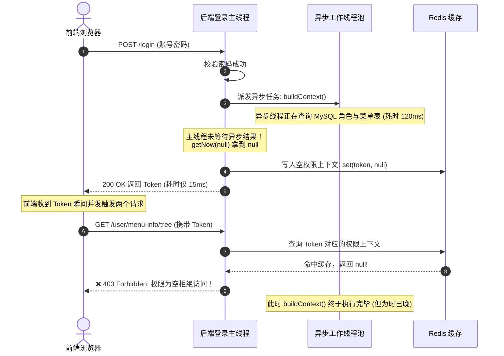

# 👻 记一次生产偶发 403 灵异事件：CompletableFuture 异步任务漏 join 引发的血案

> **作者**：Alex
> **专栏**：微服务生产排错实战与高并发踩坑集
> **关键词**：CompletableFuture、Race Condition、Redis 缓存击穿、ThreadLocal、异步编排
> **阅读时长**：约 14 分钟

---

@[TOC](目录)

---

## 💥 诡异现象：登录成功了，但“薛定谔的权限”出现了

在系统刚上线不久的某天早高峰，监控后台和客服群里炸开了锅：

> **客服反馈**：“有几位重点客户反馈，他们用正确的账号密码登录成功，页面刚跳转到首页，系统立刻弹窗报错 **‘403 Forbidden / 请先登录’**，然后被踢回登录页！但奇怪的是，过两分钟他们再试一次，又能正常登录了！”

运维和后端团队迅速排查日志：
1. **Nginx 网关层**：登录接口返回 `200 OK`，生成了合法的 JWT Token；
2. **随后紧跟的首页请求**：`/api/user/info` 和 `/api/menu-info/tree` 却在校验 Token 时，偶发报错：
   ```text
   2026-09-10 08:31:02.102 WARN [gateway] - User permission context is EMPTY! Denying access for token: eyJhbGci...
   ```
3. **更诡异的是**：本地开发环境怎么测都测不出来，只有在服务器网络稍有延迟或早高峰并发高时才偶发出现。

这种**“偶发、无报错堆栈、过会儿又自行恢复”**的问题，在软件工程中被统称为典型的**海森堡 Bug（Heisenbug）**。

---

## 🔍 溯源排查：从登录逻辑揪出真凶

我们顺藤摸瓜，调出了用户微服务的核心登录逻辑 `TUserServiceImpl.java`。

为了缩短用户的登录等待耗时（从 800ms 优化到 150ms），研发团队在登录接口中引入了 **异步并发编排（CompletableFuture）**，把原本串行执行的几项耗时操作改为了并行：
1. **密码哈希校验**（主线程同步执行）；
2. **获取用户头像 OSS 预签名链接**（耗时网络 IO，走异步线程池）；
3. **构建组织、角色、菜单树及按钮权限上下文**（耗时复杂 SQL 计算，走异步线程池）。

出问题的代码伪代码如下（看看你能不能一眼看出破绽）：

```java
// ❌ 存在严重并发竞态的原始代码
public LoginResponse login(LoginDto loginDto) {
    // 1. 校验账号密码
    TUser user = verifyUser(loginDto.getUsername(), loginDto.getPassword());

    // 2. 异步任务 A：拉取头像（网络 IO 耗时约 50~100ms）
    CompletableFuture<String> avatarFuture = CompletableFuture.supplyAsync(() -> {
        return ossFileService.getAvatarPresignedUrl(user.getAvatarPath());
    }, customThreadPool);

    // 3. 异步任务 B：构建复杂的权限与机构上下文（耗时约 80~150ms）
    CompletableFuture<UserPermissionContext> permFuture = CompletableFuture.supplyAsync(() -> {
        return permissionService.buildContext(user.getId());
    }, customThreadPool);

    // 4. 生成 Token 并异步写入 Redis
    String token = JwtUtils.generateToken(user.getId());

    // 💥 致命漏洞：直接装配响应并写入 Redis 缓存！
    UserPermissionContext permContext = permFuture.getNow(null); // 此时 permFuture 根本还没跑完！
    redisTemplate.opsForValue().set(
        "LoginKey:token:" + token, 
        permContext, // 写入了 NULL！
        7, TimeUnit.DAYS
    );

    LoginResponse response = new LoginResponse();
    response.setToken(token);
    response.setAvatar(avatarFuture.getNow(defaultAvatar));
    return response; // 立即将 Token 返回给前端
}
```

---

## ⚡ 竞态分析：微秒级的生死时速

问题水落石出！这就是经典的 **竞态条件（Race Condition）**：



1. **主线程执行速度极快**：校验密码后，启动异步线程，直接 `permFuture.getNow(null)`。由于异步线程里的复杂 SQL 还没跑完，主线程拿到的是 `null`！
2. **提前落库污染**：主线程把 `null` 包装成了缓存直接打入 Redis，并把 Token 欢欢喜喜地返回给了浏览器；
3. **时序交错**：浏览器拿到 Token 后，路由守卫瞬间并发请求 `/user/info` 和菜单树，网关或微服务查 Redis 发现权限是空的，果断判为 `403`！
4. **为什么有时候正常？** 本地测试时，数据库在 `localhost`，查询只要 2ms，主线程调度慢一点刚好异步执行完了；而线上服务器网络稍有波动，异步任务慢了 10ms，惨案就会准时发生！

---

## 🛠️ 规范治理：编写健壮的高并发编排代码

异步编排的核心法则是：**“允许在幕后并行计算，但落库与响应前必须汇聚对齐”**。

### 正确修复方案 (`TUserServiceImpl.java`)

```java
public LoginResponse login(LoginDto loginDto) {
    // 1. 基础校验
    TUser user = verifyUser(loginDto.getUsername(), loginDto.getPassword());

    // 复制父线程的请求上下文（防止异步线程拿不到租户/请求头）
    RequestAttributes attributes = RequestContextHolder.getRequestAttributes();

    // 2. 异步任务 A：头像提取（带降级保护）
    CompletableFuture<String> avatarFuture = CompletableFuture.supplyAsync(() -> {
        try {
            return ossFileService.getAvatarPresignedUrl(user.getAvatarPath());
        } catch (Exception e) {
            log.warn("拉取用户头像失败，降级为默认头像, userId: {}", user.getId(), e);
            return defaultAvatar;
        }
    }, taskExecutor);

    // 3. 异步任务 B：权限构建（必须隔离异常）
    CompletableFuture<UserPermissionContext> permFuture = CompletableFuture.supplyAsync(() -> {
        RequestContextHolder.setRequestAttributes(attributes);
        try {
            return userPermissionContextService.buildContext(user.getId());
        } finally {
            RequestContextHolder.resetRequestAttributes();
        }
    }, taskExecutor);

    // 4. ✅ 关键防线：通过 allOf().join() 显式挂起等待两项异步任务完全收敛！
    try {
        CompletableFuture.allOf(avatarFuture, permFuture)
                .get(3, TimeUnit.SECONDS); // 必须设置超时时间，防止下游阻塞拖死主线程！
    } catch (TimeoutException e) {
        log.error("用户登录异步上下文构建超时, userId: {}", user.getId(), e);
        throw new BusinessException("系统繁忙，登录超时请重试");
    } catch (Exception e) {
        log.error("用户登录异步编排异常, userId: {}", user.getId(), e);
        throw new BusinessException("登录认证失败");
    }

    // 5. 此时获取必然能拿到计算完毕的真实数据
    UserPermissionContext context = permFuture.join();
    String avatarUrl = avatarFuture.join();

    // 6. 安全写入 Redis 并响应前端
    String token = JwtUtils.generateToken(user.getId());
    userPermissionContextService.cacheContext(token, context);

    return LoginResponse.builder()
            .token(token)
            .avatar(avatarUrl)
            .username(user.getUsername())
            .build();
}
```

---

## 🧠 核心避坑军规：CompletableFuture 的“四大红线”

在微服务中把玩异步编排，切记以下四大守则：

### 红线 1：严禁依赖默认 `ForkJoinPool.commonPool()`
如果你写 `CompletableFuture.supplyAsync(() -> ...)` 不传线程池，底层会使用 JVM 全局唯一的 `ForkJoinPool.commonPool()`。
一旦某个业务在异步任务里执行了慢 IO（如发邮件、调第三方慢接口），**整个 JVM 的所有异步任务将被全部拖垮阻塞！** 必须为不同核心业务自定义独立的线程池。

### 红线 2：必须设置超时时间 `get(timeout, unit)`
单纯调用 `join()` 或 `get()` 会导致主线程无限期挂起。一旦异步线程池打满或下游数据库死锁，主线程将耗尽 Tomcat 连接池。必须显式设置合理的超时熔断阈值（如 2~3 秒）。

### 红线 3：警惕 `ThreadLocal` 上下文丢失与内存泄露
Spring 的 `RequestContextHolder`、`SecurityContextHolder` 底层都是基于 `ThreadLocal`。主线程开子线程后，子线程无法继承上下文！
必须在派发任务时显式传递 `RequestAttributes`，且在任务结束后于 `finally` 块中执行 `resetRequestAttributes()` 清理，否则会导致线程池复用时的内存泄露。

### 红线 4：决不能用 `getNow(defaultValue)` 偷懒代替 `join()`
`getNow()` 的语义是“若完成则返回结果，否则返回默认值”。只有当你对该数据**“可有可无、没算完拉倒”**时才能使用；对于**权限、金额、关键状态**等核心数据，必须用 `join()` 确保百分之百完成！

---

## 🎯 总结

异步并发编排如同一把双刃剑：
- 用得好，它能把接口响应时间压缩到极致，带来极致的吞吐性能；
- 用不好，它便成了深藏在代码里的定时炸弹，在生产高并发的深夜悄然引爆。

记住这次教训：**“异步并行是过程，落库一致是底线；只要异步数据要入库，必须显式 join 守住门！”**

---

*（本文已同步收录至 Alex 知识库：`02-Features/02-RBAC-用户组织权限/避坑与Bug修复SOP/避坑SOP-登录异步join漏等.md`）*
