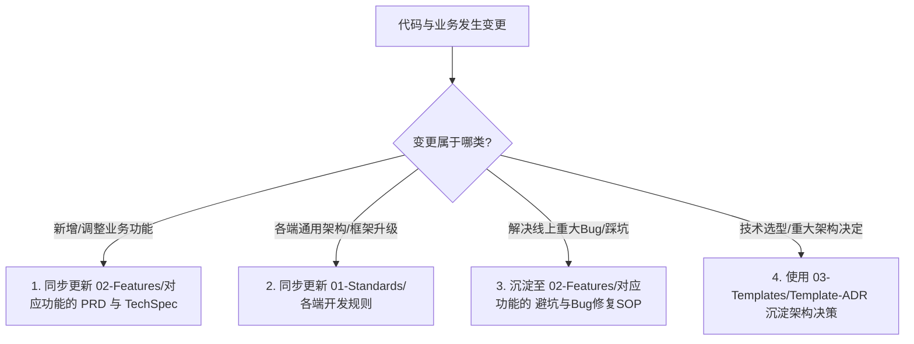

# 🔄 知识库持续维护与代码同步 SOP

返回导航：[[Home]]

---

## 1. 核心契约原则 (Core Contract)

> [!IMPORTANT]
> **代码与知识库双向同步原则**：
> 知识库 `my_alex_brain` 是项目全生命周期唯一可信的业务与技术真实之源（Source of Truth）。
> **凡涉及代码中的业务规则、数据模型、API 契约、页面交互逻辑或运维配置修改，必须在交付代码的同时，同步更新 `D:\project\my_alex_brain` 中对应的文档！**

---

## 2. 场景化同步映射指南

### 2.1 变更场景与对应更新文件映射表

| 代码变更场景 | 对应模块/端 | 知识库必须同步更新的路径 |
| :--- | :--- | :--- |
| **新增/修改业务字段或表结构** (如 Gift 增加字段) | `alex_miaosha_finance` | • `02-Features/01-Gift-礼尚往来/PRD-*.md` • `02-Features/01-Gift-礼尚往来/TechSpec-*.md` |
| **PC 端新增/调整页面与交互** | `alex_miaosha_front` | • `01-Standards/PC端开发规则与组件范式.md` • `02-Features/对应功能/PRD-*.md` |
| **移动端交互/触觉/视口调整** | `alex_miaosha_mobile` | • `01-Standards/移动端开发规则与适配规约.md` • `02-Features/对应功能/PRD-*.md` |
| **权限规则/数据隔离逻辑调整** | `alex_miaosha_user` | • `02-Features/02-RBAC-用户组织权限/TechSpec-*.md` • `01-Standards/后端微服务开发规则与运维规约.md` |
| **新增微服务或端口变更** | 全局网关/运维 | • `00-System/全栈系统架构总览与交互流.md` • `01-Standards/后端微服务开发规则与运维规约.md` |
| **修复复杂竞态/缓存/安全 Bug** | 全端通用 | • `02-Features/对应功能/避坑与Bug修复SOP/` 沉淀复盘 SOP |

---

## 3. AI Agent 与开发者工作流约束

每次 AI Assistant 或开发团队完成功能迭代时，必须执行 **闭环检查**：
1. **代码与单测实现**（满足功能与测试覆盖率）；
2. **知识库文档同步**（检查 `D:\project\my_alex_brain` 对应需求/开发文档是否同步更新，版本日期置为最新）。
