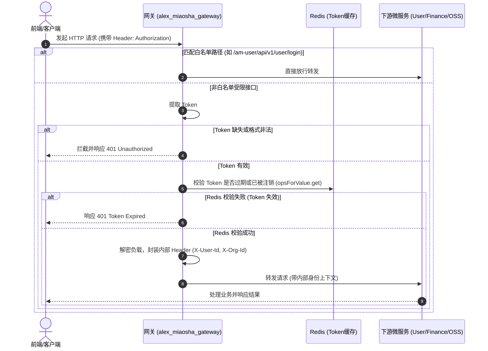

# 🚪 网关路由与统一鉴权设计

返回导航：[[Home]] | [[00-System/全栈系统架构总览与交互流|系统全景]]

---

## 1. 网关核心定位与拓扑

网关微服务（`alex_miaosha_gateway`）作为全系统唯一的公网流量出入口（端口 `30001`），承担以下四大核心职能：
1. **反向代理与动态路由**：基于 Nacos 注册中心实现微服务实例的负载均衡转发；
2. **全局统一鉴权**：校验 HTTP Header 中的 `Authorization` Bearer Token；
3. **白名单机制**：对登录接口、Swagger/Knife4j 文档及公共资源免鉴权放行；
4. **身份信息透传**：鉴权通过后，网关解析 Token 提取 `userId`、`username`、`orgId`，以内部 Header 形式透明透传给下游微服务。

---

## 2. 鉴权执行时序流

---

## 3. 全局报文加解密与安全协议演进 (AES-GCM AEAD)

### 3.1 当前运行架构 (v1.0 - AES-CBC)
- **实现位置**：`alex_miaosha_gateway` 全局过滤器 `GatewayFilter` + `EncryptionUtils`。
- **加解密算法**：AES/CBC/PKCS5Padding，预共享密钥与固定 IV（`20230610HelloDog` / `1234567890123456`）。
- **动静分流与跳过机制**：
  - 二进制文件（Excel、PDF、图片、Office 文档、`application/octet-stream`）通过 Content-Type 与路径白名单（`**/download/**` 等）自动跳过加密。
  - SSE 流式推送（`text/event-stream`、AI 问答）通过 `GatewaySsePathMatcher` 绕过加密缓冲，避免流式截断或乱码。

### 3.2 下一代协议演进：版本协商与 AES-GCM (v2.0)
为消除固定 IV 带来的密码学重放与 Padding Oracle 隐患，系统确立了**基于 HTTP Header (`X-Crypto-Version`) 的无感版本协商机制**：

1. **协议协商机制**：
   - 存量客户端（PC/移动端旧包未带头或值为 `1.0`）：网关自动路由走 v1.0 (AES-CBC)，保证完全向下兼容。
   - 新版客户端请求携带 `X-Crypto-Version: 2.0`：网关自动路由走 v2.0 (AES-GCM)，响应头同步回写 `X-Crypto-Version: 2.0`。
2. **Wire Format 封包规范 (v2.0)**：
   $$\text{Base64}\Big(\underbrace{\text{[12 Bytes 随机 IV]}}_{\text{每次动态生成}} + \underbrace{\text{[密文主体]} + \text{[16 Bytes Auth Tag]}}_{\text{AES-GCM 密文与不可篡改校验}}\Big)$$
3. **前端加速解密**：
   - 现代浏览器与 WebView 原生支持 **Web Crypto API (`window.crypto.subtle`)**，通过硬件级 AES-NI 加速，解密性能相比传统 JS 提升 20~50 倍。
4. **平滑演进三阶段 SOP**：
   - **Phase 1 网关双模部署**：网关同时支持 v1.0 与 v2.0，默认回退 1.0，线上老业务零影响。
   - **Phase 2 客户端灰度发版**：前端与移动端引入 `X-Crypto-Version: 2.0` 拦截器，新老版本客户端透明并存。
   - **Phase 3 归档下线**：待存量老版本流量归零后，网关关闭 CBC 降级通道，彻底消除安全漏洞告警。

> 📖 **深入实战与代码剖析详见**：[[00-System/技术分享-从Sonar告警到架构跃迁：全栈报文安全演进与AES-GCM协议协商无感升级实战|技术分享-全栈报文安全演进与AES-GCM协议协商实战]]

---

## 4. 关键避坑 SOP：WebFlux 网关与 OpenFeign 踩坑规约

1. **Servlet API 隔离规约**：
   - Gateway 基于 Spring WebFlux（响应式、Netty 容器），运行时缺少 `javax.servlet-api`。
   - `common_api` 中定义的通用 `FeignConfig` 若涉及 `HttpServletRequest` 或 `RequestContextListener`（实现 `javax.servlet.ServletRequestListener`），必须使用 `@ConditionalOnClass(name = "javax.servlet.ServletRequestListener")` 注解隔离 Bean 定义，并在 `apply` 方法中加入 `Throwable` 异常保护，防止网关 `@ComponentScan` 或 `@EnableFeignClients` 字节码扫描时抛出 `ClassNotFoundException: FeignConfig` / `NoClassDefFoundError: Result`。
2. **Feign 接口依赖强校验**：
   - 启动类 `GatewayApplication` 上的 `@EnableFeignClients(basePackages = {...})` 声明的包路径（如 `com.alex.api.ai`），其对应的 Maven API 依赖模块（如 `ai_api`）必须显式引入到 Gateway 的 `pom.xml` 中，且需补齐 `javax.servlet-api`（`scope=provided`）作为编译期防护。

