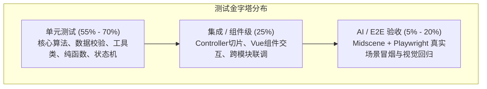

# 🧪 全栈测试标准与质量工程规约

返回导航：[[Home]] | [[01-Standards/后端微服务开发规则与运维规约|后端规约]] | [[01-Standards/PC端开发规则与组件范式|PC端规约]] | [[01-Standards/移动端开发规则与适配规约|移动端规约]]

> **工程定位**：本项目采用「分层测试金字塔 + Midscene AI 视觉断言 + 契约化 Checklist」三位一体质量保障体系。
> 任何业务功能开发、重构或缺陷修复，必须严格遵循本文档定义的测试分层比例、字段边界七点法与质量红线。

---

## 1. 测试金字塔与分层配比矩阵

各端根据应用形态差异，严格贯彻分层测试配比，严禁出现“重 E2E 轻单测”的倒金字塔 Anti-pattern：

| 运行端 | 单元测试 (Unit) | 组件/集成测试 (Integration) | AI/E2E 视觉回归 (E2E) | 核心驱动栈 |
| :--- | :---: | :---: | :---: | :--- |
| **后端微服务** (`alex_miaosha`) | **70%** | **25%** | **5%** | JUnit 5 + Mockito + MockMvc + Testcontainers |
| **PC 管理端** (`alex_miaosha_front`) | **60%** | **25%** | **15%** | Vitest + Vue Test Utils + Playwright + Midscene |
| **移动端 H5** (`alex_miaosha_mobile`) | **55%** | **25%** | **20%** | Vitest + Vant 探针 + Playwright (390×844) + Midscene |



---

## 2. 核心方法论与边界设计

### 2.1 字段边界「七点法」
任何接口参数校验与表单字段测试，必须覆盖七个基准点：
1. **Null / 缺失**：参数未传递或字段为 `null`；
2. **空值 / Empty**：空字符串 `""`、空白符 `"   "` 或空列表 `[]`；
3. **最小有效边界**：如字符串长度为 1、金额为 0.01、数字取值下限；
4. **典型有效值**：常规业务数据（Happy Path）；
5. **最大有效边界**：如字符串长度达到最大限制（如名称 20 字符）、金额上限；
6. **越界与无效**：超出最大长度、负数金额、非法格式；
7. **特殊与安全字符**：包含特殊标点、Emoji 表情、换行符、XSS 注入脚本 `<script>` 等。

### 2.2 权限矩阵全覆盖
涉及数据权限的操作（CRUD），必须覆盖四种标准身份断言：
- **超级管理员 (`super_super`)**：不受机构限制，全系统直通；
- **机构管理员 (`admin`)**：仅限操作本机构/家庭组内数据；
- **普通用户 (`user`)**：仅限操作本人创建的数据；
- **未登录 / 越权身份 (`unauth`)**：抛出未登录（60004）或越权拒绝（403）。

---

## 3. Midscene + Playwright AI 测试工程规约

AI 与端到端自动化测试统一采用 `@midscene/web` 与 `@playwright/test` 双引擎驱动。

### 3.1 四大绝对红线（Forbidden）
> [!CAUTION]
> 1. **严禁依赖中文文案精确匹配**：按钮、输入框、表单项必须挂载语义化 `data-testid`；
> 2. **严禁用硬编码休眠**：严禁 `Thread.sleep` 或 `page.waitForTimeout()`，统一使用 `page.waitForResponse`、`page.waitForSelector` 或 `aiWaitFor`；
> 3. **严禁残留污染数据**：测试数据必须在 `try...finally` 或 `afterEach` 中通过 API 幂等清理，严禁直连开发库残留脏数据；
> 4. **严禁在单测中启动浏览器**：单测必须秒级反馈，浏览器驱动仅允许在 E2E 套件中运行。

### 3.2 选型决策树：Playwright 原生 vs Midscene AI
- **Playwright 原生断言**：适用于明确的 DOM 属性、HTTP 状态码、接口返回值、列表行数统计、精准点击输入；
- **Midscene AI 驱动**：适用于动态布局视觉回归、复杂的跨组件流程走查、动态文案语义校验、自然语言辅助交互。

### 3.3 移动端专属基建规约
1. **Viewport 统一基准**：固定为 `390 × 844`（iPhone 12/13/14 标准尺寸），强制配置 `isMobile: true` 与 `hasTouch: true`；
2. **触觉反馈探针**：使用 `installHapticProbe` 拦截并代理 `navigator.vibrate`，在 UI 动作后断言振动触发频次与时长；
3. **弹层与穿透**：Vant Popup、ActionSheet、Picker 等全局遮罩容器，通过专门的测试辅助方法等待动画完成再断言。

---

## 4. 功能交付 Checklist 契约

新功能交付前，必须在项目对应目录的 `tests/checklists/{feature}.md` 中落地方案清单（以 `gift.md` 为样板）：

```markdown
# {Feature} 测试验收 Checklist

## 1. 字段边界矩阵 (七点法)
| 字段名 | 校验规则 | 边界覆盖情况 | 单测类名与用例方法 |
|---|---|---|---|
| amount | 必填, >0, 最多两位小数 | null / 0 / -1 / 0.01 / 99999999.99 | GiftRecordServiceTest#testAmount |

## 2. 状态机流转矩阵
| 当前状态 | 触发动作 | 期望下一状态 | 越权/非法动作预期拦截 |
|---|---|---|---|

## 3. 权限矩阵
| 角色 | 查询本机构 | 查询跨机构 | 标记回礼 | 删除记录 |
|---|:---:|:---:|:---:|:---:|
| super | ✅ | ✅ | ✅ | ✅ |
| admin | ✅ | ❌ 403 | ✅ | ✅ |
| user  | 仅本人 | ❌ 403 | 仅本人 | 仅本人 |

## 4. 不测理由 (Waivers)
- 理由充分且已由 Lead 确认豁免的非核心场景说明。
```

---

## 5. Anti-Patterns 质量黑名单

| 典型反模式 | 现象表现 | 危害后果 | 正确姿势 |
| :--- | :--- | :--- | :--- |
| **金字塔倒置** | 没有单测，全靠 Midscene 跑长链路 | 执行极慢（数十分钟），报错定位成本极高 | 业务逻辑下沉到单测，E2E 仅跑关键冒烟 |
| **花瓶单测** | 仅测试 POJO getter/setter 或无断言 | 虚假的高覆盖率，无法发现真实业务 Bug | 聚焦于分支判定、异常阻断、边界取值 |
| **环境相互污染** | Case A 创建的数据被 Case B 依赖或污染 | 测试执行顺序改变后产生偶发随机失败 | 单用例独立隔离，前置或后置必须清数据 |
| **异步竞态假死** | 乱加 sleep 赌网络快慢 | 网络波动时频繁超时崩溃 | `Promise.all([waitForResponse, action])` |

---

## 6. 关联规范与延伸阅读

- [[01-Standards/后端微服务开发规则与运维规约|后端微服务开发规则与运维规约]]
- [[01-Standards/PC端开发规则与组件范式|PC端开发规则与组件范式]]
- [[01-Standards/移动端开发规则与适配规约|移动端开发规则与适配规约]]
- [[00-System/前后端ID安全与数据契约护城河|前后端ID安全与数据契约护城河]]
