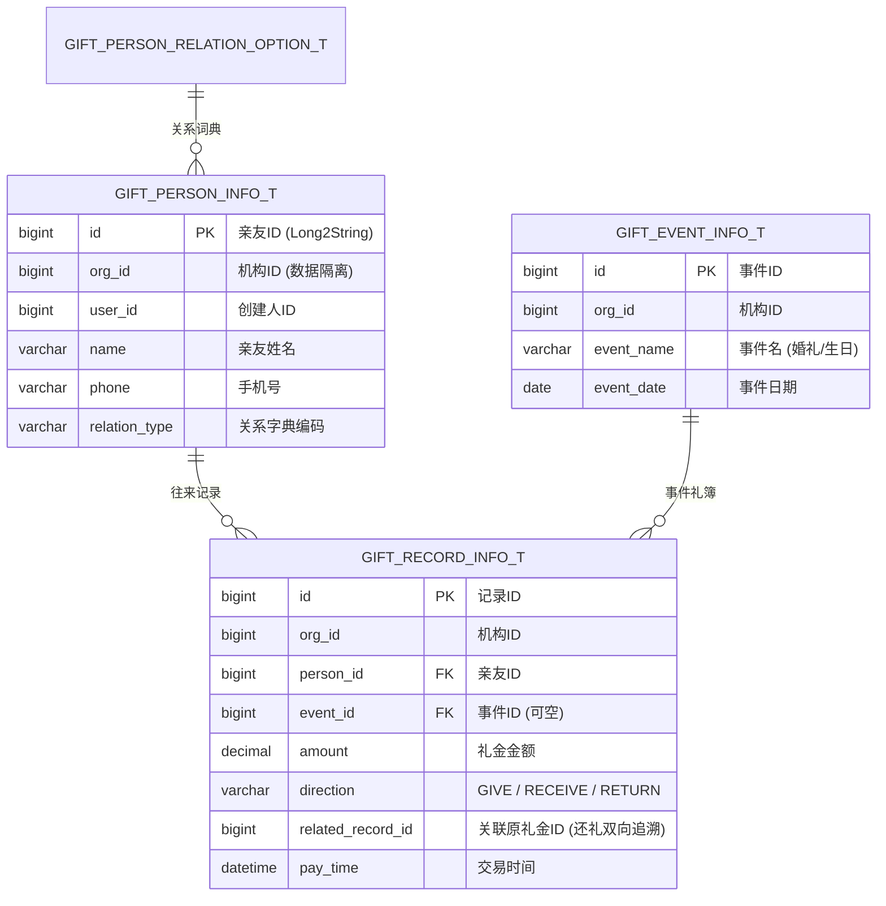

# 💻 TechSpec - 礼尚往来业务领域模型与契约

返回导航：[[Home]] | 功能描述：[[02-Features/01-Gift-礼尚往来/PRD-礼尚往来与人情记账功能说明|PRD-礼尚往来与人情记账功能说明]]

---

## 1. 架构领域划分与三表模型

礼尚往来微服务位于 `alex_miaosha_finance`，按 `record`、`person`、`event` 三大子域分包：



---

## 2. 核心技术设计

### 2.1 10w+ 级复合索引设计
```sql
ALTER TABLE gift_record_info_t ADD INDEX idx_org_user_paytime (org_id, user_id, pay_time);
ALTER TABLE gift_record_info_t ADD INDEX idx_org_person_direction (org_id, person_id, direction);
ALTER TABLE gift_record_info_t ADD INDEX idx_related_record_id (related_record_id);
```

### 2.2 数据权限与安全规约
- Mapper 查询必须显式标注 `@DataPermission(tableAlias = "t", userColumn = "user_id", orgColumn = "org_id")`；
- 严禁调用 MyBatis-Plus 默认的 `service.page()` 查询礼金数据（详见对应避坑 SOP）。

### 2.3 历史菜单彻底下线与全量收敛 (2026-09-19)
- **历史演进**：系统早期在「个人财务」(`selfFinance`) 下挂载了单表维度的「个人随礼信息」(`personalGift`, `/selfFinance/personalGift`)。随着「礼尚往来管理」(`gift`, `/finance/gift`) 完整领域模型（三表 + 数据概览 + 亲友 + 事由 + 礼金 + 统计）上线，老菜单已完全被新体系覆盖；
- **下线清理**：于 2026-09-19 对 `t_menu_info` (IDs: 1810856881968091138, 1810856882504962050) 及对应权限、角色关联彻底执行逻辑删除，清理 Redis 缓存并移除前端废弃组件目录 `alex_miaosha_front/src/views/finance/personalGift/`。

---

## 3. 关联方案与排错 SOP 导航
- 历史开发实施方案：
  - `02-Features/01-Gift-礼尚往来/历史开发方案/2026-05-14-gift-stitch-alignment.md`
  - `02-Features/01-Gift-礼尚往来/历史开发方案/2026-05-14-gift-stitch-alignment-design.md`
- 关联高危排错 SOP：
  - [[02-Features/01-Gift-礼尚往来/避坑与Bug修复SOP/避坑SOP-MyBatisPlus数据越权|避坑SOP-MyBatisPlus数据越权]]
