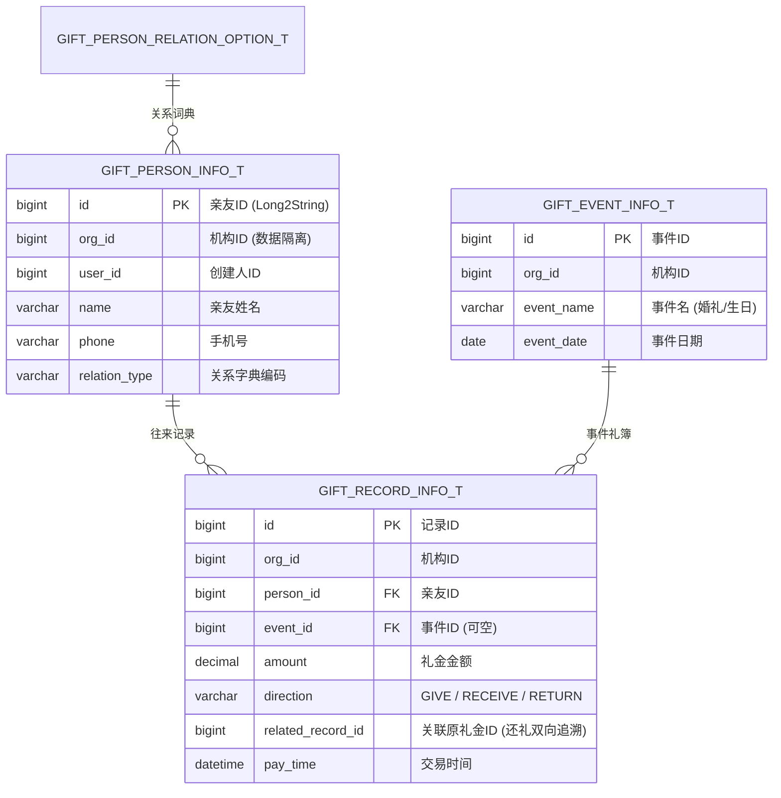

# 💻 TechSpec - 礼尚往来业务领域模型与契约

返回导航：[[Home]] | 功能描述：[[02-Features/01-Gift-礼尚往来/PRD-礼尚往来与人情记账功能说明|PRD-礼尚往来与人情记账功能说明]]

---

## 1. 架构领域划分与三表模型

礼尚往来微服务位于 `alex_miaosha_finance`，按 `record`、`person`、`event` 三大子域分包：


```mermaid
erDiagram
    GIFT_PERSON_INFO_T ||--o{ GIFT_RECORD_INFO_T : "往来记录"
    GIFT_EVENT_INFO_T ||--o{ GIFT_RECORD_INFO_T : "事件礼簿"
    GIFT_PERSON_RELATION_OPTION_T ||--o{ GIFT_PERSON_INFO_T : "关系词典"

    GIFT_PERSON_INFO_T {
        bigint id PK "亲友ID (Long2String)"
        bigint org_id "机构ID (数据隔离)"
        bigint user_id "创建人ID"
        varchar name "亲友姓名"
        varchar phone "手机号"
        varchar relation_type "关系字典编码"
    }

    GIFT_EVENT_INFO_T {
        bigint id PK "事件ID"
        bigint org_id "机构ID"
        varchar event_name "事件名 (婚礼/生日)"
        date event_date "事件日期"
    }

    GIFT_RECORD_INFO_T {
        bigint id PK "记录ID"
        bigint org_id "机构ID"
        bigint person_id FK "亲友ID"
        bigint event_id FK "事件ID (可空)"
        decimal amount "礼金金额"
        varchar direction "GIVE / RECEIVE / RETURN"
        bigint related_record_id "关联原礼金ID (还礼双向追溯)"
        datetime pay_time "交易时间"
    }
```

---

## 2. 核心技术设计

### 2.1 10w+ 级复合索引设计
```sql
ALTER TABLE gift_record_info_t ADD INDEX idx_org_user_paytime (org_id, user_id, pay_time);
ALTER TABLE gift_record_info_t ADD INDEX idx_org_person_direction (org_id, person_id, direction);
ALTER TABLE gift_record_info_t ADD INDEX idx_related_record_id (related_record_id);
```

### 2.2 数据权限与安全规约
- Mapper 查询必须显式标注 `@DataPermission(tableAlias = "t", userColumn = "user_id", orgColumn = "org_id")`；
- 严禁调用 MyBatis-Plus 默认的 `service.page()` 查询礼金数据（详见对应避坑 SOP）。

### 2.3 历史菜单彻底下线与全量收敛 (2026-09-19)
- **历史演进**：系统早期在「个人财务」(`selfFinance`) 下挂载了单表维度的「个人随礼信息」(`personalGift`, `/selfFinance/personalGift`)。随着「礼尚往来管理」(`gift`, `/finance/gift`) 完整领域模型（三表 + 数据概览 + 亲友 + 事由 + 礼金 + 统计）上线，老菜单已完全被新体系覆盖；
- **下线清理**：于 2026-09-19 对 `t_menu_info` (IDs: 1810856881968091138, 1810856882504962050) 及对应权限、角色关联彻底执行逻辑删除，清理 Redis 缓存并移除前端废弃组件目录 `alex_miaosha_front/src/views/finance/personalGift/`。

### 2.4 Picker 级动态新建与自动回填契约 (2026-09-24)
- **问题与场景**：在「快速记礼」等高频录入抽屉中，用户点击「+ 新建外部联系人」唤起 `gift-person-detail` 弹窗创建人员。
- **契约标准**：
  1. `gift-person-detail` 必须在保存成功时触发 `emit('success', resultPerson)` 传递新增的人员实体对象（含生成的 Long/String ID）；
  2. `gift-contact-picker` / `gift-person-picker` 监听 `success` 事件后，立即将该联系人注入本地 options 并将 `modelValue.value` 自动设为 `String(person.id)`；
  3. 自动触发父级（如抽屉）的 `watch` 获取画像统计，实现**零二次点击、即建即选**的无缝闭环体验。

### 2.5 AI 智能赋能与自然语言记账契约 (2026-09-29)
- **自然语言记账智能解析 (`POST ${api.version}/gift-record-info-t/ai-parse`)**：
  - 入参：`GiftRecordAiParseReq` (`content: String`, `defaultDirection: String`)；
  - 出参：`GiftRecordAiParseVo`（含 `personName`, `personId`, `isNewPerson`, `relationType`, `relationName`, `eventType`, `eventTypeName`, `amount`, `direction`, `payTime`, `location`, `remark`）；
  - 核心链路：调用 `ai_api` RPC（`AiAnalyzeApi#chat`，`bizType="gift-ledger-parse"`）提取结构化要素，并联动 `gift_person_info_t`、`gift_person_relation_option_t`、`gift_event_type_option_t` 自动匹配已有联系人及分类；若 AI 超时或不可用，无缝降级为本地正规正则与文化语义抽取保底。
- **智能礼金推荐理由与情景贺词 (`GET ${api.version}/gift-event-type-option-t/recommend-amount`)**：
  - 出参结构扩充：`GiftRecordRecommendAmountVo` 新增 `aiReasoning`（人情往来理由推理，结合往来历史对等性、吉利双数建议说明）与 `aiGreetingTip`（针对婚礼、乔迁、满月、寿宴等不同事由的得体贺词/祝福语）；
### 2.6 AI 端到端烟测与自动化验收基线 (2026-09-30)
- **移动端 AI 快速记账与贺词烟测 (`GIFT-AI-MOBILE-001`, `GIFT-AI-MOBILE-002`)**：
  - 测试用例定义于 `alex_miaosha_mobile/tests/midscene/gift/cases/mobile-ai-smoke.json`；
  - 运行命令：`pnpm test:ai:smoke`（执行 `scripts/playwright/run-mobile-ai-smoke.mjs`）；
  - 核心断言：
    1. 自然语言快速录入解析回填（金额 800、亲友 李四、事由 百日宴）；
    2. 智能推荐卡片与吉利贺词即时渲染（`data-testid="gift-record-ai-recommend-card"`）；
    3. 点击复制贺词触发剪贴板复制提示并激活触觉振动（`window.__hapticCallCount` 递增）；
  - 稳定性保障：基于 `installHapticProbe` 拦截 `navigator.vibrate`，配合网关 AES-128-CBC 统一加解密 Mock 与 `/api/am-` 路由隔离，支持 Chromium / Edge 多通道弹性降级启动。

---

## 3. 关联方案与排错 SOP 导航
- 历史开发实施方案：
  - `02-Features/01-Gift-礼尚往来/历史开发方案/2026-05-14-gift-stitch-alignment.md`
  - `02-Features/01-Gift-礼尚往来/历史开发方案/2026-05-14-gift-stitch-alignment-design.md`
- 关联高危排错 SOP：
  - [[02-Features/01-Gift-礼尚往来/避坑与Bug修复SOP/避坑SOP-MyBatisPlus数据越权|避坑SOP-MyBatisPlus数据越权]]
