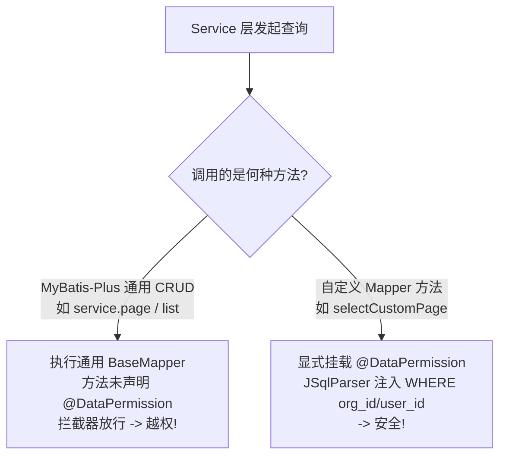

# 🚨 避坑 SOP - MyBatis-Plus 数据越权

返回功能：[[02-Features/01-Gift-礼尚往来/PRD-礼尚往来与人情记账功能说明|Gift 功能描述]] | [[02-Features/01-Gift-礼尚往来/TechSpec-礼尚往来业务领域模型与契约|Gift 技术设计]]

---

## 1. 现象与危害
普通用户调用礼金流水分页查询接口时，查出了其他机构或全系统的私密数据，造成严重的数据泄露。

---

## 2. 根本原因



- `@DataPermission` 数据权限拦截器仅拦截标注了注解的 Mapper 方法；
- MyBatis-Plus 的 `IService.page()` 默认实现未携带领域注解，导致拦截器绕过。

---

## 3. 正确编码规约

### ❌ 错误做法
```java
// 严禁在涉及多租户/机构隔离时直接调用 service.page
return this.page(page, Wrappers.<GiftRecord>lambdaQuery().eq(GiftRecord::getPersonId, personId));
```

### ✅ 正确做法
```java
// 1. Mapper 显式挂载注解
@DataPermission(tableAlias = "t", userColumn = "user_id", orgColumn = "org_id")
Page<GiftRecordVo> selectGiftRecordPage(Page<GiftRecordVo> page, @Param("query") GiftRecordQuery query);

// 2. Service 显式调用 Mapper 方法
return baseMapper.selectGiftRecordPage(page, query);
```
