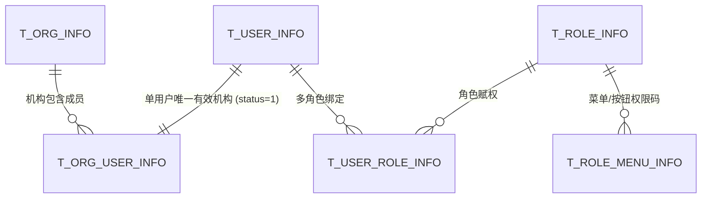

# 👥 PRD - 用户体系与组织权限功能说明

返回导航：[[Home]] | 技术实现：[[02-Features/02-RBAC-用户组织权限/TechSpec-RBAC组织与动态数据权限架构|TechSpec-RBAC组织与动态数据权限架构]]

---

## 1. 业务目标与权限模型
系统构建标准的企业级多租户组织权限控制体系，支持单用户单机构归属、多角色权限聚合、菜单按钮级鉴权以及底层行级数据隔离。

---

## 2. 核心功能设计

### 2.1 组织机构树与单有效归属
- **机构层级树**：支持多级机构组织树形展示、同级/子级机构新增与变更；
- **单机构唯一性**：用户在系统内同一时刻仅有一条 `status = 1` 的有效机构关联关系，用户调动机构时，原机构关系置为 `status = 0`，确保统计归属严格唯一。

### 2.2 多角色聚合与菜单树
- **多角色绑定**：一个用户可同时拥有多个角色（如：部门经理 + 财务审核员）；
- **权限聚合**：系统在登录后将用户拥有的所有角色菜单、按钮权限码进行并集去重，生成唯一的权限上下文写入 Redis 缓存。

### 2.3 三层数据权限边界
- **超级管理员 (`super_super`)**：不受限，查看所有机构与所有用户数据；
- **机构管理员 (`admin`)**：仅可查看本机构及下级机构的数据；
- **普通用户 (`user/readonly`)**：仅可查看创建人等于当前登录人自身（`user_id = #{currentLoginUserId}`）的数据。

---

## 3. 验收标准
- [ ] **[AC1] 机构变更事务性**：调用 `assignSingleOrg` 必须严密加事务，严禁出现一个用户名下存在多条 `status=1` 或无 `status=1` 的悬空状态；
- [ ] **[AC2] 行级隔离越权防护**：普通用户通过参数拼接查询他人机构数据必须被拦截过滤。
