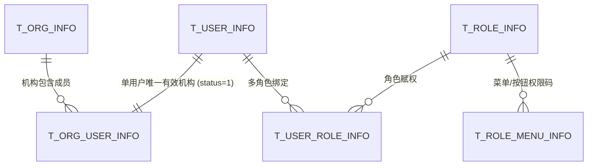

# 👥 PRD - 用户体系与组织权限功能说明

返回导航：[[Home]] | 技术实现：[[02-Features/02-RBAC-用户组织权限/TechSpec-RBAC组织与动态数据权限架构|TechSpec-RBAC组织与动态数据权限架构]]

---

## 1. 业务目标与权限模型
系统构建标准的企业级多租户组织权限控制体系，支持单用户单机构归属、多角色权限聚合、菜单按钮级鉴权以及底层行级数据隔离。

```mermaid
erDiagram
    T_ORG_INFO ||--o{ T_ORG_USER_INFO : "机构包含成员"
    T_USER_INFO ||--|| T_ORG_USER_INFO : "单用户唯一有效机构 (status=1)"
    T_USER_INFO ||--o{ T_USER_ROLE_INFO : "多角色绑定"
    T_ROLE_INFO ||--o{ T_USER_ROLE_INFO : "角色赋权"
    T_ROLE_INFO ||--o{ T_ROLE_MENU_INFO : "菜单/按钮权限码"
```

---

## 2. 核心功能设计

### 2.1 组织机构树与单有效归属
- **机构层级树**：支持多级机构组织树形展示、同级/子级机构新增与变更；
- **单机构唯一性**：用户在系统内同一时刻仅有一条 `status = 1` 的有效机构关联关系，用户调动机构时，原机构关系置为 `status = 0`，确保统计归属严格唯一。

### 2.2 多角色聚合与菜单树
- **多角色绑定**：一个用户可同时拥有多个角色（如：部门经理 + 财务审核员）；
- **权限聚合**：系统在登录后将用户拥有的所有角色菜单、按钮权限码进行并集去重，生成唯一的权限上下文写入 Redis 缓存。

### 2.3 三层数据权限边界
- **超级管理员 (`super_super`)**：不受限，查看所有机构与所有用户数据；
- **机构管理员 (`admin`)**：仅可查看本机构及下级机构的数据；
- **普通用户 (`user/readonly`)**：仅可查看创建人等于当前登录人自身（`user_id = #{currentLoginUserId}`）的数据。

### 2.4 岗位角色权限 AI 智能推荐 (`POST /role-info/ai-recommend-permissions`)
- **智能分析**：在角色权限配置抽屉中，运营或管理员点击“✨ AI 智能权限推荐”，系统基于角色名称与职责说明通过大模型/规则引擎推导出契合的系统功能菜单与按钮操作权限；
- **自动补齐与一键勾选**：返回包含父级节点的菜单ID清单，前端一键自动勾选与展开对应节点，并呈现推荐原因，大幅降低权限配置门槛与误配风险。

---

## 3. 验收标准
- [ ] **[AC1] 机构变更事务性**：调用 `assignSingleOrg` 必须严密加事务，严禁出现一个用户名下存在多条 `status=1` 或无 `status=1` 的悬空状态；
- [ ] **[AC2] 行级隔离越权防护**：普通用户通过参数拼接查询他人机构数据必须被拦截过滤。

---

## 历史迭代方案归档

- [[rbac-maturity-scorecard|rbac-maturity-scorecard]]
- [[2026-09-15-pc-login-permission-tidy|2026-09-15-pc-login-permission-tidy]]
- [[2026-09-15-pc-login-permission-tidy-design|2026-09-15-pc-login-permission-tidy-design]]
- [[2026-09-15-mobile-menu-on-enter|2026-09-15-mobile-menu-on-enter]]
- [[2026-09-15-mobile-menu-on-enter-design|2026-09-15-mobile-menu-on-enter-design]]
- [[2026-09-15-mobile-login-slim-tidy|2026-09-15-mobile-login-slim-tidy]]
- [[2026-09-15-mobile-login-slim-tidy-design|2026-09-15-mobile-login-slim-tidy-design]]
- [[2026-09-15-login-slim-menu-warmup|2026-09-15-login-slim-menu-warmup]]
- [[2026-09-15-login-slim-menu-warmup-design|2026-09-15-login-slim-menu-warmup-design]]
- [[2026-08-19-user-mybatis-lazy-orgsubtree|2026-08-19-user-mybatis-lazy-orgsubtree]]
- [[2026-08-19-user-mybatis-lazy-orgsubtree-design|2026-08-19-user-mybatis-lazy-orgsubtree-design]]
- [[2026-08-19-role-org-binding|2026-08-19-role-org-binding]]
- [[2026-08-19-role-org-binding-design|2026-08-19-role-org-binding-design]]
- [[2026-08-18-datapermission-single-ctor|2026-08-18-datapermission-single-ctor]]
- [[2026-08-18-datapermission-single-ctor-design|2026-08-18-datapermission-single-ctor-design]]
- [[2026-08-11-rbac-batch3-s3|2026-08-11-rbac-batch3-s3]]
- [[2026-08-11-rbac-batch3-product-design|2026-08-11-rbac-batch3-product-design]]
- [[2026-08-06-rbac-maturity-review-execution|2026-08-06-rbac-maturity-review-execution]]
- [[2026-08-06-rbac-maturity-review-design|2026-08-06-rbac-maturity-review-design]]
- [[2026-08-06-rbac-batch2-s2|2026-08-06-rbac-batch2-s2]]
- [[2026-08-06-rbac-batch1-s1|2026-08-06-rbac-batch1-s1]]
- [[2026-08-06-rbac-batch0-regression-hooks|2026-08-06-rbac-batch0-regression-hooks]]
- [[2026-08-03-role-assign-permissions|2026-08-03-role-assign-permissions]]
- [[2026-08-03-role-assign-permissions-design|2026-08-03-role-assign-permissions-design]]
- [[2026-08-03-rbac-p1-wave2|2026-08-03-rbac-p1-wave2]]
- [[2026-08-03-rbac-p1-wave2-design|2026-08-03-rbac-p1-wave2-design]]
- [[2026-08-03-rbac-p1-wave1|2026-08-03-rbac-p1-wave1]]
- [[2026-08-03-rbac-p1-wave1-design|2026-08-03-rbac-p1-wave1-design]]
- [[2026-05-07-rbac-system-design|2026-05-07-rbac-system-design]]
- [[2026-05-07-rbac-phase1-backend|2026-05-07-rbac-phase1-backend]]
