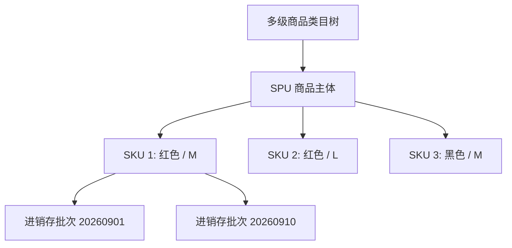

# 📋 PRD - 商品中心与类目库存功能说明

返回首页：[[Home|知识库首页]] | 架构总览：[[00-System/全栈系统架构总览与交互流|系统架构总览]]

---

## 1. 业务全景与模型定位

商品中心为系统提供统一的商品信息底座与进销存能力，采用业界标准的 **SPU（标准产品单元）** 与 **SKU（库存量单元）** 双层解耦设计。

---

## 2. 端侧功能与业务流程

### 2.1 PC 运营端 (`views/product/goods` / `views/goods/stock`)
1. **类目树与属性库管理**：
   - 维护多级分类树，绑定规格模版（如服饰类的颜色、尺码；数码类的内存、版本）。
2. **商品多规格发布**：
   - 输入商品标题、类目选择、轮播图批量上传。
   - 动态规格选择：选择规格值后，前端笛卡尔积自动生成 SKU 明细表格。
   - 批量设定销售价、成本价、划线价及初始库存。
3. **库存批次与进销存核算**：
   - 维护 `shop_stock_batch` 批次入库，记录采购批次号、入库成本、生产日期。
   - 实时盘点看板，直观监控在售库存与锁定库存。

### 2.2 移动端与 C 端展现
1. **商品详情页规格选择器**：
   - 动态联动禁用无库存规格组合（SKU 矩阵禁能判断）。
   - 实时根据所选规格切换价格与主图预览。

---

## 3. 验收标准 (Acceptance Criteria)

- **[AC1] 笛卡尔积规格平滑增减**：动态增加规格值或删除规格值时，SKU 矩阵中未改动的规格行价格与库存数据严禁被清空丢失。
- **[AC2] 绝对防负库存**：无论通过秒杀预扣、普通出库、盘点损耗，可用库存绝对不允许出现负数。
- **[AC3] SPU/SKU 级联状态一致性**：当 SPU 执行下架或逻辑删除时，所属全部 SKU 立即在前端和 API 端阻断下单。
