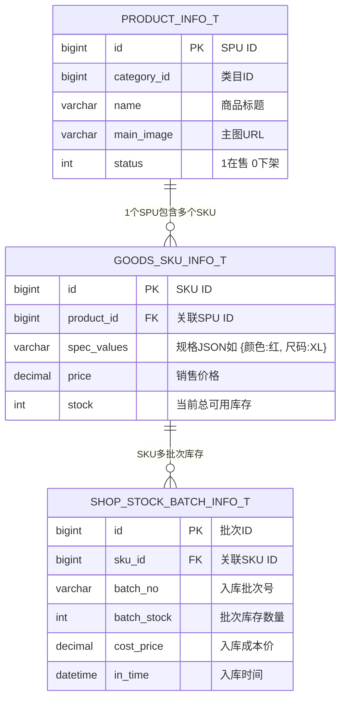

# 🛠️ TechSpec - SPU与SKU多规格模型设计

返回功能说明：[[02-Features/03-Product-商品与类目库存/PRD-商品中心与类目库存功能说明|PRD-商品中心与类目库存功能说明]]

---

## 1. 实体关系模型 (ER Diagram)



---

## 2. 核心技术规格

### 2.1 数据库表结构规约

1. **主表 `product_info_t`**：记录基础属性、所属类目、品牌与上下架状态；
2. **规格表 `goods_sku_info_t`**：记录不同规格组合的具体价格与物理库存。字段 `spec_values` 以规范化 JSON 存储，通过 `spec_hash` 唯一索引（`uk_prod_hash (product_id, spec_hash)`）避免重复创建同一规格组合；
3. **批次表 `shop_stock_batch_info_t`**：支持先进先出（FIFO）出库与成本单价核算。

### 2.2 数据库行级锁安全扣减

```sql
-- 原子扣减库存，防止并发负库存
UPDATE goods_sku_info_t 
SET stock = stock - #{deductCount} 
WHERE id = #{skuId} 
  AND stock >= #{deductCount} 
  AND is_delete = 0;
```

---

## 3. 前端笛卡尔积算法规范

```typescript
// 规格笛卡尔积计算工具
export function cartesianProduct<T>(specs: T[][]): T[][] {
  return specs.reduce(
    (acc, current) => acc.flatMap(a => current.map(c => [...a, c])),
    [[]] as T[][]
  );
}
```
结合 Map 缓存已有填写的 `price` 与 `stock`，以规格组合字符串为 key，实现“增删规格不丢旧行输入”的健壮交互。
