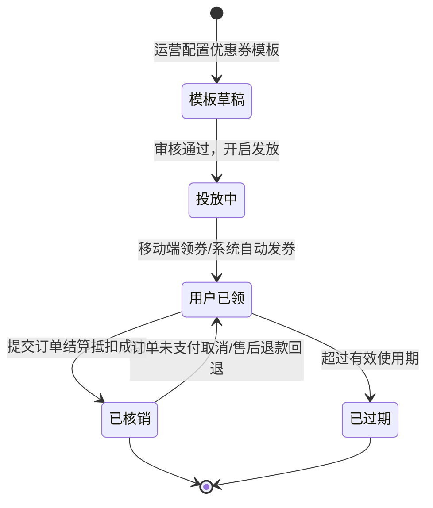

# 📋 PRD - 优惠券营销与核销功能说明

返回首页：[[Home|知识库首页]] | 架构总览：[[00-System/全栈系统架构总览与交互流|系统架构总览]]

---

## 1. 业务全景与券生命周期

优惠券系统覆盖营销策略制定、C 端定向分发、结算智能抵扣与逆向退款回滚闭环：

---

## 2. 端侧功能与业务规约

### 2.1 PC 运营端 (`views/cpn-coupon/couponTemplate`)
1. **券模板多维配置**：
   - 券类型：满减券（满 100 减 20）、折扣券（9 折封顶 50 元）、无门槛立减券。
   - 适用范围：全场通用、指定类目、指定 SKU 商品。
   - 有效期模式：固定区间（如 `2026-10-01 ~ 2026-10-07`）或领券相对天数（自领取之日起 N 天有效）。
   - 门槛校验规则：门槛金额必须严格大于抵扣金额。
2. **发放与核销台账**：
   - 实时监控发行总量、已领数量、已核销数量。
   - 支持反查已核销券对应的订单号与支付时间。

### 2.2 移动端 C 端交互 (`views/cpn-coupon/center` / `views/order/checkout`)
1. **领券中心与卡券包**：
   - 分类查看全场券与品类券，点击“立即领取”触发轻微触觉反馈。
   - 达到单人限领上限后自动变为“已领取”。
2. **结算页智能匹配**：
   - 订单结算时，系统默认自动推荐抵扣金额最大的可用券组合。
   - 半屏优惠券选择器：清晰拆分为“可用券（可单选）”与“不可用券（置灰并展示差额原因，如‘还差¥20可用’）”。

---

## 3. 验收标准 (Acceptance Criteria)

- **[AC1] 券总发行量硬隔离**：已领数量达到模板发行上限时，领券接口立即返回已领完，严禁超发。
- **[AC2] 结算金额毫秒级即时联动**：切换不同优惠券时，实付金额即时重新计算，无抖动与延时。
- **[AC3] 逆向关单精准回补**：未支付取消订单后，已冻结/预占的优惠券必须在 3 秒内恢复为“可用”状态并重置有效期。
