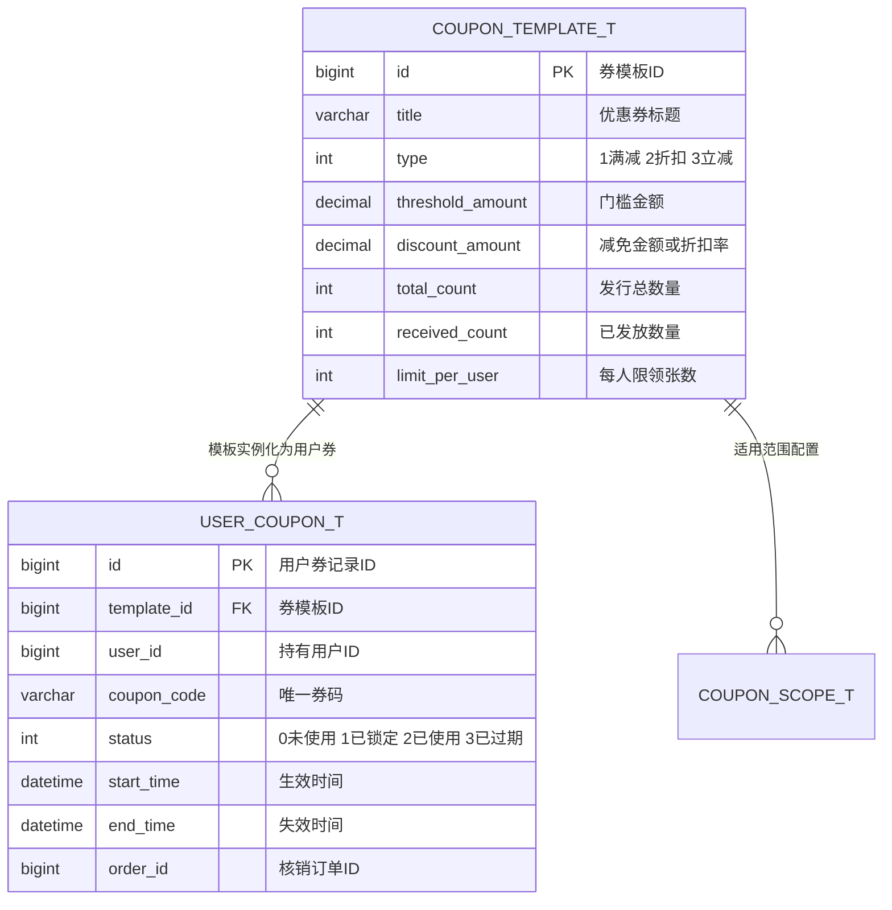
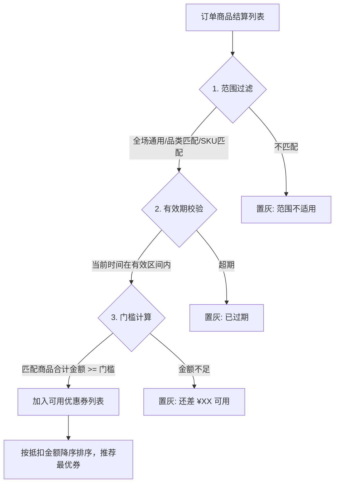

# 🛠️ TechSpec - 优惠券规则引擎与核销设计

返回功能说明：[[02-Features/04-Coupon-营销与优惠券/PRD-优惠券营销与核销功能说明|PRD-优惠券营销与核销功能说明]]

---

## 1. 核心模型设计

---

## 2. 规则引擎匹配与计算管道

---

## 3. 两阶段核销与防超发并发控制

1. **领券防超发**：采用 Redis `DECR` 预扣减券库存，并用 Redis Set 记录 `user_id` 判定限领数量，避免穿透数据库；
2. **两阶段核销**：
   - **创建订单时（预占）**：`UPDATE user_coupon_t SET status = 1, order_id = #{orderId} WHERE id = #{id} AND status = 0;`（乐观锁保证唯一锁定）；
   - **支付成功时（核销终态）**：`UPDATE user_coupon_t SET status = 2 WHERE id = #{id} AND status = 1;`；
   - **超时取消/退款（回补）**：`UPDATE user_coupon_t SET status = 0, order_id = null WHERE id = #{id} AND status = 1;`。
