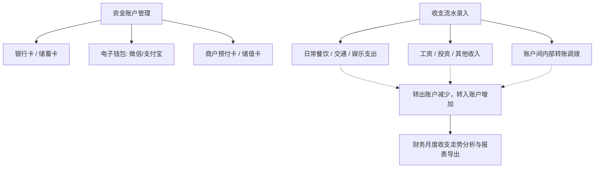

# 📋 PRD - 个人资产与收支记账功能说明

返回首页：[[Home|知识库首页]] | 架构总览：[[00-System/全栈系统架构总览与交互流|系统架构总览]]

---

## 1. 业务全景与功能定位

个人资产与收支记账模块（SelfFinance）为用户提供多账户资金全景监控、日常收支记账流水追踪及多维财务健康分析。

---

## 2. 页面与功能需求清单

### 2.1 财务信息与日常记账 (`/finance/financeManager`)
- **轻量收支小结条**：展示当月/选定周期总支出（-¥xxx）、总收入（+¥xxx）、当期结余（±¥xxx）及账单笔数；
- **单行紧凑筛选工具栏**：
  - 收支类型快捷切换：`[全部 / 支出 / 收入]` 一键点选；
  - 业务时间快捷预设：支持【本月】、【上月】、【近30天】、【今年】等快速切换；
  - 关键词即输即搜，并支持展开低频高级条件（类别、支付方式、归属成员）；
- **日常记账入口与降噪流水**：
  - 【＋ 记一笔】主按钮快速唤起记账弹窗；
  - 账单流水金额强化红绿收支色彩与等宽字体；
  - 操作列改用纯净轻量的链接按钮（编辑 / 删除），右侧浮动固定；
  - 严格遵循 Ponytail ID 字符串安全契约与列宽像素规范。

### 2.2 收支与转账流水 (`/finance/accountRecordInfo`)
- **三类流水录入**：
  - **支出**：选择付款账户、分类标签、支出金额、发生时间、备注；
  - **收入**：选择收款账户、收入分类、收入金额、发生时间；
  - **转账**：选择转出账户、转入账户、调拨金额、手续费。
- **流水检索**：支持按时间区间、所属账户、分类标签、收支类型进行多维组合筛选。

### 2.3 财务收支多维分析 (`/finance/financeAnalysis`)
- **核心 KPI 卡片阵列**：
  - **总资产净值**：全账户可用资产汇总与同环比；
  - **本月总收入**：资金流入汇总与同环比；
  - **本月总消费**：资金流出汇总与同环比；
  - **当月净结余与储蓄率**：结余金额（收入 - 支出）与当月储蓄率健康指标。
- **四大账户资产结构看板**：
  - **流动资金 / 电子账户**：银行卡、微信、支付宝、现金、京东等账户余额与小计；
  - **信用与负债**：花呗、白条等负债账户与透支风险高亮；
  - **生活缴费**：水电燃气费账单明细与小计；
  - **通讯缴费**：话费各账户明细与小计。
- **收支分类环形图（Donut Chart）**：收入结构与支出结构环形占比分布，支持无数据优雅空状态兜底与金额/百分比悬浮；
- **日/月消费走势图**：自适应日期刻度与圆角渐变柱状走势。

### 2.4 历史单表随礼菜单下线说明 (`/selfFinance/personalGift`)
- **下线背景**：早期在个人财务模块下挂载的「个人随礼信息」(`personalGift`) 仅支持单表流水登记，缺乏社交维度的亲友档案、往来双向对账、事件礼簿管理及深度统计看板。
- **业务收敛**：随着系统顶层独立一级模块 **「礼尚往来管理」** (`/finance/gift`) 的全面上线，该旧单表菜单与前端页面已于 2026-09-19 彻底下线清理，实现记账与人情领域的清晰边界划分。

---

## 3. 验收标准 (Acceptance Criteria)

- **[AC1] 账户流水事务原子性**：录入转账流水时，转出账户扣减与转入账户增加必须包裹在同一本地事务中，禁止出现单边账。
- **[AC2] 用户数据安全隔离**：用户仅能查看、操作归属自身用户 ID 的账户资产与交易流水，严格受 `@DataPermission` 数据权限约束。
- **[AC3] 统计数值与流水汇总一致性**：收支分析图表展示的月度支出/收入汇总金额，必须与筛选该月份流水记录计算出的总和 100% 吻合。

