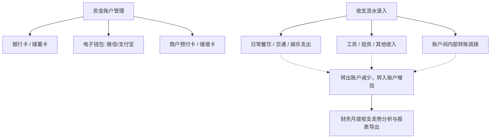

# 📋 PRD - 个人资产与收支记账功能说明

返回首页：[[Home|知识库首页]] | 架构总览：[[00-System/全栈系统架构总览与交互流|系统架构总览]]

---

## 1. 业务全景与功能定位

个人资产与收支记账模块（SelfFinance）为用户提供多账户资金全景监控、日常收支记账流水追踪及多维财务健康分析。

---

## 2. 页面与功能需求清单

### 2.1 财务信息与日常记账 (`/finance/financeManager`)
- **轻量收支小结条**：展示当月/选定周期总支出（-¥xxx）、总收入（+¥xxx）、当期结余（±¥xxx）及有效统计账单笔数；
  - **转账数据剔除规约**：默认收支统计与笔数自动剔除「转账」（`type_code = '转账'`）内部往来流水，避免资金在银行卡、微信、支付宝间调配虚增收支总额与结余；
  - **交互透传**：概览条明确展示「不含转账」提示挂件与气泡说明；仅当用户在高级筛选中显式输入或选择「转账」类别时，统计才针对转账专项汇总；
- **单行紧凑筛选工具栏**：
  - 收支类型快捷切换：`[全部 / 支出 / 收入]` 一键点选；
  - 业务时间快捷预设：支持【本月】、【上月】、【近30天】、【今年】等快速切换；
  - 关键词即输即搜，并支持展开低频高级条件（类别、支付方式、归属成员）；
- **日常记账入口与降噪流水**：
  - 【＋ 记一笔】主按钮快速唤起记账弹窗；
  - 账单流水金额强化红绿收支色彩与等宽字体；
  - 操作列改用纯净轻量的链接按钮（编辑 / 删除），右侧浮动固定；
  - 严格遵循 Ponytail ID 字符串安全契约与列宽像素规范。

### 2.2 收支与转账流水 (`/finance/accountRecordInfo`)
- **三类流水录入**：
  - **支出**：选择付款账户、分类标签、支出金额、发生时间、备注；
  - **收入**：选择收款账户、收入分类、收入金额、发生时间；
  - **转账**：选择转出账户、转入账户、调拨金额、手续费。
- **流水检索**：支持按时间区间、所属账户、分类标签、收支类型进行多维组合筛选。

### 2.3 财务收支多维分析 (`/finance/financeAnalysis`)
- **核心 KPI 卡片阵列**：
  - **总资产净值**：全账户可用资产汇总与同环比；
  - **本月总收入**：资金流入汇总与同环比；
  - **本月总消费**：资金流出汇总与同环比；
  - **当月净结余与储蓄率**：结余金额（收入 - 支出）与当月储蓄率健康指标。
- **四大账户资产结构看板**：
  - **流动资金 / 电子账户**：银行卡、微信、支付宝、现金、京东等账户余额与小计；
  - **信用与负债**：花呗、白条等负债账户与透支风险高亮；
  - **生活缴费**：水电燃气费账单明细与小计；
  - **通讯缴费**：话费各账户明细与小计。
- **收支分类环形图（Donut Chart）**：收入结构与支出结构环形占比分布，支持无数据优雅空状态兜底与金额/百分比悬浮；
- **日/月消费走势图**：自适应日期刻度与圆角渐变柱状走势。

### 2.4 历史单表随礼菜单下线说明 (`/selfFinance/personalGift`)
- **下线背景**：早期在个人财务模块下挂载的「个人随礼信息」(`personalGift`) 仅支持单表流水登记，缺乏社交维度的亲友档案、往来双向对账、事件礼簿管理及深度统计看板。
- **业务收敛**：随着系统顶层独立一级模块 **「礼尚往来管理」** (`/finance/gift`) 的全面上线，该旧单表菜单与前端页面已于 2026-09-19 彻底下线清理，实现记账与人情领域的清晰边界划分。

### 2.5 家庭管理员全景总账与人情看板融合规范 (Ponytail Model)
- **家庭全景双轨收支模型**：
  - 当登录用户拥有「家庭管理员」角色或处于家庭上下文时，首页工作台（`OrgAdminDashboard`）融合个人日常收支与礼金往来：
    - **本月综合总支出**：`日常月支出 + 随礼支出`，采用现代 SaaS 顶栏分离排版架构，副胶囊拆解：`日常 ¥X · 随礼 ¥Y`，附环比微徽章（悬浮 Tooltip 展开同比）；
    - **本月综合总收入**：`日常月收入 + 收礼收入`，副胶囊拆解：`日常 ¥X · 收礼 ¥Y`，附环比微徽章（悬浮 Tooltip 展开同比）；
    - **本月家庭净结余**：`综合总收入 - 综合总支出`，剔除 `¥ +` 语法错误，支持盈亏动态预警与储蓄率微胶囊标识（`储蓄率 95% · 结余充裕`），附资产结余环比/同比微徽章；
    - **家庭在册亲友**：在册成员数，副标签按照**发生日期（`event_time` / `pay_time` / `info_date`）**统一度量：展示本月发生人情事由场数及本月记账笔数（如 `本月人情 0 场 · 记账 24 笔`），避免与全历史数据混淆；
    - **交互穿透直达**：4 大指标卡均支持鼠标指针手势与微动效，点击一键穿透直达日常记账明细、财务分析大盘及亲友名录。
- **多维走势与分类构成交互**：
  - 支持 `[综合走势 | 支出分类 | 人情专线]` 三段式一键无感切换，自适应动态渲染月度综合收支柱状/折线复合图、当月日常分类环形饼图与礼金收支专线。
- **家庭最新人情事由卡片 (替代零散待还礼)**：
  - 彻底摒弃单人零散随礼堆砌，统一升级为展示家庭最新举办/近期的 5 场重大事由（婚礼、满月、寿宴等），呈现事由类型彩色微标签、办事人、举办时间、亲友参与规模与礼金吞吐，并提供「查看礼簿」一键直达通道。
- **家庭专属高频快捷入口**：
  - 精准替换 B 端商品与秒杀入口为家庭 5 大核心通道：记一笔日常账、随礼/收礼登记、人情事由大盘、家庭财务分析、家庭成员档案。

---

## 3. 验收标准 (Acceptance Criteria)

- **[AC1] 账户流水事务原子性**：录入转账流水时，转出账户扣减与转入账户增加必须包裹在同一本地事务中，禁止出现单边账。
- **[AC2] 用户数据安全隔离**：用户仅能查看、操作归属自身用户 ID 的账户资产与交易流水，严格受 `@DataPermission` 数据权限约束。
- **[AC3] 统计数值与流水汇总一致性**：收支分析图表展示的月度支出/收入汇总金额，必须与筛选该月份流水记录计算出的总和 100% 吻合。
- **[AC4] 转账流水不虚增日常收支**：日常记账概览条在未显式筛选转账时，必须自动剔除 `type_code = '转账'` 的所有记录，确保总支出、总收入、净结余真实反映日常消费能力。

