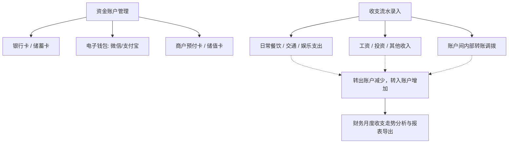

# 📋 PRD - 个人资产与收支记账功能说明

返回首页：[[Home|知识库首页]] | 架构总览：[[00-System/全栈系统架构总览与交互流|系统架构总览]]

---

## 1. 业务全景与功能定位

个人资产与收支记账模块（SelfFinance）为用户提供多账户资金全景监控、日常收支记账流水追踪及多维财务健康分析。

```mermaid
graph TD
    A[资金账户管理] --> B1[银行卡 / 储蓄卡]
    A --> B2[电子钱包: 微信/支付宝]
    A --> B3[商户预付卡 / 储值卡]
    
    C[收支流水录入] --> D1[日常餐饮 / 交通 / 娱乐支出]
    C --> D2[工资 / 投资 / 其他收入]
    C --> D3[账户间内部转账调拨]
    
    D1 -.-> E[账户余额扣减]
    D2 -.-> E[账户余额增加]
    D3 -.-> E[转出账户减少，转入账户增加]
    
    E --> F[财务月度收支走势分析与报表导出]
```

---

## 2. 页面与功能需求清单

### 2.1 账单流水与日常记账 (`/selfFinance/financeManager`，原财务信息菜单升级)
- **轻量收支小结条**：展示当月/选定周期总支出（-¥xxx）、总收入（+¥xxx）、当期结余（±¥xxx）及有效统计账单笔数；
  - **转账数据剔除规约**：默认收支统计与笔数自动剔除「转账」（`type_code = '转账'`）内部往来流水，避免资金在银行卡、微信、支付宝间调配虚增收支总额与结余；
  - **交互透传**：概览条明确展示「不含转账」提示挂件与气泡说明；仅当用户在高级筛选中显式输入或选择「转账」类别时，统计才针对转账专项汇总；
- **单行紧凑筛选工具栏 (Tailwind Modern Filter)**：
  - 收支类型快捷切换：升级为 Tailwind 浅灰底 Segmented 分段器（`[全部 / 支出 / 收入]` 滑块切换，激活态为白底微投影与品牌蓝字）；
  - 业务时间快捷预设：支持【本月】、【上月】、【近30天】、【全部】Pill 胶囊快速切换；
  - 关键词即输即搜，并支持展开低频高级条件（类别、支付方式、归属成员）；
- **高密度双行复合明细流水 (Taste-Skill `VISUAL_DENSITY=8`)**：
  - 【＋ 记一笔】与【智能记账】主按钮快速唤起录入与解析；
  - **双行复合主列**：首行展示加粗账目名称与状态呼吸圆点（有效绿点 `bg-emerald-500` 带双环光晕 / 失效灰点），副行展示经办成员微徽章与等宽格式化时间；
  - **金额红绿自解释**：金额列靠右严格对齐（`align: 'right'`），应用等宽数字字体 `font-mono tabular-nums`，收入绿色（`+¥`）与支出红色（`-¥`）自解释，彻底剔除单独的「收支类型」冗余列与「属于」列；
  - **支付渠道品牌微胶囊**：彻底消除 `wx`、`mm`、`yhk`、`dfw` 等代码暗号，建立「静态词典 + 后端字典 + 业务前缀」三层转译，转为带微图标的品牌微标签；
  - **操作列磁吸微交互**：查看、编辑、删除按钮挂载 `.table-action-btn`，Hover 呈现语义轻色底（灰/蓝/红）并触发 GPU 平滑微放大（`scale(1.08)`）；
- **响应式双子 SaaS 概览面板 (.finance-overview-grid)**：
  - 将「全量账单统计」与「零花钱月度预算」由原单条生硬卡片拆分为左右独立的现代 SaaS 指标网格卡（`.finance-overview-grid`，支持大中小屏幕自适应折行）；
  - 左侧展示账目收支总览（总支出、总收入、净结余、笔数），右侧展示本月预算核心状态（剩余可用/超支、上限与已用微指标、进度条、计入分类、调整预算入口）；
  - 核心金额指标升级为 18px 等宽粗体，配合轻底微图标，兼顾通透度与高信息密度。

- **零花钱预算弹窗 (Tailwind 风格与动态类别提取)**：
  - 弹窗采用 Tailwind 现代卡片化排版，摒弃传统旧式表单，提供视觉通透的胶囊 Chip 交互；
  - 取消写死的静态预设分类，后端提供接口 GET /finance-budget/categories?yearMonth={YYYY-MM} 动态提取「上个月 + 本月」真实记账的非空有效 type_code（排除转账）；
  - 选项集合包含「收支大类（支出、收入）」与「动态提取账目类别」，支持一键全选与清空。

### 2.2 收支与转账流水 (`/selfFinance/accountRecordInfo`，原猫超管理/账户流水)
- **三类流水录入**：
  - **支出**：选择付款账户、分类标签、支出金额、发生时间、备注；
  - **收入**：选择收款账户、收入分类、收入金额、发生时间；
  - **转账**：选择转出账户、转入账户、调拨金额、手续费。
- **流水检索**：支持按时间区间、所属账户、分类标签、收支类型进行多维组合筛选。

### 2.3 财务收支多维分析 (`/selfFinance/financeAnalysis`，兼容原 `/finance/financeAnalysis`)
- **核心 KPI 卡片阵列**：
  - **总资产净值**：全账户可用资产汇总与同环比；
  - **本月总收入**：资金流入汇总与同环比；
  - **本月总消费**：资金流出汇总与同环比；
  - **当月净结余与储蓄率**：结余金额（收入 - 支出）与当月储蓄率健康指标。
- **四大账户资产结构看板**：
  - **流动资金 / 电子账户**：银行卡、微信、支付宝、现金、京东等账户余额与小计；
  - **信用与负债**：花呗、白条等负债账户与透支风险高亮；
  - **生活缴费**：水电燃气费账单明细与小计；
  - **通讯缴费**：话费各账户明细与小计。
- **收支分类环形图（Donut Chart）**：收入结构与支出结构环形占比分布，支持无数据优雅空状态兜底与金额/百分比悬浮；
- **日/月消费走势图**：自适应日期刻度与圆角渐变柱状走势；
- **归属成员与家庭组全景查询**：顶栏支持切换「家庭组所有人」与组织内各成员。选择「家庭组所有人」时，后端自动剔除 `belong_to` 过滤条件，聚合全家庭/组织成员的资产净值、收支明细与各月走势；前端统一保持 ID 字符串交互，杜绝 64 位 Long 精度截断。

### 2.4 历史单表随礼菜单下线说明 (`/selfFinance/personalGift`)
- **下线背景**：早期在个人财务模块下挂载的「个人随礼信息」(`personalGift`) 仅支持单表流水登记，缺乏社交维度的亲友档案、往来双向对账、事件礼簿管理及深度统计看板。
- **业务收敛**：随着系统顶层独立一级模块 **「礼尚往来管理」** (`/finance/gift`) 的全面上线，该旧单表菜单与前端页面已于 2026-09-19 彻底下线清理，实现记账与人情领域的清晰边界划分。

### 2.5 家庭管理员全景总账与人情看板融合规范 (Ponytail Model)
- **家庭全景双轨收支模型**：
  - 当登录用户拥有「家庭管理员」角色或处于家庭上下文时，首页工作台（`OrgAdminDashboard`）融合个人日常收支与礼金往来：
    - **本月综合总支出**：`日常月支出 + 随礼支出`，采用现代 SaaS 顶栏分离排版架构，副胶囊拆解：`日常 ¥X · 随礼 ¥Y`，附环比微徽章（悬浮 Tooltip 展开同比）；
    - **本月综合总收入**：`日常月收入 + 收礼收入`，副胶囊拆解：`日常 ¥X · 收礼 ¥Y`，附环比微徽章（悬浮 Tooltip 展开同比）；
    - **本月家庭净结余**：`综合总收入 - 综合总支出`，剔除 `¥ +` 语法错误，支持盈亏动态预警与储蓄率微胶囊标识（`储蓄率 95% · 结余充裕`），附资产结余环比/同比微徽章；
    - **家庭在册亲友**：在册成员数，副标签按照**发生日期（`event_time` / `pay_time` / `info_date`）**统一度量：展示本月发生人情事由场数及本月记账笔数（如 `本月人情 0 场 · 记账 24 笔`），避免与全历史数据混淆；
    - **交互穿透直达**：4 大指标卡均支持鼠标指针手势与微动效，点击一键穿透直达日常记账明细、财务分析大盘及亲友名录。
- **多维走势与分类构成交互**：
  - 支持 `[综合走势 | 支出分类 | 人情专线]` 三段式一键无感切换，自适应动态渲染月度综合收支柱状/折线复合图、当月日常分类环形饼图与礼金收支专线。
- **家庭最新人情事由卡片 (替代零散待还礼)**：
  - 彻底摒弃单人零散随礼堆砌，统一升级为展示家庭最新举办/近期的 5 场重大事由（婚礼、满月、寿宴等），呈现事由类型彩色微标签、办事人、举办时间、亲友参与规模与礼金吞吐，并提供「查看礼簿」一键直达通道。
- **家庭专属高频快捷入口**：
  - 精准替换 B 端商品与秒杀入口为家庭 5 大核心通道：记一笔日常账、随礼/收礼登记、人情事由大盘、家庭财务分析、家庭成员档案。

### 2.6 零花钱月度预算与分类消费管控 (2026-10-08 / 2026-10-09 体验升级)
- **月度零花钱预算设定**：
  - 用户可在日常记账（`financeManage`）及移动端顶部查看本月零花钱预算总额、已用消费、剩余额度/超支金额及使用率进度条；
  - **Task-Skill 交互优化 (2026-10-09)**：
    - **快捷面额填充**：提供 `¥1000`、`¥2000`、`¥3000`、`¥5000` 快捷胶囊，一键填入；
    - **范畴显式分流**：支持「全量消费 (推荐，默认纳入全部非转账生活支出)」与「指定专属分类 (圈选餐饮美食、日用等)」单选切换，杜绝三态歧义；
    - **双轨分类调色盘**：系统预设 10 项常用高频生活分类 + 近两月真实流水双轨合并，彻底消除冷启动无账单时的白板问题；
    - **实时试算卡片**：弹窗内即时预演本月已匹配消费、调整后剩余额度、使用率进度条与健康/临界/超支状态，彻底告别盲盒式保存；
- **智能历史继承（0-Cron Job Ponytail模式）**：
  - 首月配置后，次月及未来月份默认自动继承上一配置月的预算额度与分类设置（显示“继承自上月”）；
  - 任一月份均可按需独立修改，系统仅为当前月份写入独立快照，决不污染历史数据，也无需每月运行后台跑批定时任务。

---

## 3. 验收标准 (Acceptance Criteria)

- **[AC1] 账户流水事务原子性**：录入转账流水时，转出账户扣减与转入账户增加必须包裹在同一本地事务中，禁止出现单边账。
- **[AC2] 用户数据安全隔离**：用户仅能查看、操作归属自身用户 ID 的账户资产与交易流水，严格受 `@DataPermission` 数据权限约束。
- **[AC3] 统计数值与流水汇总一致性**：收支分析图表展示的月度支出/收入汇总金额，必须与筛选该月份流水记录计算出的总和 100% 吻合。
- **[AC4] 转账流水不虚增日常收支**：日常记账概览条在未显式筛选转账时，必须自动剔除 `type_code = '转账'` 的所有记录，确保总支出、总收入、净结余真实反映日常消费能力。
- **[AC5] 零花钱预算回溯与超支预警**：当月无独立设置时自动继承历史最近月配置；当累计消费超过预算上限时，进度条与数字显示显式超支告警。
- **[AC6] 移动端独立预算管理二级动态路由**：移动端预算调整改造为独立二级动态路由 `/finance/financeManager/budgetManage`（`hide_in_menu: '1'`），支持原生返回与全屏沉浸试算；列表大盘卡片通过 `onActivated` 实现返回即时刷新。
- **[AC7] 细粒度权限与家庭成员属主保护**：家庭成员与管理员均拥有流水查询与预算大盘查看权限（`budget:view`）；家庭成员仅可编辑/删除属于个人创建的流水（`belongTo === loginUserId`），他人流水禁止篡改；家庭成员在预算页面处于只读试算模式；家庭管理员与超管拥有组内全员流水管理与预算编辑调整权限（`budget:edit`）。

