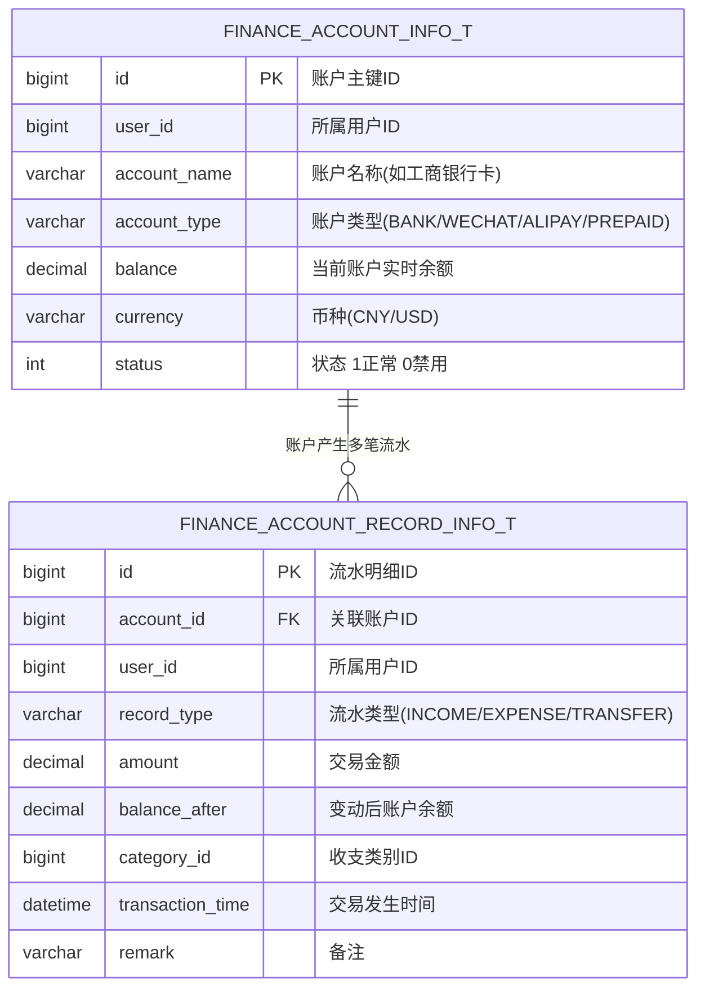

# 🛠️ TechSpec - 收支核算与预付卡流水设计

返回功能说明：[[02-Features/05-SelfFinance-个人资产财务/PRD-个人资产与收支记账功能说明|PRD-个人资产与收支记账功能说明]]

---

## 1. 实体领域模型与核心表



---

## 2. 核心技术规格

### 2.1 账户转账与事务防并发处理

```java
@Transactional(rollbackFor = Exception.class)
public boolean transfer(TransferVo req, Long userId) {
    // 1. 悲观锁锁定源账户与目标账户，按账户ID从小到大锁定避免死锁
    Long firstId = Math.min(req.getFromAccountId(), req.getToAccountId());
    Long secondId = Math.max(req.getFromAccountId(), req.getToAccountId());
    
    financeAccountMapper.selectByIdForUpdate(firstId);
    financeAccountMapper.selectByIdForUpdate(secondId);
    
    // 2. 检查余额充足
    FinanceAccountInfo from = financeAccountMapper.selectById(req.getFromAccountId());
    if (from.getBalance().compareTo(req.getAmount()) < 0) {
        throw new BusinessException("账户余额不足");
    }
    
    // 3. 执行双边流水扣减与增加
    financeAccountMapper.updateBalance(req.getFromAccountId(), req.getAmount().negate());
    financeAccountMapper.updateBalance(req.getToAccountId(), req.getAmount());
    
    // 4. 插入两笔对称流水日志
    insertRecord(from, req.getAmount().negate(), "TRANSFER_OUT");
    insertRecord(to, req.getAmount(), "TRANSFER_IN");
    return true;
}
```

### 2.2 数据权限与多租户

所有个人财务与流水操作必须在 Service 层面强制传入 `userId = SecurityUtils.getLoginUserId()` 进行硬编码约束或使用 `@DataPermission(tableAlias = "f", userField = "user_id")` 进行 SQL 级行过滤，防止越权操作他人物料。

### 2.3 财务收支多维分析双柱核算架构

- **聚合计算规范**：日/月度收支走势分析中，收入（`income_amount`）与支出（`expense_amount`）独立通过 `CASE income_and_expenses WHEN 'income'/'expense' THEN amount ELSE 0 END` 聚合求和，解耦正负抵消。
- **前后端契约**：`AnalysisVo` 提供独立字段 `BigDecimal incomeAmount` 与 `BigDecimal expenseAmount`，保留 `amount` 保证历史向下兼容。
- **前端可视化呈现**：`barChart.vue` 提供双柱分组对比（收入绿色 `#10b981`、支出暖橙 `#f97316`），全面反映同一时间粒度下的资金流入与流出真实全貌。

### 2.4 历史单表随礼菜单下线与清理规范 (2026-09-19)

- **数据库级联清理**：
  - `t_menu_info`：逻辑删除主菜单（`id = 1810856881968091138`，`name: personalGift`，`path: /selfFinance/personalGift`）与详情菜单（`id = 1810856882504962050`，`name: personalGiftDetail`），置 `is_delete = 1`；
  - `t_permission_info`：逻辑删除权限项 `selfFinance:personalGift`（`id = 1810856883473846273`）；
  - `t_role_permission_info`：逻辑删除对应角色绑定记录（IDs: `28`, `29`）。
- **Redis 缓存失效与预热**：
  - 级联清除 `LoginKey:login:in:menu_all_tree` 全量共享菜单树；
  - 遍历清除各在线用户的 `LoginKey:login:in:permission_context:*` 权限上下文，保证用户刷新页面即刻生效。
- **前端废弃视图源码移除**：
  - 彻底删除 `alex_miaosha_front/src/views/finance/personalGift/` 目录，消除无用的冗余打包体积与历史维护负担。


