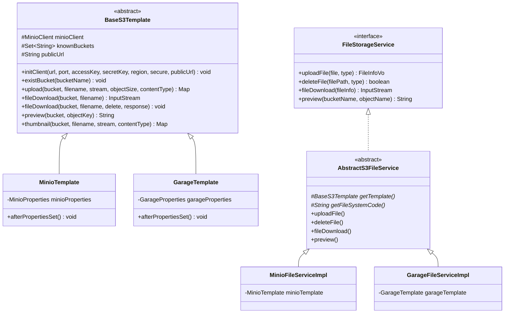

# 🛠️ TechSpec - 对象存储抽象与流式传输设计

返回功能说明：[[02-Features/06-OSS-对象存储与文件中心/PRD-文件中心与附件存取功能说明|PRD-文件中心与附件存取功能说明]]

---

## 1. S3 协议通用适配器收敛架构

全系统对象存储底座（MinIO、Garage）全面收敛并统一实现 S3 协议。通过 `BaseS3Template` 抽象模板与 `AbstractS3FileService` 统一收敛核心存取逻辑，消除 >95% 的镜像重复代码，并保持 Spring 依赖注入与历史数据完全向后兼容。

---

## 2. 768M 内存限制下的流式安全规约与防坑准则

微服务生产容器在 Docker 中严格配置 `limit: 768MiB`。针对对象存储存取，实施以下强硬规约：

### 2.1 上传规约：严禁误用 `available()`
- **禁令**：严禁在 `PutObjectArgs.builder().stream(inputStream, inputStream.available(), -1)` 中使用 `available()`。在 Java 网络 I/O 中，`available()` 仅代表无阻塞可读字节数，极易导致大文件在弱网或分块上传时被截断或报 `Size Mismatch`；
- **规约**：必须通过 `file.getSize()` 明确传入完整对象长度。

### 2.2 下载规约：严禁工具类内部过早 Close 流
- **禁令**：严禁在 `fileDownload(bucket, file)` 的 `finally` 块中调用 `inputStream.close()`，否则调用者接收到的流必定抛出 `java.io.IOException: Stream closed`；
- **规约**：工具类仅负责从 S3 SDK 提取并交付流，生命周期必须由最外层消费端（如 HTTP Response 写入流或业务解码器）通过 `try-with-resources` 关闭。

### 2.3 性能优化：Bucket 内存缓存
- **禁令**：禁止在每次写入（`upload` / `thumbnail`）时无脑执行远程 `existBucket()` / `bucketExists()` 探活请求；
- **规范**：`BaseS3Template` 采用 `ConcurrentHashMap.newKeySet()` 维护本地 Bucket 缓存，首次校验成功后加入缓存，后续写入直接命中，消除 50% 的网络往返 RTT 开销。

### 2.4 内外网分离与预签名 CDN 映射
- **痛点**：默认由 S3 SDK 生成的 `getPresignedObjectUrl` 会硬编码配置项中的物理 IP 与端口，导致外部访问暴露物理网络拓扑或无法经由 CDN 加速；
- **规范**：支持在配置中指定 `publicUrl`（如 `https://oss.example.com`）。`BaseS3Template#preview` 在生成签名后，自动将内部物理 Host 替换为对外的公网或 CDN 域名，确保签名 Query 参数完整的同时实现内外网拓扑隔离。

### 2.5 多环境优雅容错 (Graceful Startup)
- **痛点**：在仅启用单一存储引擎的环境（如生产环境启用 `garage` 而未配置 `minio`），如果模板类硬编码 `Assert.notNull` 会导致服务启动直接挂掉；
- **规范**：`afterPropertiesSet()` 中检测到未配置时，输出 INFO 告警日志并安全跳过，由业务网关或动态路由统一兜底，保证多环境容器平稳拉起。

### 2.6 多附件批量上传与安全防护
- **配额与白名单**：多文件批量上传限制单次最多 9 个附件，严格执行扩展名白名单机制（禁止危险格式如 `.exe`、`.sh` 等），拦截不符合规则的请求并抛出清晰业务异常；
- **Saga 补偿清理**：多附件异步并发上传 S3 过程中，若后续业务或 DB 落库发生异常，触发 Saga 补偿机制自动清理本轮已上传的文件，杜绝对象存储孤儿垃圾文件残留；
- **NPE 防御与引擎解析**：`getFileService(fileSystem)` 严禁返回 `null`，在多级降级均未命中可用存储引擎时抛出结构化 `FileException(ResultEnum.SYSTEM_NO_AVAILABLE)`；`FileException` 显式调用 `super(message)` 保证全局异常处理与日志打印消息链完整；
- **显式领域异常契约**：存储接口 `FileStorageService` 与业务接口 `FileInfoService` 核心操作全面显式标注 `throws FileException`，彻底消除顶层泛化受检异常 `throws Exception` 导致的 SonarQube `java:S112` 告警，向调用方提供清晰强类型的业务失败契约。

### 2.7 S3 存储桶路由解析与 DNS 规范防护 (`getBucket` Ponytail 编织架构)
- **安全红线与合规正则**：严格遵循 AWS S3 / MinIO DNS 规范（3-63 字符、仅小写字母、数字和连字符，禁止特殊符号与路径穿越符号），采用静态预编译正则 `^[a-z0-9][a-z0-9-]{1,61}[a-z0-9]$` 强校验；
- **OCP 开闭原则与枚举自省**：解耦基类中的硬编码 `switch-case`，在 `BucketNameEnum` 中扩展 `findValueByName(name)`，基于不可变只读 `Map` 实现 $O(1)$ 查找，原生内置 `user`, `goods`, `common`, `finance`, `gift`, `ai` 等系统业务桶；
- **确定性五级降级流水线**：
  1. 枚举预置精确匹配（`user` ➔ `user-bucket`）；
  2. 显式已合规完整存储桶直通（如已以 `-bucket` 结尾且合规的名称）；
  3. 动态扩展业务桶拼装并校验合规性（`order` ➔ `order-bucket`）；
  4. 模板配置的默认存储桶 `getDefaultBucketName()`（如 Nacos/Yaml 声明的 `alex-bucket`）；
  5. 系统终极安全兜底基线 `BucketNameEnum.COMMON_BUCKET`（`common-bucket`），彻底根治空值时拼接出非法 `"-bucket"` 的历史缺陷；
- **健壮性与归一化**：入参在入口统一执行 `.trim().toLowerCase()`，实现大小写与多余空格完全容错；
- **零垃圾性能保障**：无锁 Map 字典映射搭配预编译静态正则，在高频上传场景下实现零多余内存堆分配。

### 2.8 存储桶公私分级（Public/Private Separation）与免签直链规约
- **痛点与时效根因**：原预签名直链均硬编码 `expiry(60 * 60)`（1小时），而用户头像（`user-bucket`）等公开高频静态资源被前端与 Redis 登录态长期缓存（24h~7天），跨小时使用时 S3 签名失效抛出 `400 Bad Request: Date is too old`；
- **语义分级与枚举扩展**：`BucketNameEnum` 扩展 `isPublic` 属性，`USER_BUCKET` 与 `GOODS_BUCKET` 标记为公开，`COMMON_BUCKET`、`FINANCE_BUCKET`、`GIFT_BUCKET` 标记为私有；对外提供基于不可变 Map 的 $O(1)$ 快速自省方法 `isPublicBucket(bucketName)`；
- **智能分流机制 (`BaseS3Template#preview`)**：
  - **公开桶**：调用 `buildPublicDirectUrl(bucket, key)`，直接输出免签静态直链（优先采用 `publicUrl` 外部/CDN 域名，回退到 `url:port`），完全不携带任何 `?X-Amz-...` 签名参数，永久有效且 CDN/浏览器强缓存友好；
  - **私有桶**：继续调用底层 `getPresignedObjectUrl` 生成受保护的带时效预签名 URL；
- **基础设施联动**：公开桶需在底层对象存储（如 Garage WebUI 或 MinIO 控制台）中将对应 Bucket 设为静态网站/匿名可读（`Website Access: Enabled` 或 `garage bucket website --allow <bucket>`）；
- **查询端动态 isPublic 显式控制（严格安全决策管道）**：
  - 允许在调用 `getFileInfo(ids, isPublic)`、`queryFileInfo(id, isPublic)` 或 `preview(bucket, key, isPublic)` 时动态传入 `Boolean isPublic` 参数；
  - **决策流水线**：
    1. **仅当 `Boolean.TRUE.equals(isPublic)`（显式传入 `true`）**：强制生成免签持久直链 `buildPublicDirectUrl`（如用户头像、商品展示等永久静态展示资源）；
    2. **当 `isPublic` 不是 `true`（包括 `false` 及 `null` 缺省未传）**：不论什么存储桶，**一律强制生成带 1 小时时效签名的 S3 预签名 URL**（`getPresignedObjectUrl`），彻底移除缺省未传时的隐式免签旁路，保障全域资源默认高安全性防盗链；
  - **模型回显**：`FileInfoVo` 增加 `Boolean isPublic` 属性，透传并清晰标注本条记录生成的预览链接是否为免签直链。

