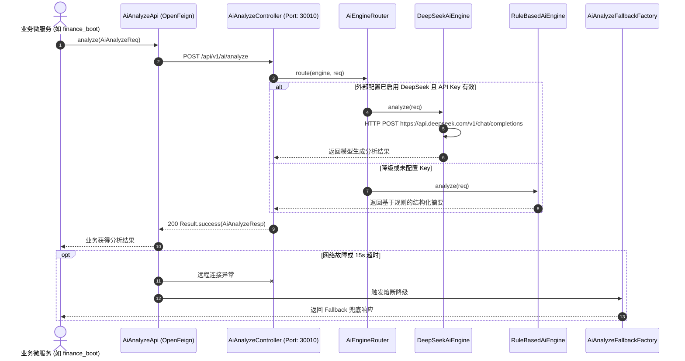
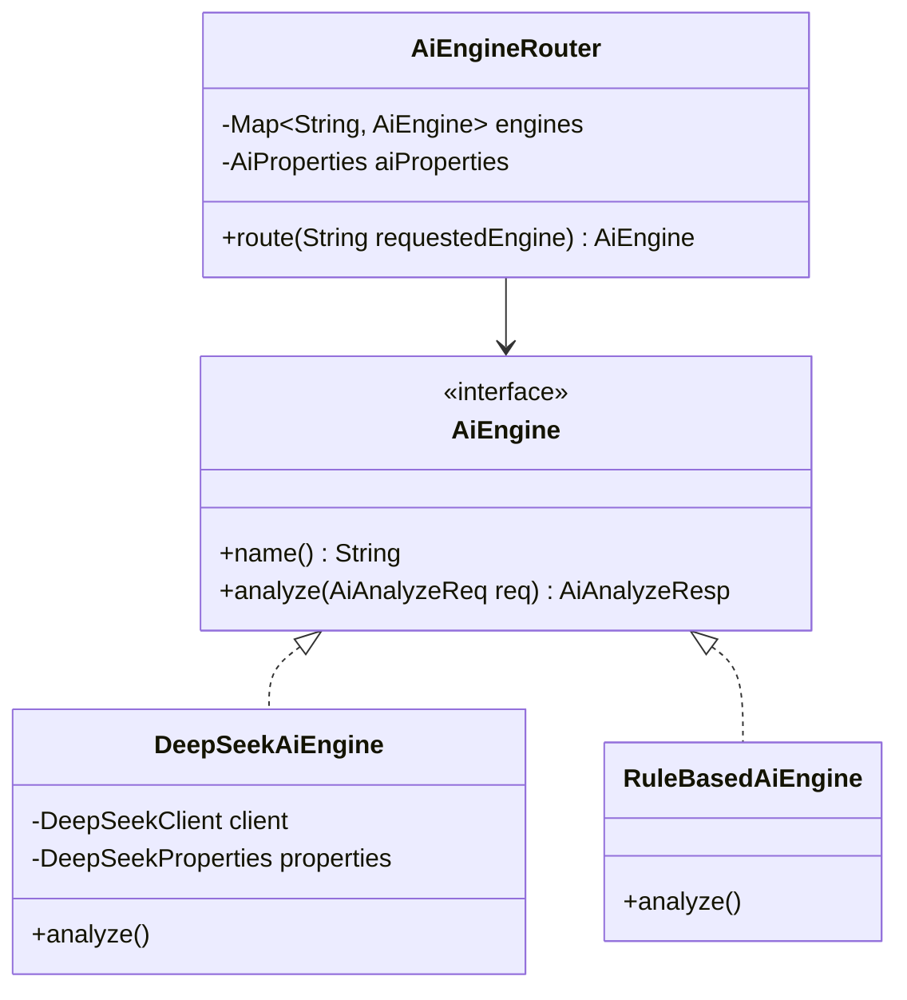

# 🛠️ TechSpec - AI多引擎路由与DeepSeek集成设计

返回功能说明：[[02-Features/07-AI-智能分析中心/PRD-智能分析中心功能说明|PRD-智能分析中心功能说明]]

---

## 1. 架构总览与时序流转

`alex_miaosha_ai` 服务由公共契约模块 `ai_api` 与核心运行时 `ai_boot` 构成，采用面向接口的多引擎策略模式：



---

## 2. 核心类结构与引擎抽象



---

## 3. 契约定义与数据模型

### 3.1 请求对象 `AiAnalyzeReq`
```java
public class AiAnalyzeReq implements Serializable {
    private String bizType;             // 业务标识 (finance/coupon/order)
    private String content;             // 待分析正文内容 (必填)
    private Map<String, Object> context;// 结构化上下文参数
    private Integer depth;              // 分析深度 (1~3，默认1)
    private String engine;              // 强制指定引擎 (deepseek / rule-based)
    private String model;               // 指定模型 (deepseek-chat / deepseek-reasoner)
    private Double temperature;         // 采样温度 (默认0.2)
    private Integer maxTokens;          // 最大Token数 (默认1024)
}
```

### 3.2 响应对象 `AiAnalyzeResp`
```java
public class AiAnalyzeResp implements Serializable {
    private String requestId;           // 链路追踪ID
    private String summary;             // 智能分析摘要
    private List<String> keyPoints;     // 关键核心要点列表
    private String engine;              // 实际执行引擎标识
    private Long costMs;                // 执行耗时(毫秒)
}
```

---

## 4. 生产配置与环境变量规约

```yaml
# application-prod.yaml
server:
  port: 30010

spring:
  application:
    name: alex-ai-prod

ai:
  engine: deepseek
  deepseek:
    base-url: https://api.deepseek.com
    chat-completions-path: /v1/chat/completions
    api-key: ${AI_DEEPSEEK_API_KEY:} # 严格通过系统环境变量注入，严禁硬编码提交仓库
    model: deepseek-chat
    temperature: 0.2
    max-tokens: 1024
    timeout-ms: 15000 # 15s 严格超时
```
