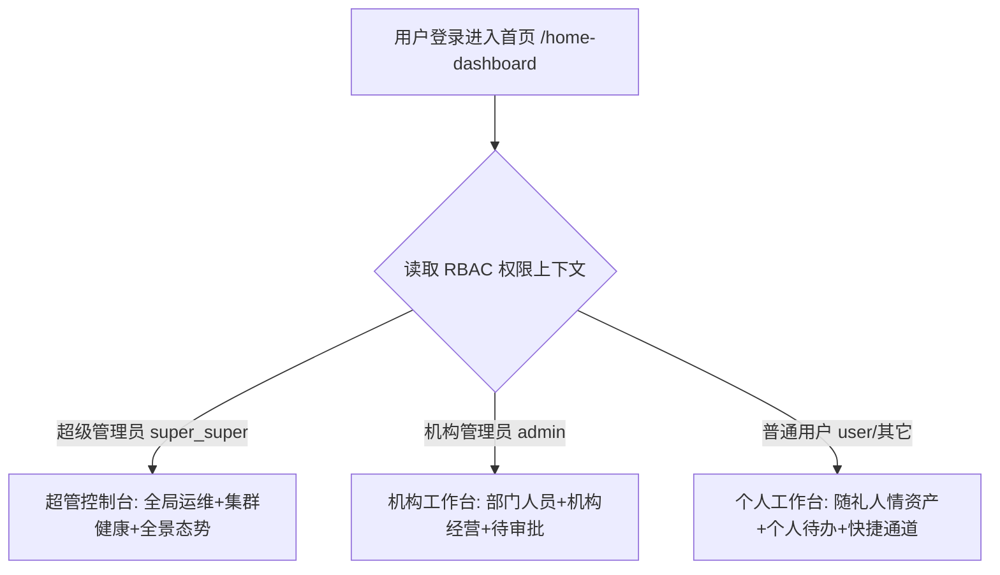

# 📊 PRD - 多角色差异化工作台门户功能说明

返回首页：[[Home|知识库首页]] | 架构设计：[[02-Features/08-Dashboard-工作台门户/TechSpec-多角色工作台分流与组件架构|TechSpec-多角色工作台分流与组件架构]]

---

## 1. 业务全景与定位 (WHAT & WHY)

### 1.1 业务背景
原有首页（`home-dashboard/index.vue`）采用纯静态写死电商指标，系统内所有用户（无论超级管理员、机构主管还是普通员工）登录后呈现完全一致的内容，引发以下核心问题：
1. **超级管理员感知受限**：缺乏全站微服务节点健康状态感知、多租户/机构统计和平台级操作审计入口；
2. **机构管理员缺乏组织视角**：无法直观掌控本部门人员配置、本机构商品库存和礼金往来经营态势；
3. **普通用户被无关信息干扰**：充斥无权访问的系统管理与全站订单数据，无法聚焦个人随礼、人情记账及个人待办。

### 1.2 解决方案与三层角色定位矩阵

| 角色身份 | 核心使命 | 核心看板要素 | 快捷操作 |
| :--- | :--- | :--- | :--- |
| **超级管理员 (`super_super`)** | 全平台全局监控、微服务基础设施保障、多租户组织管理 | Nacos 5大微服务在线探针、全平台注册用户/机构/交易额、双轴流量单量走势图、系统审计流水 | 用户权限中心、组织架构树、操作日志审计、微服务配置 |
| **机构/垂直管理员 (`admin` / `*_admin` 如 `family_admin`, `gift_admin`)** | 机构或家庭运营统筹、团队/家庭成员管理、业务督导（企业与家庭双模自适应） | 在册员工/家庭成员数、在售商品/人情事件数、本月成交额/人情流转额、礼簿往来收支比 | 分配部门员工/家庭成员、发布商品/记录事件、发起秒杀活动、礼簿大盘 |
| **普通用户 (`user`)** | 个人事务处理、随礼记账、个人待办闭环 | 个人随礼笔数与净值总额、待还人情提醒、个人秒杀订单、今日待办清单 | 快速随礼记一笔、查看人情档案、秒杀专区、个人安全设置 |

---

## 2. 端侧功能规格 (`alex_miaosha_front`)

### 2.0 动态欢迎横幅 (`WelcomeHeader`)
- **[F001] 多角色徽章全量展示 (Multi-Role Badges)**：
  - 遍历当前用户名下所有有效角色（从 `userInfo.roleInfoVoList` 与 `permissionContext.roleList` 聚合去重）；
  - 每一个角色均独立渲染对应色系的徽章标签（超管紫色、家庭/机构管理员青色/蓝色、普通角色绿色），支持一人多角色（如【家庭管理员】+【人情管理员】）并列清晰展示，彻底告别单角色遗漏。
- **[F002] 机构归属复合挂件与物理分流 (Org Affiliation Chip)**：
  - 机构标签从普通胶囊升级为“复合型组织挂件”，与角色药丸形成形态（方矩形 6px vs 全圆角 14px）、底色（深色微磨砂 vs 浅底）、结构（双拼复合 vs 纯文本）的三维立体视觉反差；
  - 角色组与机构之间通过半透明物理竖线（`|`）隔开；
  - 机构挂件内嵌 `🏢 家庭/机构` 前缀与加粗名称，一眼可辨。

### 2.1 超级管理员门户 (`SuperAdminDashboard`)
- **[F101] 微服务节点健康探针 (`ServiceHealthCard`)**：
  - 实时检测展示用户服务 (`alex-user-dev:30006`)、商品服务 (`alex-product-dev:30007`)、财务服务 (`alex-finance-dev:30008`)、存储服务 (`alex-oss-dev:30009`)、AI微服务 (`alex-ai-dev:30010`) 在线心跳。
- **[F102] 全平台 KPI 大盘**：
  - 展示“全平台注册用户”、“活跃组织机构”、“平台累计交易/记账额”、“集群请求吞吐 (QPS)”，附带环比涨跌百分比。
- **[F103] 全景流量与业务态势图 (ECharts)**：
  - 动态渲染近 7 天 API 请求 QPS 与业务记账量的双轴走势曲线图。
- **[F104] 高风险操作审计流 (Timeline)**：
  - 展示敏感操作审计动态（如：用户提权、批量删除、机构调整）。
- **[F105] 超管沙盒视角预览器**：
  - 仅超级管理员可见的视角切换胶囊，支持一键在前端无感切换预览“机构管理员”与“普通用户”视图。

### 2.2 机构管理员门户 (`OrgAdminDashboard`)
- **[F201] 机构归属欢迎卡片**：
  - 突出显示当前管理员所归属的机构名称（如 `财务管理部` / `华东运营中心`）与管理员认证标签。
- **[F202] 机构经营与管理指标**：
  - 本机构成员数（在册/活跃）、本机构管辖商品数、本月部门交易流水、机构礼尚往来流转总额。
- **[F203] 机构业务走势与礼金占比 (ECharts)**：
  - 部门销售/记账趋势柱线图 + 礼金收支结构环形占比图。
- **[F204] 机构审批与管理待办**：
  - 员工入组审批、退款纠纷待办、机构待下架商品预警。

### 2.3 普通用户工作台 (`UserDashboard`)
- **[F301] 个人亲切问候卡片**：
  - 结合时间（早安/午安/晚安）智能问候语、显示所属机构（只读）与个性签名。
- **[F302] 个人礼金与人情资产卡**：
  - 统计我记录的礼簿笔数、累计送出与收受金额、人情结余净值、待参加赴宴事件数。
- **[F303] 个人收支人情走势 (ECharts)**：
  - 近半年个人月度礼尚往来折线柱状图。
- **[F304] 个人交互式待办清单 (Interactive Todo)**：
  - 支持快捷查看、打勾标记完成、清除已完成待办，具有响应式交互反馈。
- **[F305] 常用随礼记账入口**：
  - 一键跳转礼簿记账页，极速登记人情往来。

---

## 3. 验收标准 (Acceptance Criteria)

- [ ] **[AC1] 角色分流确定性**：登录身份为 `super_super` 必定进入超级管理员视图；`admin` 必定进入机构管理员视图；其余角色必定收敛至普通用户工作台。
- [ ] **[AC2] 权限与隐私隔离**：普通用户工作台严禁展示任何涉及其他机构或全站的系统健康/审计数据。
- [ ] **[AC3] 图表生命周期完整**：窗口缩放自适应 resize，路由注销时彻底销毁 ECharts 实例，无控制台报错。
- [ ] **[AC4] 契约与测试支持**：所有核心操作均配有标准 `data-testid`，满足 Midscene 自动化用例抓取。
