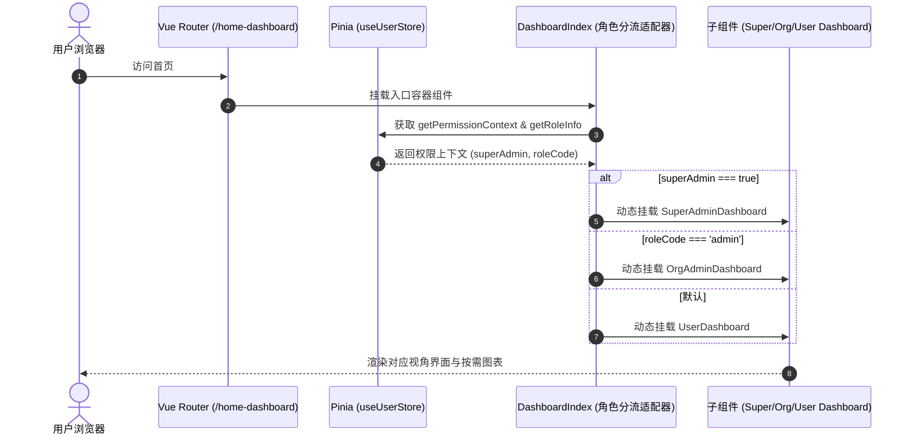

# 🛠️ TechSpec - 多角色工作台分流与组件架构设计

返回需求说明：[[02-Features/08-Dashboard-工作台门户/PRD-多角色差异化工作台门户|PRD-多角色差异化工作台门户]]

---

## 1. 架构总览与角色分流时序 (HOW)

### 1.1 动态角色分流与自适应挂载



### 1.2 目录与模块划分

```
src/views/home-dashboard/
├── index.vue                          # 路由宿主容器（角色判定 + 动态挂载 + 超管预览沙盒）
├── config/
│   └── index.ts                       # 首页数据模型、微服务节点列表、角色元数据
├── components/
│   ├── common/
│   │   ├── WelcomeHeader.vue          # 自适应问候与所属机构横幅
│   │   └── QuickActionGrid.vue        # 统一规范的快捷操作卡片网格
│   ├── super-admin/
│   │   ├── SuperAdminDashboard.vue    # 超级管理员全局管控台
│   │   ├── ServiceHealthCard.vue      # Nacos 微服务运行探针卡片
│   │   └── SystemAuditTimeline.vue    # 系统高风险操作审计时间轴
│   ├── org-admin/
│   │   ├── OrgAdminDashboard.vue      # 机构管理员专属工作台
│   │   └── OrgTodoCard.vue            # 机构审核与待办列表
│   └── user/
│       ├── UserDashboard.vue          # 普通用户个人工作台
│       └── PersonalTodoCard.vue       # 个人待办打勾清单
```

---

## 2. 关键技术方案与开发规约

### 2.1 角色判定算法 (Exact Role Resolution & Administrator Heuristics)
依据 `alex_miaosha_user` 角色标准与垂直业务场景：
```typescript
export type DashboardRoleType = 'super_admin' | 'org_admin' | 'user';

export const isAdministratorRole = (role?: {
	roleCode?: string;
	roleName?: string;
} | null): boolean => {
	if (!role) return false;
	const code = role.roleCode?.toLowerCase() || '';
	const name = role.roleName || '';
	return (
		code === 'admin' ||
		code.endsWith('_admin') ||
		code.includes('admin') ||
		name.includes('管理员') ||
		name.includes('主管') ||
		name.includes('经理')
	);
};

export const resolveDashboardRole = (
	permissionContext: PermissionContext | null | undefined,
	roleCode?: string,
	roleName?: string,
): DashboardRoleType => {
	// 1. 超级管理员
	if (
		permissionContext?.superAdmin ||
		roleCode === 'super_super' ||
		permissionContext?.roleList?.some((r) => r?.roleCode === 'super_super')
	) {
		return 'super_admin';
	}
	// 2. 机构/垂直管理员（涵盖 admin, family_admin, gift_admin 等）
	if (
		isAdministratorRole({ roleCode, roleName }) ||
		permissionContext?.roleList?.some((r) =>
			isAdministratorRole({ roleCode: r?.roleCode, roleName: r?.roleName }),
		)
	) {
		return 'org_admin';
	}
	// 3. 普通用户
	return 'user';
};
```

### 2.2 多角色标签全量聚合与渲染规范
```typescript
interface DisplayRoleTag {
	roleCode: string;
	roleName: string;
	tagColor: string;
	iconType: 'crown' | 'bank' | 'smile' | 'user';
}
```
1. 聚合数据源：合并 `userInfo.roleInfoVoList`、`permissionContext.roleList` 与 `roleInfo`，以 `roleCode || roleName` 为唯一键排重；
2. 色彩与图标映射：超级管理员统一为紫色+皇冠；管理类角色（含 `admin`、`*_admin` 如 `family_admin`、`gift_admin` 等）映射为青色/蓝色+机构图标；普通业务角色映射为绿色+微笑；
3. 容器布局：采用 `.roles-badge-container` 响应式 flex-wrap 换行排列，保障无论用户拥有 2 个还是 5 个角色，均能整齐清晰排列，杜绝漏显。

### 2.3 机构归属复合挂件设计 (Org Affiliation Chip)
```html
<span v-if="orgName" class="header-v-divider" />
<div v-if="orgName" class="org-affiliation-chip" data-testid="dash-org-chip">
  <div class="org-chip-prefix">
    <apartment-outlined class="org-icon" />
    <span>{{ isFamilyOrg ? '家庭' : '机构' }}</span>
  </div>
  <div class="org-chip-name" data-testid="dash-org-name">{{ orgName }}</div>
</div>
```
- **视觉反差维度**：
  - 角色标签：圆角药丸 Tag（`border-radius: 16px`），彩色高亮，代表个人职务；
  - 机构挂件：微圆矩形（`border-radius: 6px`），深色毛玻璃（`rgba(0, 0, 0, 0.26)`）+ 双拼结构（左侧分类前缀，右侧组织名），代表物理空间；
  - 物理隔离：通过 `.header-v-divider` 半透明分割线清晰隔离，杜绝形态同质化。

### 2.4 ECharts 性能与内存生命周期规约
1. **统一按需动态引入**：使用 `@/utils/echarts/loadEcharts` 避免 Vite 8 预构建失败；
2. **实例管理与自适应**：
   - 监听 `window.addEventListener('resize', onChartResize)`；
   - 在 `onUnmounted` 中移除事件监听并执行 `chartInstance?.dispose()`，彻底防内存泄漏。

### 2.3 超管沙盒预览器设计
为超级管理员提供轻量响应式切角调试条：
```html
<a-radio-group v-if="isRealSuperAdmin" v-model:value="previewRole" button-style="solid">
  <a-radio-button value="super_admin">超级管理员视角</a-radio-button>
  <a-radio-button value="org_admin">机构管理员视角</a-radio-button>
  <a-radio-button value="user">普通用户视角</a-radio-button>
</a-radio-group>
```
仅对实际身份为 `superAdmin` 的用户激活，切换时无感热更组件，不修改本地真实 Token 与权限缓存。

### 2.5 Tailwind 现代美学设计系统规范 (Tailwind Modern Design System)
1. **画布底色革新**：整页摒弃老旧 AntD `#f0f2f5` 水泥灰，升级为清透通透的 `bg-slate-50/60`（`#f8fafc`）；
2. **极光微光 Banner**：
   - 机构/家庭端采用科技蓝紫极光（`#1e3a8a 0%, #2563eb 55%, #4f46e5 100%`）；
   - 超管端采用高端深邃暗夜流光（`#090d16 0%, #1e1b4b 60%, #311042 100%`）；
   - 组织归属挂件全面改用 `backdrop-blur-md bg-white/14 border border-white/24` 晶透毛玻璃质感，杜绝黑底粗糙感；
3. **KPI 指标卡片 (Rounded-2xl + Ring-1)**：
   - 统一采用 `border-radius: 16px; border: 1px solid #e2e8f0; box-shadow: 0 1px 3px 0 rgba(0, 0, 0, 0.04);`；
   - 4 种彩色药丸徽章对齐 Tailwind 调色板（`blue-50`, `emerald-50`, `amber-50`, `purple-50`）；
   - 悬浮动效：`hover:-translate-y-0.5 hover:shadow-md hover:border-slate-300`；
4. **快捷通道与待办**：
   - 采用 `border border-slate-100 bg-slate-50/50 rounded-xl` 并在 hover 时平滑提亮、箭头右移（`translateX(4px)`）；
   - 待办列表项边框细化、药丸 Tag 视觉降噪。

---

## 3. 验收与工程守则

1. **DOM 测试属性标定**：所有核心按钮与卡片必挂 `data-testid`；
2. **禁止显式导入自动注销 API**：严禁在单文件显式 import `ref`, `computed`, `watch`, AntD 组件；
3. **ID 类型保持 String**：所有涉及业务实体 ID 的字段，均保持 String 字符串类型。
