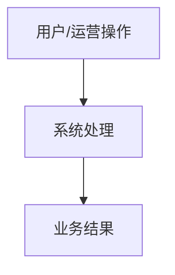

# 📋 PRD - [功能模块名称]功能说明

返回首页：[[Home|知识库首页]] | 架构总览：[[00-System/全栈系统架构总览与交互流|系统架构总览]]

---

## 1. 业务全景与定位 (WHAT & WHY)
- **业务背景**：该模块解决什么问题？服务于谁？
- **业务流程图**：(使用 Mermaid 绘制端到端业务流)

---

## 2. 端侧功能清单 (Front-PC / Mobile / Backend)

### 2.1 PC 运营管理后台 (`views/...`)
- 功能列表、筛选项、操作权限与交互细节。

### 2.2 移动端 C 端功能 (`views/...`)
- 触觉反馈、表单录入、响应式导航与卡片渲染。

---

## 3. 验收标准 (Acceptance Criteria)
- **[AC1] 正常流断言**：...
- **[AC2] 逆向与边界异常断言**：...
- **[AC3] 前端 ID 安全与防精度截断**：所有 ID 保持 String 类型。
