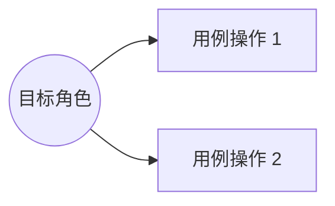
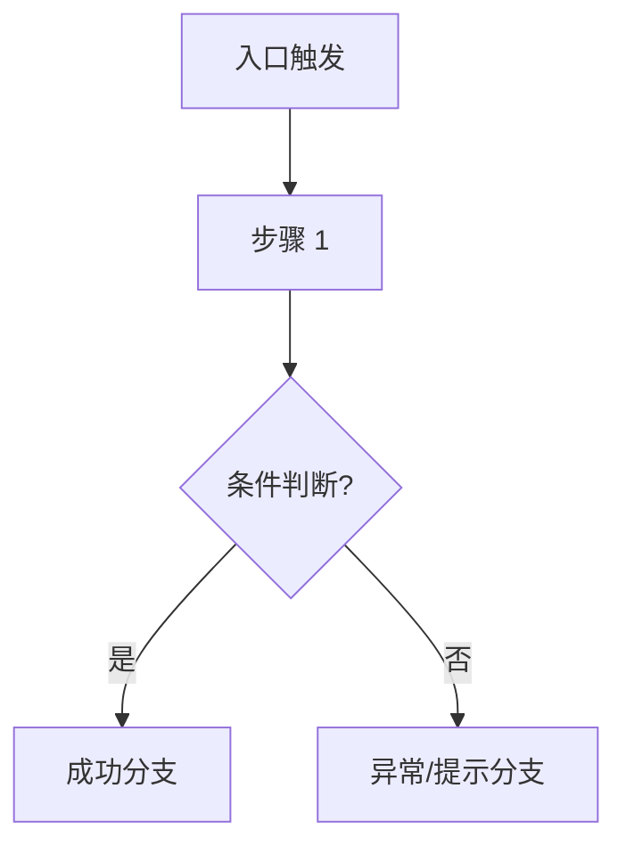

# 📋 PRD - {{feature_name}} 需求规格说明书

返回导航：[[Home]]

---

## 1. 需求背景与业务目标
<!-- 描述该需求要解决的核心用户痛点、业务背景与预期业务指标 -->

---

## 2. 用户角色与用例图 (Use Cases)

---

## 3. 功能清单与页面流程图 (Flowchart)

---

## 4. 字段规则与边界（七点法）

| 字段名称 | 类型 | 必填 | 长度/范围 | 默认值 | 唯一性/校验规则 | 交互与提示说明 |
| :--- | :--- | :--- | :--- | :--- | :--- | :--- |
| `field_name` | string | 是 | 1~50 | - | 正则/唯一性校验 | 占位符与报错提示 |

---

## 5. 验收标准 (Acceptance Criteria / Checklist)
- [ ] **[AC1] 正常流断言**：
- [ ] **[AC2] 边界与异常提示**：
- [ ] **[AC3] 权限矩阵控制**：
