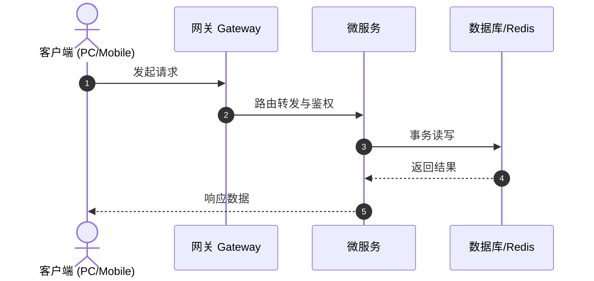
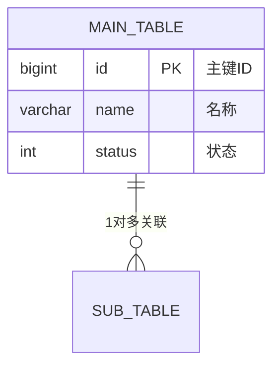

# 🛠️ TechSpec - [功能模块名称]技术方案设计

返回功能说明：[[02-Features/XX-FeatureName/PRD-FeatureName|对应PRD]]

---

## 1. 架构总览与时序 (HOW)

---

## 2. 数据模型与实体规约 (ER Diagram & DDL)

---

## 3. 接口契约与关键算法实现
- 接口路径与请求体/响应体 VO 定义；
- 悲观锁/分布式锁/事务控制规约；
- `@DataPermission` 数据权限挂载位置。
