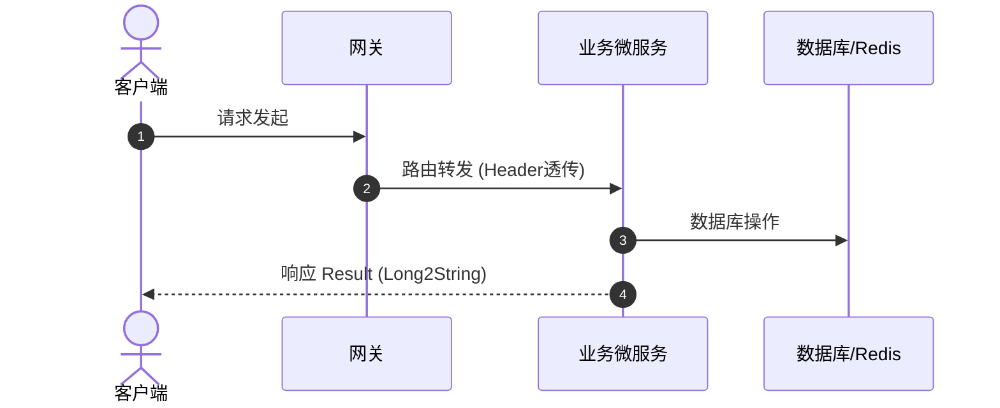

# 💻 TechSpec - {{feature_name}} 技术方案说明书

返回导航：[[Home]]

---

## 1. 方案目标与架构变更
<!-- 简述技术方案目标、影响的微服务/前端端点及主要变更范围 -->

---

## 2. 交互时序图 (Sequence Diagram)



---

## 3. 数据模型与 API 契约

### 3.1 DTO / VO 契约
```typescript
export interface {{FeatureName}}DTO {
  id: string; // 必须保持 string
  name: string;
}
```

### 3.2 实体与注解约束
```java
public class {{FeatureName}}Vo {
    @JsonSerialize(using = Long2StringSerializer.class)
    private Long id;
}
```

---

## 4. 核心实现与关键代码
<!-- 粘贴关键算法、防重入拦截器或组件封装代码 -->

---

## 5. 测试与排错 SOP
- **单元测试 / 集成测试**：
- **AI 自动化测试 (Midscene + Playwright)**：需挂载 `data-testid`
- **避坑预警**：
