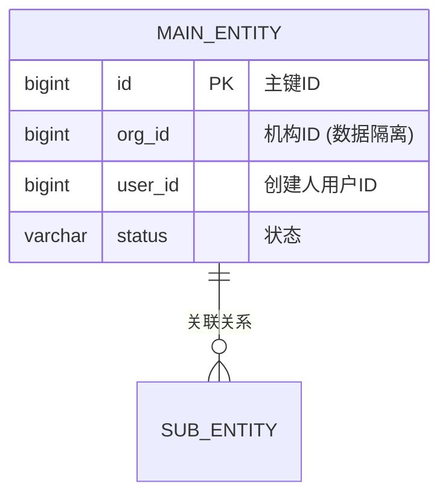
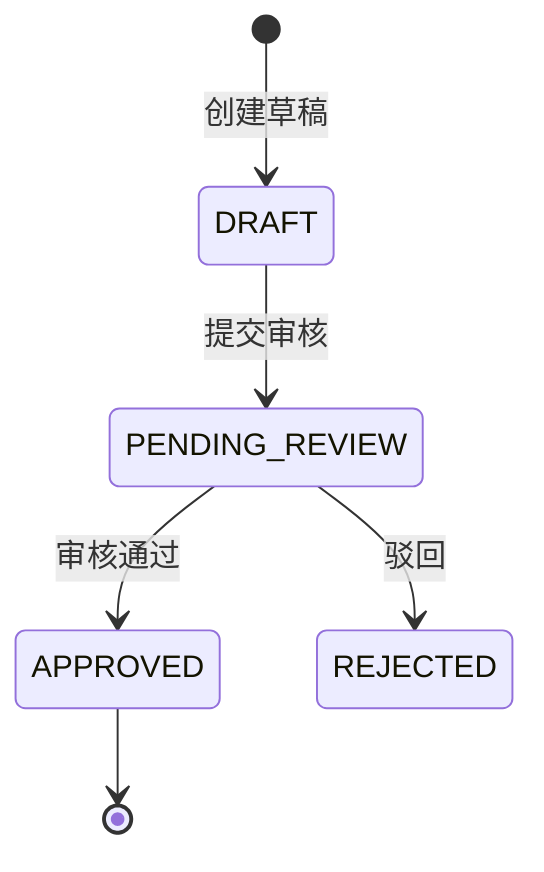

# 📦 {{title}} 领域模型说明书

返回导航：[[03-Backend/MOC-后端微服务|03-Backend/MOC-后端微服务]]

---

## 1. 业务背景与问题定义

<!-- 描述该领域模型的业务场景、要解决的核心问题及边界 -->

---

## 2. 实体关系图 (ER / Domain Model)

---

## 3. 核心业务规则与状态机

- **规则 1**：
- **规则 2**：

---

## 4. 索引与性能设计

| 表名 | 复合索引定义 | 覆盖查询场景 |
| :--- | :--- | :--- |
| `t_xxx_info` | `(org_id, user_id, create_time)` | 分页查询 |
