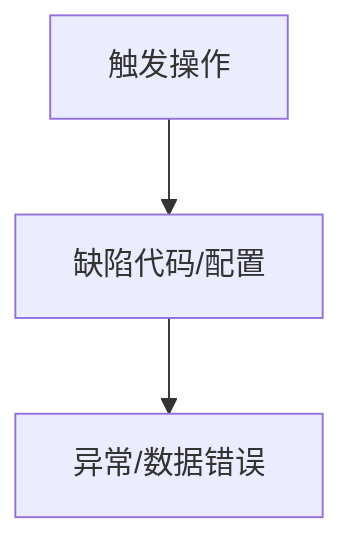

# 🚨 排错复盘: {{title}}

返回导航：[[03-Backend/MOC-后端微服务|03-Backend/MOC-后端微服务]]

---

## 1. 故障现象与影响面 (Incident Summary)
- **触发时间**：
- **故障现象**：
- **受影响模块与用户范围**：

---

## 2. 根本原因分析 (Root Cause)
<!-- 深入代码、配置或并发竞态进行原理级分析 -->



---

## 3. 修复方案与代码对比 (Fix & Code Diff)

### ❌ 错误实现
```java
// 错误代码
```

### ✅ 正确修复
```java
// 修复后代码
```

---

## 4. 预防措施与护城河 (Prevention & Safeguards)
1. **单元测试/集成测试锁住行为**：
2. **静态检查 / 拦截器防护**：
3. **知识库与文档同步**：
