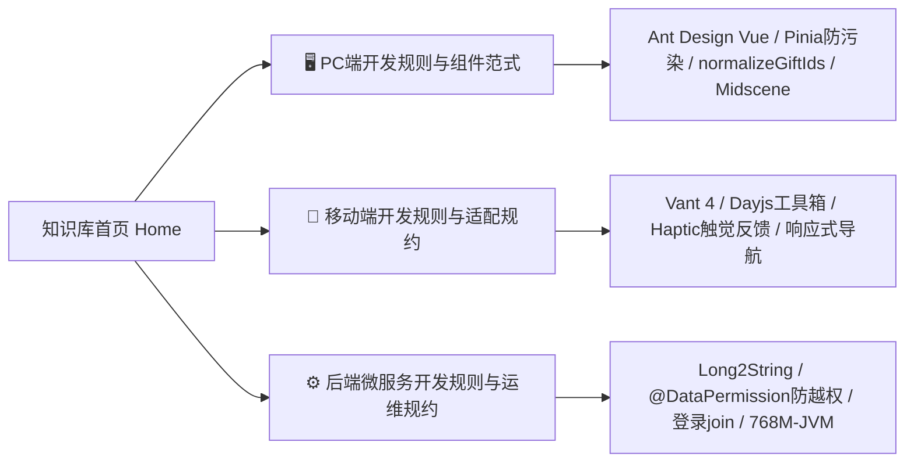

# 🚀 Alex 秒杀与人情记账系统全栈知识库 (Ponytail Hub)

> 欢迎来到 **alex_miaosha** 全栈系统中央知识库。本项目采用 **Ponytail Matrix** 架构治理模型：
> - **单顶层入口（Home）** 贯通全局；
> - **横向平台规约（01-Standards）** 筑牢工程防线；
> - **纵向功能胶囊（02-Features）** 闭环业务全生命周期：`PRD (WHAT) ➔ TechSpec (HOW) ➔ 历史开发方案 ➔ 避坑与Bug修复SOP`。

---

## 🏛️ 1. 系统架构与底层护城河 (`00-System`)

| 架构主题 | 核心内容与契约说明 | 关联白皮书与看板 |
| :--- | :--- | :--- |
| **微服务拓扑与公共底座** | 网关(30001)、用户(30006)、商品(30007)、财务(30008)、OSS(30009)、AI分析(30010)；统一公共底座分为 common_api（轻量契约）与 common_core（运行时底座） | [[00-System/全栈系统架构总览与交互流\|全栈系统架构总览与交互流]] |
| **ID 安全契约** | 后端 Long 统一序列化为 String；前端禁止使用 JS Number 处理 ID | [[00-System/前后端ID安全与数据契约护城河\|前后端ID安全与数据契约护城河]] |
| **统一网关与鉴权** | Gateway JWT 拦截、黑名单校验与 Token 续期机制 | [[00-System/网关路由与统一鉴权设计\|网关路由与统一鉴权设计]] |
| **生产运维与监控** | 生产 Docker 768M-JVM 调优配额、Drone CI 发布前快照、日志挂载 | [[00-System/生产运维Runbook与容器监控\|生产运维Runbook与容器监控]] |
| **报文安全与协议协商** | 基于 HTTP Header (X-Crypto-Version: 2.0) 的全栈 AES-GCM AEAD 升级实战与防重放演进 | [[00-System/技术分享-从Sonar告警到架构跃迁：全栈报文安全演进与AES-GCM协议协商无感升级实战\|技术分享-AES-GCM协议协商实战]] |
| **知识库同步规范** | 修改代码后同步更新需求与开发文档的标准操作规程 (SOP) | [[00-System/知识库持续维护与代码同步SOP\|知识库持续维护与代码同步SOP]] |
| **架构全景白板** | Obsidian Canvas 可视化全栈架构与数据流转拓扑 | [[00-System/全栈系统架构全景.canvas\|全栈系统架构全景.canvas]] |
| **业务功能全景** | Obsidian Canvas 可视化各子领域与功能映射 | [[00-System/全系统业务功能全景.canvas\|全系统业务功能全景.canvas]] |

---

## 🛠️ 2. 横向三大端开发规则与工程规约 (`01-Standards`)

点击进入各端核心开发规约，开发前**必须严格遵循四大红线与工程基准**：

- 🖥️ **PC 前端规约**：[[01-Standards/PC端开发规则与组件范式|PC端开发规则与组件范式 (`alex_miaosha_front`)]]
- 📱 **移动端规约**：[[01-Standards/移动端开发规则与适配规约|移动端开发规则与适配规约 (`alex_miaosha_mobile`)]]
- ⚙️ **后端服务规约**：[[01-Standards/后端微服务开发规则与运维规约|后端微服务开发规则与运维规约 (`alex_miaosha`)]]

---

## 📦 3. 纵向业务功能矩阵 (`02-Features`)

每个业务功能均为自包含的独立工程胶囊，下辖 **功能需求 PRD**、**技术实现 TechSpec**、**历史演进方案** 及 **避坑排错 SOP**：

| 功能模块                         | 业务需求说明 (PRD - WHAT)                                                    | 技术架构与模型 (TechSpec - HOW)                                                              | 历史开发方案 (Plans & Specs)                                                                                                                                                                      | 避坑与Bug修复SOP (Postmortems)                                                                                                                                            |
| :--------------------------- | :--------------------------------------------------------------------- | :------------------------------------------------------------------------------------ | :------------------------------------------------------------------------------------------------------------------------------------------------------------------------------------------ | :------------------------------------------------------------------------------------------------------------------------------------------------------------------- |
| **01-Gift 礼尚往来**          | [[02-Features/01-Gift-礼尚往来/PRD-礼尚往来与人情记账功能说明\|PRD-礼尚往来与人情记账]]          | [[02-Features/01-Gift-礼尚往来/TechSpec-礼尚往来业务领域模型与契约\|TechSpec-礼尚往来领域模型]]                | • [[02-Features/01-Gift-礼尚往来/历史开发方案/2026-05-14-gift-stitch-alignment\|2026-05-14 接口对齐方案]] • [[02-Features/01-Gift-礼尚往来/历史开发方案/2026-05-14-gift-stitch-alignment-design\|2026-05-14 对齐设计]] | • [[02-Features/01-Gift-礼尚往来/避坑与Bug修复SOP/避坑SOP-MyBatisPlus数据越权\|避坑SOP-MyBatisPlus数据越权]] • [[02-Features/01-Gift-礼尚往来/Gift礼尚往来业务流转.canvas\|业务流转.canvas]]           |
| **02-RBAC 用户组织权限**        | [[02-Features/02-RBAC-用户组织权限/PRD-用户体系与组织权限功能说明\|PRD-用户体系与组织权限]]        | [[02-Features/02-RBAC-用户组织权限/TechSpec-RBAC组织与动态数据权限架构\|TechSpec-RBAC组织与数据权限]]         | • [[02-Features/02-RBAC-用户组织权限/历史开发方案/2026-05-07-rbac-phase1-backend\|2026-05-07 后端阶段1方案]] • [[02-Features/02-RBAC-用户组织权限/历史开发方案/2026-05-07-rbac-system-design\|2026-05-07 多组织架构设计]]     | • [[02-Features/02-RBAC-用户组织权限/避坑与Bug修复SOP/避坑SOP-登录异步join漏等\|避坑SOP-登录异步join漏等]] • [[02-Features/02-RBAC-用户组织权限/避坑与Bug修复SOP/避坑SOP-Redis共享菜单污染\|避坑SOP-Redis共享菜单污染]] |
| **03-Product 商品与类目库存**    | [[02-Features/03-Product-商品与类目库存/PRD-商品中心与类目库存功能说明\|PRD-商品中心与类目库存]]    | [[02-Features/03-Product-商品与类目库存/TechSpec-SPU与SKU多规格模型设计\|TechSpec-SPU/SKU多规格模型]]     | *(随迭代持续沉淀)*                                                                                                                                                                                 | *(随迭代持续沉淀)*                                                                                                                                                          |
| **04-Coupon 营销与优惠券**      | [[02-Features/04-Coupon-营销与优惠券/PRD-优惠券营销与核销功能说明\|PRD-优惠券营销与核销]]        | [[02-Features/04-Coupon-营销与优惠券/TechSpec-优惠券规则引擎与核销设计\|TechSpec-规则引擎与核销设计]]            | *(随迭代持续沉淀)*                                                                                                                                                                                 | *(随迭代持续沉淀)*                                                                                                                                                          |
| **05-SelfFinance 个人资产财务** | [[02-Features/05-SelfFinance-个人资产财务/PRD-个人资产与收支记账功能说明\|PRD-个人资产与收支记账]] | [[02-Features/05-SelfFinance-个人资产财务/TechSpec-收支核算与预付卡流水设计\|TechSpec-收支核算与流水设计]]       | *(随迭代持续沉淀)*                                                                                                                                                                                 | *(随迭代持续沉淀)*                                                                                                                                                          |
| **06-OSS 对象存储文件中心**       | [[02-Features/06-OSS-对象存储与文件中心/PRD-文件中心与附件存取功能说明\|PRD-文件中心与附件存取]]      | [[02-Features/06-OSS-对象存储与文件中心/TechSpec-对象存储抽象与流式传输设计\|TechSpec-对象存储与流式传输]]           | • [[00-System/历史运维方案/2026-05-26-drone-runtime-optimization\|2026-05-26 容器运行优化]]                                                                                                             | *(随迭代持续沉淀)*                                                                                                                                                          |
| **07-AI 智能分析中心**          | [[02-Features/07-AI-智能分析中心/PRD-智能分析中心功能说明\|PRD-智能分析中心]]                | [[02-Features/07-AI-智能分析中心/TechSpec-AI多引擎路由与DeepSeek集成设计\|TechSpec-AI多引擎路由与DeepSeek]] | • [[02-Features/07-AI-智能分析中心/TechSpec-AI多引擎路由与DeepSeek集成设计\|DeepSeek大模型集成]]                                                                                                                 | • [[02-Features/07-AI-智能分析中心/TechSpec-AI多引擎路由与DeepSeek集成设计#4-生产配置与环境变量规约\|规则引擎降级防抖]]                                                                                 |

---

## ✍️ 4. 全栈实战技术分享与避坑专栏 (CSDN/掘金精选博客)

本专栏精选本项目生产实战中沉淀的高价值技术攻坚与深度避坑经验，采用 CSDN Markdown 规范排版，可直接用于对外技术分享：

| 专栏核心主题 | 核心实战与踩坑深度 | 博客全文直达链接 |
| :--- | :--- | :--- |
| **🔐 密码学与协议协商** | Sonar S3329 驱动全栈自适应 HTTP Header 演进至 AES-GCM (AEAD)，双模无感平滑升级 | [[00-System/技术分享-从Sonar告警到架构跃迁：全栈报文安全演进与AES-GCM协议协商无感升级实战\|从Sonar告警到架构跃迁：AES-GCM协议协商实战]] |
| **🔢 前后端 ID 安全** | 19 位雪花算法在 JS IEEE 754 中的精度黑洞、后端 Long2String 与前端 normalize 护城河 | [[00-System/技术分享-被前端追着打后，我终于搞懂了雪花ID在JS中的精度黑洞与前后端护城河设计\|被前端追着打后，我搞懂了雪花ID精度黑洞]] |
| **⚡ 并发编排与缓存** | CompletableFuture 异步拉取头像与权限树并发竞态，漏 join 导致 Redis 写入 null 引发偶发 403 排错 | [[00-System/技术分享-记一次生产偶发403灵异事件：CompletableFuture异步任务漏join引发的血案\|生产偶发403：CompletableFuture漏join血案]] |
| **🛡️ 动态数据权限** | 基于 MyBatis-Plus + JSqlParser AST 语法树动态注入组织/租户隔离，防反射与重入死循环 | [[00-System/技术分享-告别写死where条件！基于MyBatis-Plus+JSqlParser实现企业级动态数据权限拦截器\|告别写死where条件：动态数据权限拦截器]] |
| **🤖 AI 流式与网关** | DeepSeek SSE (text/event-stream) 遭遇 Gateway WebFlux DataBuffer 缓冲陷阱，动态旁路防憋大招 | [[00-System/技术分享-当DeepSeek遇到SpringCloudGateway：为什么你的SSE流式打字机变成了憋大招？\|当DeepSeek遇到Gateway：SSE流式防憋大招]] |
| **💣 缓存一致性与引用** | 共享菜单树在内存中就地修改 children 导致堆内存与 Redis 污染，不可变封装与 structuredClone | [[00-System/技术分享-Java引用传递惹的祸：一个偷懒的tree拼接把Redis菜单缓存污染了\|Java引用传递惹的祸：偷懒tree拼接污染Redis菜单]] |
| **💻 低成本云原生运维** | 2核4G 低配服务器极限压榨，768M-JVM 黄金配比、4GB Swap 避难所与 Drone 顺位发布，稳跑 6 微服务 | [[00-System/技术分享-极限压榨：如何在2核4G低配服务器上稳跑6个SpringCloud微服务+Nacos+MySQL？\|极限压榨：2核4G稳跑6个SpringCloud微服务]] |

---

## 📌 5. 模版库与资源索引 (`03-Templates` / `04-Attachments`)

- 📑 **需求文档模版**：`03-Templates/Template-PRD.md`
- 📐 **技术方案模版**：`03-Templates/Template-TechSpec.md`
- 🚨 **避坑排错SOP模版**：`03-Templates/Template-Bug-SOP.md`
- 🖼️ **系统附件与图表**：`04-Attachments/`
